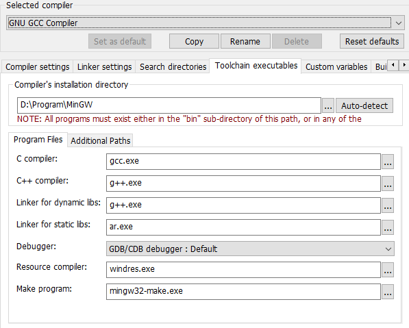
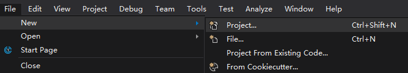
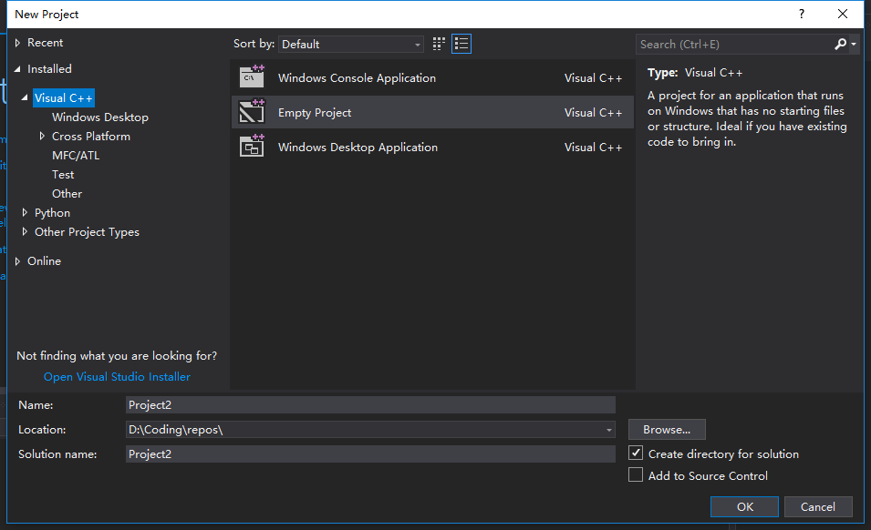
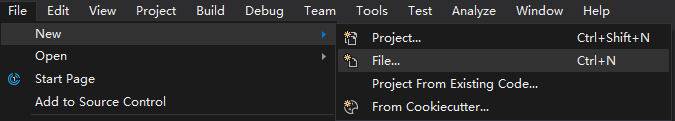
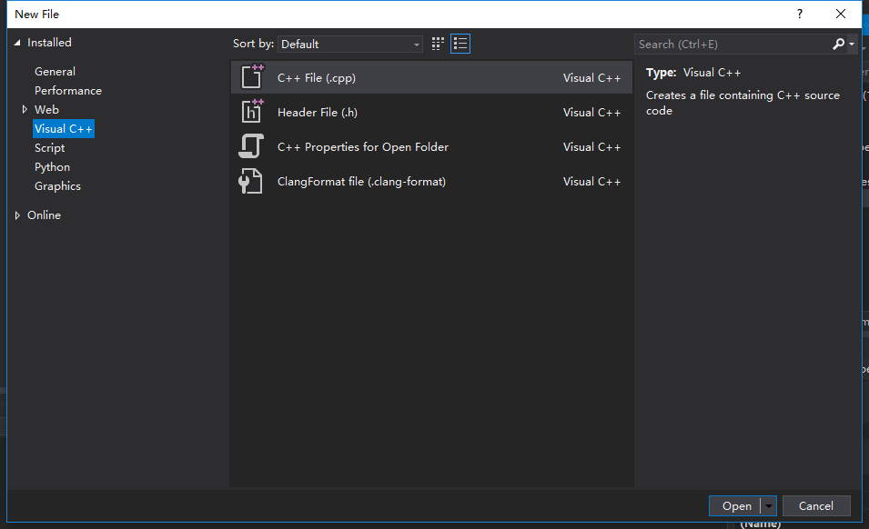
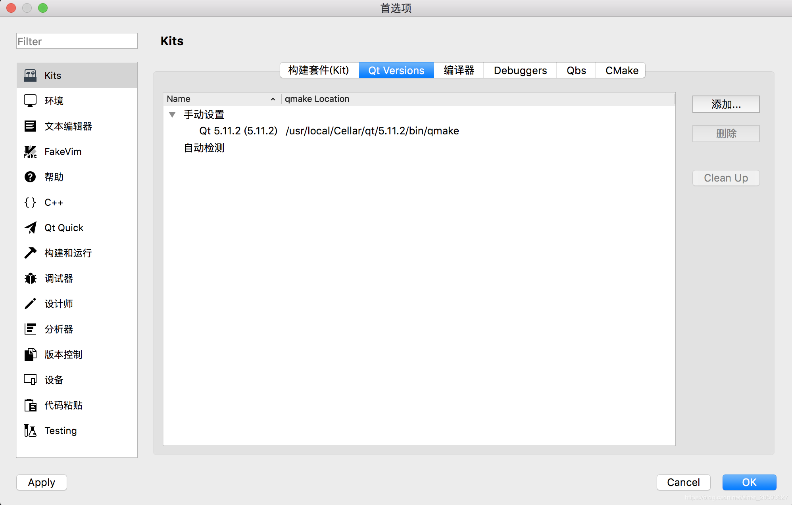
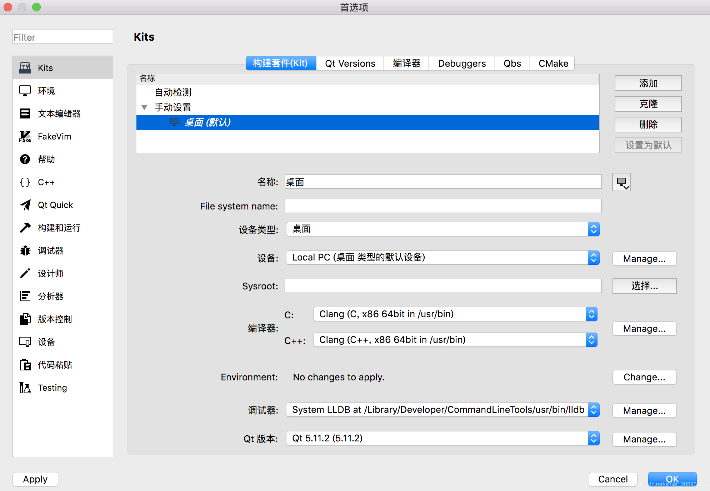
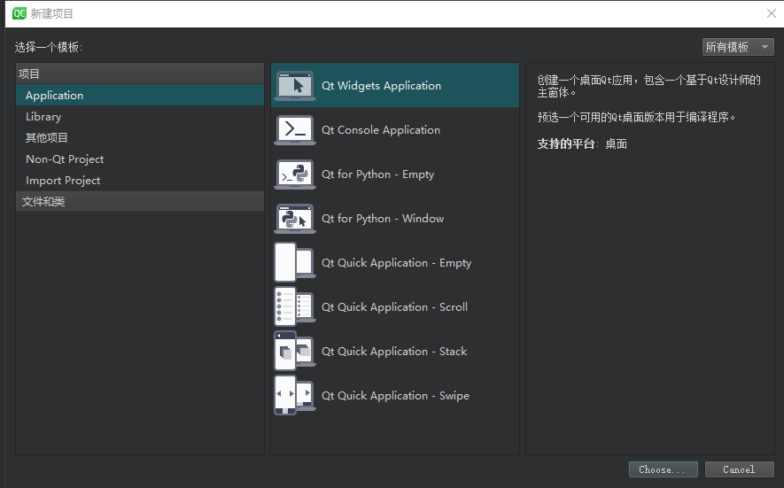

# 附录 

## 1. Code::Blocks 

### 1.1 Compiler

Settings -&gt; Compiler

#### 1.1.1 Tool Chain

#### 1.1.2 Search directory

"lib/gcc/x86\_64-w64-mingw32/8.1.0/include/c++",  
"lib/gcc/x86\_64-w64-mingw32/8.1.0/include/c++/x86\_64-w64-mingw32",  
"lib/gcc/x86\_64-w64-mingw32/8.1.0/include/c++/backward",  
"lib/gcc/x86\_64-w64-mingw32/8.1.0/include",  
 "include",  
 "x86\_64-w64-mingw32/include",  
 "lib/gcc/x86\_64-w64-mingw32/8.1.0/include-fixed"

## 2. Visual Studio

### 2.1 Installation

安装时选择的缓存目录必须是本地硬盘，否则建立项目时会提示未安装组件

### 2.2 Project

#### 2.2.1 New a project 

 

#### 2.2.2 add project files

## 3. QT 

### 3.1 Configuration

#### 3.1.1 No valid kits（macOS）

偏好设置-Kits-Qt Versions-添加路径qmake路径，如：/usr/local/Cellar/qt/5.11.2/bin/qmake

#### 3.1.2 编译找不到头文件（macOS）

1. 偏好设置-Kits-构建套件(Kit)-手动设置-桌面(默认)-Qt版本-Qt 5.11.2

2. 设置编译器C、C++为Clang

   

### 3.2 Project

1. 新建项目-Application-Qt Widgets Application
  

  - 设置项目路径

  - 选择基类：

    QWidgets、QMainWindows、QDialog

  

2. 添加类

## 4. Dev-c++
