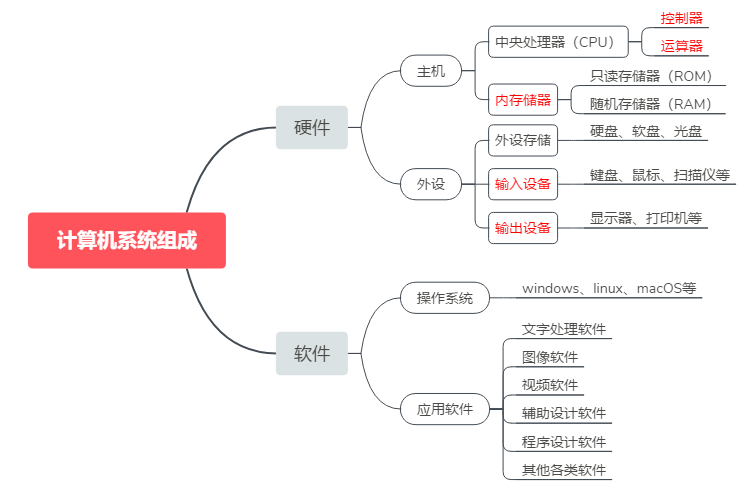
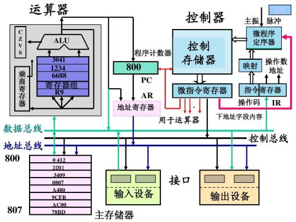
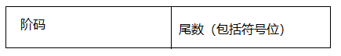

# 一、计算机基础知识

## 1.1 计算机的基本常识

### 1.1.1 计算机的产生与发展

  计算机的产生是20世纪最重要的科学技术大事件之一。世界上的第一台计算机（ENIAC）于1946年诞生在美国宾夕法尼亚大学，到目前为止，计算机的发展大致经历了四代：

1. 第一代电子管计算机，始于1946年，结构上以CPU为中心，使用计算机语言，速度慢，存储量小，主要用于数值计算；
2. 第二代晶体管计算机，始于1958年，结构上以存储器为中心，使用高级语言，应用范围扩大到数据处理和工业控制；
3. 第三代中小规模集成电路计算机，始于1964年，结构上仍以存储器为中心，增加了多种外部设备，软件得到了一定的发展，文字图象处理功能加强；
4. 第四代大规模和超大规模集成电路计算机，始于1971年，应用更广泛，很多核心部件可集成在一个或多个芯片上，从而出现了微型计算机。

  我国从1956年开始电子计算机的科研和教学工作，1983年研制成功1亿/秒运算速度的“银河”巨型计算机，1992年11月研制成功10亿/秒运算速度的“银河II”巨型计算机，1997年研制了每秒130亿运算速度的“银河III”巨型计算机。目前计算机的发展向微型化和巨型化、多媒体化和网络化方向发展。计算机的通信产业已经成为新型的高科技产业。计算机网络的出现，改变了人们的工作方式、学习方式、思维方式和生活方式。

### 1.1.2 计算机系统组成

计算机系统由软件和硬件两部分组成。硬件即构成计算机的电子元器件；软件即程序和有关文档资料。



到目前为止,电子计算机的工作原理均采用冯·诺依曼的存储程序方式,即把程序存储在计算机内,由计算机自动存取指令（计算机可执行的命令=操作码+操作数）并执行它。它包括：**控制器、运算器、存储器、输入设备、输出设备**五个部分。工作原理图如下：



**(1)  计算机的主要硬件**

- **输入设备**：键盘、鼠标、扫描仪等。

- **输出设备**：显示器、打印机、绘图仪等。

- **中央处理器**（CPU）：包括**控制器**和**运算器**，可以进行算术运算和逻辑运算；控制器是计算机的指挥系统，它的操作过程是取指令——分析指令——执行指令。

- **存储器**：具有记忆功能的物理器件，用于存储信息。存储器分为内存和外存。存储器的两个重要技术指标：存取速度和存储容量。内存的存取速度最快(与CPU速 度相匹配)，软盘存取速度最慢。存储容量是指存储的信息量，它用字节(Byte)作为基本单位，1字节用8位二进制数表示，1KB=1024B，1MB=1024KB，lGB=1024MB。

  ①内存是半导体存储器(主存）：它分为只读存储器(ROM)和随机存储器(RAM)和高速缓冲存储器（Cache)

  * ROM:只能读，不能用普通方法写入，通常由厂家生产时写入，写入后数据不容易丢失，也可以用特殊方法（如紫外线擦除（EPROM)或电擦除(EEPROM_)存储器)；

  * RAM:可读可写，断电后内容全部丢失；

  * Cache:因为CPU读写RAM的时间需要等待，为了减少等待时间，在RAM和CPU间需要设置高速缓存Cache,断电后其内容丢失。

  ②外存：磁性存储器——软盘和硬盘；光电存储器——光盘，它们可以作为永久存器。

**(2)计算机的软件**

  计算机的软件主要分为系统软件和应用软件两类：

  ①系统软件：为了使用和管理计算机的软件，主要有操作系统软件如，WINDOWS 95／98／ 2000／NT4.0、DOS 6.0、UNIX等；WINDOWS 95／98／2000／NT4.0是多任务可视化图形界面，而DOS是字符命令形式的单任务的操作系统。

  ②应用软件：为了某个应用目的而编写的软件，主要有辅助教学软件(CAI)、辅助设计软件(CAD)、文 字处理软件、工具软件以及其他的应用软件。

### 1.1.3 计算机中有关数及编码的知识

1. **计算机是智能化的电器设备**

     计算机就其本身来说是一个电器设备，为了能够快速存储、处理、传递信息，其内部采用了大量的电子元件，在这些电子元件中，电路的通和断、电压高低，这两种状态最容易实现，也最稳定、也最容易实现对电路本身的控制。我们将计算机所能表示这样的状态，用0，1来表示、即用二进制数表示计算机内部的所有运算和操作。

2. **二进制数的运算法则**

   由于二进制数运算非常简单，电器元件容易实现，所以计算机内部都用二进制编码进行数据的传送和计算。其主要法则是：

   `0+0=0 0+1=1 1+0=1 1+1=0   0*0=0 0*1=0 1*0=0 1*1=1`

3. **十进制与二进制、八进制、十六进制数之间的相互转换**

   (1)数的进制与基数

   计数的进制不同，则它们的基数也不相同，如下表所示：

   | 进制     | 基数                    | 特点       |
   | -------- | ----------------------- | ---------- |
   | 二进制   | 0 ,1                    | 逢二进一   |
   | 八进制   | 0,1,2,3,4,5,6,7         | 逢八进一   |
   | 十六进制 | 0,1,2,...,9,A,B,C,D,E,F | 逢十六进一 |
   | 十进制   | 0,1,2,3,4,5,6,7,8,9     | 逢十进一   |

   （2）数的权

   不同进制的数，基数不同，每位上代表的值的大小（权）也不相同。如：

   $$
   \begin{align}
   （219)10 &= 2*10^2 + 1*10^1 + 9*10^0\\
   （11010)2 &= 1*2^4+1*2^3+0*2^2+1*2^1+1*2^0\\
   （273)8 &= 2*8^2+7*8^1+3*8^0\\
   （27AF)16 &= 2*16^3+7*16^2+10*16^1+15*16^0\\
   \end{align}
   $$

   (3)十进制数转换任意进制

   - **整数转换**：将十进制整数除以所定的进制数,取余逆序。
      ` （39)10=(100111)2      (245)10=(365)8 `

   - **小数转换**：将十进制小数的小数部分乘以进制数取整,作为转换后的小数部分,直到为零或精确到小数点后几位。如：

     `（0.35)10=(0.01011)2        (0.125)10=(0.001)2`

     (4)任意进制的数转换十进制
     按权值展开, 如:
   $$
   \begin{align}
      （219)10 &= 2*10^2+1*10^1+9*10^0 \\
      （11010)2 &= 1*2^4+1*2^3+0*2^2+1*2^1+1*2^0 = 26 \\
      （273)8 &= 2*8^2+7*8^1+3*8^0 = 187 \\
       (7AF)16 &= 7*16^2+10*16^1+15*16^0 = 1867 \\
     \end{align}
   $$

4. **定点数与浮点数**
      定点数是指数据中的小数点位置固定不变。由于它受到字长范围的限制，所能表示的数的范围有限，计算结果容易溢出。浮点数的形式可写成：

   $$
   N = M*2^E
   $$

    (其中M代表尾数,E代表阶码）其形式如下：

   

   

5. **ASCII编码**
       由于计算机是电器设备，计算机内部用二进制数，这样对于从外部输入给计算机的所有信息必须用二进制数表示,并且对于各种命令、字符等都需要转换二进制数，这样就牵涉到信息符号转换成二进制数所采用的编码的问题，国际上统一用美国标准信息编码（ASCII）它可用7位二进制数表示，存储时用一个字节，它的最高位为0。因此基本的ASCII字符集有128个如:

   | 字符 | ASCII值 | 二进制编码   |
   | ---- | ------- | ------------ |
   | 0-9  | 48-57   | 00110000-... |
   | A-Z  | 65-90   | 01000001-... |
   | a-z  | 97-122  | 01100000-... |

   **ASCII编码如下：（ASCII中的0~31为控制字符；32~126为可显示字符；127为Delete(删除)命令）**

   | **ASCII值** | **控制字符** | **ASCII值** | **控制字符** | **ASCII值** | **控制字符** | **ASCII值** | **控制字符** |
   | ----------- | ------------ | ----------- | ------------ | ----------- | ------------ | ----------- | ------------ |
   | 0           | NUL          | 32          | (space)      | 64          | @            | 96          | 、           |
   | 1           | SOH          | 33          | ！           | 65          | A            | 97          | a            |
   | 2           | STX          | 34          | ”            | 66          | B            | 98          | b            |
   | 3           | ETX          | 35          | #            | 67          | C            | 99          | c            |
   | 4           | EOT          | 36          | $            | 68          | D            | 100         | d            |
   | 5           | ENQ          | 37          | %            | 69          | E            | 101         | e            |
   | 6           | ACK          | 38          | &            | 70          | F            | 102         | f            |
   | 7           | BEL          | 39          | '            | 71          | G            | 103         | g            |
   | 8           | BS           | 40          | (            | 72          | H            | 104         | h            |
   | 9           | HT           | 41          | )            | 73          | I            | 105         | i            |
   | 10          | LF           | 42          | *            | 74          | J            | 106         | j            |
   | 11          | VT           | 43          | +            | 75          | K            | 107         | k            |
   | 12          | FF           | 44          | ,            | 76          | L            | 108         | l            |
   | 13          | CR           | 45          | -            | 77          | M            | 109         | m            |
   | 14          | SO           | 46          | .            | 78          | N            | 110         | n            |
   | 15          | SI           | 47          | /            | 79          | O            | 111         | o            |
   | 16          | DLE          | 48          | 0            | 80          | P            | 112         | p            |
   | 17          | DCI          | 49          | 1            | 81          | Q            | 113         | q            |
   | 18          | DC2          | 50          | 2            | 82          | R            | 114         | r            |
   | 19          | DC3          | 51          | 3            | 83          | X            | 115         | s            |
   | 20          | DC4          | 52          | 4            | 84          | T            | 116         | t            |
   | 21          | NAK          | 53          | 5            | 85          | U            | 117         | u            |
   | 22          | SYN          | 54          | 6            | 86          | V            | 118         | v            |
   | 23          | TB           | 55          | 7            | 87          | W            | 119         | w            |
   | 24          | CAN          | 56          | 8            | 88          | X            | 120         | x            |
   | 25          | EM           | 57          | 9            | 89          | Y            | 121         | y            |
   | 26          | SUB          | 58          | :            | 90          | Z            | 122         | z            |
   | 27          | ESC          | 59          | ;            | 91          | [            | 123         | {            |
   | 28          | FS           | 60          | <            | 92          | \            | 124         | \|           |
   | 29          | GS           | 61          | =            | 93          | ]            | 125         | }            |
   | 30          | RS           | 62          | >            | 94          | ^            | 126         | ~            |
   | 31          | US           | 63          | ?            | 95          | —            | 127         | DEL          |

**下表为控制字符释义。**

| **十进制** | **十六进制** | **字符意义**  | **十进制** | **十六进制** | **字符**意义 |
| ---------- | ------------ | ------------- | ---------- | ------------ | ------------ |
| 0          | 00           | 空            | 16         | 10           | 数据链路转意 |
| 1          | 01           | 头标开始      | 17         | 11           | 设备控制 1   |
| 2          | 02           | 正文开始      | 18         | 12           | 设备控制 2   |
| 3          | 03           | 正文结束      | 19         | 13           | 设备控制 3   |
| 4          | 04           | 传输结束      | 20         | 14           | 设备控制 4   |
| 5          | 05           | 查询          | 21         | 15           | 反确认       |
| 6          | 06           | 确认          | 22         | 16           | 同步空闲     |
| 7          | 07           | 震铃          | 23         | 17           | 传输块结束   |
| 8          | 08           | backspace     | 24         | 18           | 取消         |
| 9          | 09           | 水平制表符    | 25         | 19           | 媒体结束     |
| 10         | 0A           | **换行/新行** | 26         | 1A           | 替换         |
| 11         | 0B           | 竖直制表符    | 27         | 1B           | 转意         |
| 12         | 0C           | 换页/新页     | 28         | 1C           | 文件分隔符   |
| 13         | 0D           | **回车**      | 29         | 1D           | 组分隔符     |
| 14         | 0E           | 移出          | 30         | 1E           | 记录分隔符   |
| 15         | 0F           | 移入          | 31         | 1F           | 单元分隔符   |

6. 汉字编码与汉字输入法

   （1）机内码
       ASCII码不能表示汉字，因此要有汉字信息交换码，我国国家标准是GB2312，它也被称作国际码。它由两个字节组成，两个字节的最高位都为1。GB2312共收纳6763个汉字，其中，一级汉字（常用字）3755个按汉字拼音字母顺序排列，二级汉字3008个按部首笔画次序排列。
   （2）汉字输入码（外码）
       目前，汉字输入法主要有键盘输入、文字识别和语音识别。键盘输入法是当前汉字输入的主要方法。它大体可以分为：

   - 流水码：如区位码、电报码、通信密码，优点重码律少，缺点难于记忆；

   - 音码：以汉语拼音为基准输入汉字，优点是容易掌握，但重码律高；

   - 形码：根据汉字的字型进行编码，优点重码少，但不容易掌握；

   - 音形码：将音码和形码结合起来，能减少重码律同时提高汉字输入速度。

   （3）汉字字模
       供计算机输出汉字（显示和打印）用的二进制信息叫汉字字形信息也称字模。通用汉字字模点阵规格有16×16，24×24，32×32，48×48，64×64，每个点在存储器中用一个二进制位(bit)存储，如一个16×16点阵汉字需要32个字节的存储空间。

### 1.1.4 原码、反码与补码

#### 1.1.4.1 机器数和真值

在学习原码, 反码和补码之前, 需要先了解机器数和真值的概念.

1. 机器数

   一个数在计算机中的二进制表示形式,  叫做这个数的机器数。机器数是带符号的，在计算机用一个数的最高位存放符号, 正数为0, 负数为1。

   比如，十进制中的数 +3 ，计算机字长为8位，转换成二进制就是00000011。如果是 -3 ，就是 10000011 。那么，这里的 00000011 和 10000011 就是机器数。

2. 真值

   因为第一位是符号位，所以机器数的形式值就不等于真正的数值。例如上面的有符号数 10000011，其最高位1代表负，其真正数值是 -3 而不是形式值131（10000011转换成十进制等于131）。所以，为区别起见，将带符号位的机器数对应的真正数值称为机器数的真值。

   例：0000 0001的真值 = +000 0001 = +1； 1000 0001的真值 = –000 0001 = –1

#### 1.1.4.2 原码, 反码, 补码的基础概念

对于一个数, 计算机要使用一定的编码方式进行存储. 原码, 反码, 补码是机器存储一个具体数字的编码方式。

1. **原码**

   原码就是符号位加上真值的绝对值, 即用第一位表示符号, 其余位表示值。原码是人脑最容易理解和计算的表示方式。以8位二进制为:

   ~~~
   [+1]原 = 0000 0001
   [-1]原 = 1000 0001
   ~~~

   第一位是符号位. 因为第一位是符号位, 所以8位二进制数的取值范围就是:

   ` [1111 1111 , 0111 1111] ` 即 ` [-127 , 127] ` 

2. **反码**

   反码的表示方法是：正数的反码是其本身；负数的反码是在其原码的基础上, 符号位不变，其余各个位取反。

   ~~~
   [+1] = [00000001]原 = [00000001]反
   [-1] = [10000001]原 = [11111110]反
   ~~~

   可见如果一个反码表示的是负数, 人脑无法直观的看出来它的数值。通常要将其转换成原码再计算。

3. **补码**

   补码的表示方法是：正数的补码就是其本身；负数的补码是在其原码的基础上, 符号位不变, 其余各位取反, 最后+1. (即在**反码的基础上+1**)

   ~~~
   [+1] = [00000001]原 = [00000001]反 = [00000001]补
   [-1] = [10000001]原 = [11111110]反 = [11111111]补
   ~~~

   对于负数, 补码表示方式也是人脑无法直观看出其数值的，通常也需要转换成原码在计算其数值。

#### 1.1.4.3 为何要使用原码, 反码和补码

现在我们知道了计算机可以有三种编码方式表示一个数。对于正数因为三种编码方式的结果都相同；对于负数原码, 反码和补码是完全不同的：

~~~
[+1] = [00000001]原 = [00000001]反 = [00000001]补
[-1] = [10000001]原 = [11111110]反 = [11111111]补
~~~

既然原码才是被人脑直接识别并用于计算表示方式, 为何还会有反码和补码呢？

因为人脑可以知道第一位是符号位, 在计算的时候我们会根据符号位, 选择对真值区域的加减。但是对于计算机, 加减乘数已经是最基础的运算, 要设计的尽量简单。计算机辨别"符号位"显然会让计算机的基础电路设计变得十分复杂! 于是人们想出了将符号位也参与运算的方法。我们知道, 根据运算法则减去一个正数等于加上一个负数, 即: 1-1 = 1 + (-1) = 0 , 所以机器可以只有加法而没有减法, 这样计算机运算的设计就更简单了。

~~~
1 - 1 = 1 + (-1) = [00000001]原 + [10000001]原 = [10000010]原 = -2
~~~

如果用原码表示, 让符号位也参与计算, 显然对于减法来说, 结果是**不正确**的。这也就是为何计算机内部不使用原码表示一个数。为了解决原码做减法的问题, 出现了反码，计算十进制的表达式: 1-1=0：

~~~
1 - 1 = 1 + (-1) = [0000 0001]原 + [1000 0001]原 = [0000 0001]反 + [1111 1110]反 
      = [1111 1111]反 = [1000 0000]原 = -0 
~~~

发现用反码计算减法, 结果的真值部分是正确的. 而唯一的问题其实就出现在"0"这个特殊的数值上。虽然人们理解上+0和-0是一样的, 但是0带符号是没有任何意义的. 而且会有[0000 0000]原和[1000 0000]原两个编码表示0。

于是补码的出现, 解决了0的符号以及两个编码的问题:

~~~
1-1 = 1 + (-1) = [0000 0001]原 + [1000 0001]原 = [0000 0001]补 + [1111 1111]补 
    = [0000 0000]补=[0000 0000]原
~~~

这样0用[0000 0000]表示, 而以前出现问题的-0则不存在了.而且可以用[1000 0000]表示-128：

~~~
(-1) + (-127) = [1000 0001]原 + [1111 1111]原 = [1111 1111]补 + [1000 0001]补 
              = [1000 0000]补
~~~

-1-127的结果应该是-128, 在用补码运算的结果中, [1000 0000]补 就是-128. 但是注意因为实际上是使用以前的-0的补码来表示-128, 所以**-128并没有原码和反码表示**。(对-128的补码表示[1000 0000]补，算出来的原码是[0000 0000]原, 这是不正确的)

使用补码, 不仅仅修复了0的符号以及存在两个编码的问题, 而且还能够多表示一个最低数。这就是为什么8位二进制, 使用原码或反码表示的范围为[-127, +127], 而使用补码表示的范围为[-128, 127]。因为机器使用补码, 所以对于编程中常用到的32位int类型, 可以表示范围是: [-2^31, 2^31-1] 因为第一位表示的是符号位，而使用补码表示时又可以多保存一个最小值。

#### 1.1.4.4 原码、反码、补码计算原理

计算机巧妙地把符号位参与运算, 并且将减法变成了加法, 背后蕴含了怎样的数学原理呢?

将钟表想象成是一个1位的12进制数. 如果当前时间是6点, 我希望将时间设置成4点, 需要怎么做呢？我们可以：

~~~
1. 往回拨2个小时: 6 - 2 = 4
2. 往前拨10个小时: (6 + 10) mod 12 = 4
3. 往前拨10+12=22个小时: (6+22) mod 12 =4
~~~

2,3方法中的mod是指取模操作, 16 mod 12 =4 即用16除以12后的余数是4。所以钟表往回拨(减法)的结果可以用往前拨(加法)替代！

现在的焦点就落在了如何用一个正数, 来替代一个负数。上面的例子我们能感觉出来一些端倪, 发现一些规律。但是数学是严谨的，不能靠感觉。首先介绍一个数学中相关的概念：**同余**。

1. **同余的概念**

   两个整数a，b，若它们除以整数m所得的余数相等，则称a，b对于模m同余。

   记作 ` a ≡ b (mod m) `, 读作 a 与 b 关于模 m 同余。

   ```
   4  mod 12 = 4
   16 mod 12 = 4
   28 mod 12 = 4
   ```

   所以4, 16, 28关于模 12 同余。

2. **计算原理**

   回到时钟的问题上：

   ~~~
   回拨2小时 = 前拨10小时
   回拨4小时 = 前拨8小时
   回拨5小时 = 前拨7小时
   ~~~

   结合上面学到的同余的概念.实际上:

   ~~~
   (-2) mod 12 = 10
   10 mod 12 = 10
   ~~~

   -2与10是同余的。

   ~~~
   (-4) mod 12 = 8
   8 mod 12 = 8
   ~~~

   -4与8是同余的。

   其实，要实现用正数替代负数, 只需要运用同余数的两个定理:

   - 反身性:  

     ~~~
     a ≡ a (mod m) 
     ~~~

   - 线性运算定理：（想看这个定理的证明, 请看：[同余线性运算定理](http://baike.baidu.com/view/79282.htm)）

     ~~~
     如果a ≡ b (mod m)，c ≡ d (mod m) 那么:
     (1)a ± c ≡ b ± d (mod m)
     (2)a * c ≡ b * d (mod m)
     ~~~

   所以，现在我们为一个负数, 找到了它的正数同余数。但是并不是7-2 = 7+10, 而是 7 -2 ≡ 7 + 10 (mod 12) , 即计算结果的余数相等。

     ~~~
     7 ≡ 7 (mod 12)
     (-2) ≡ 10 (mod 12)
     7 -2 ≡ 7 + 10 (mod 12)
     ~~~

   接下来回到二进制的问题上, 看一下: 2-1=1 的问题。

     ~~~
   2-1=2+(-1) = [0000 0010]原 + [1000 0001]原 = [0000 0010]反 + [1111 1110]反
     ~~~

   -1的反码表示是1111 1110。如果这里将[1111 1110]认为是原码, 则[1111 1110]原 = -126, 这里将符号位除去, 即认为是126。发现有如下规律:

     ~~~
   (-1) mod 127 = 126
   126 mod 127 = 126
     ~~~

   即:

     ~~~
   (-1) ≡ 126 (mod 127)
   2-1 ≡ 2+126 (mod 127)
     ~~~

   我们发现：2-1 与 2+126 的余数结果是相同的! 而这个余数, 正式我们的期望的计算结果: 2-1=1

   所以说一个数的反码, 实际上是这个数对于一个膜的同余数。而**这个膜就是所能表示的最大值**! 这就和钟表一样, 转了一圈后总能找到在可表示范围内的一个正确的数值！而2+126很显然相当于钟表（127）转过了一轮, 而因为符号位是参与计算的, 正好和溢出的最高位形成正确的运算结果。

   既然反码可以将减法变成加法, 那么现在计算机使用的补码呢? 为什么在反码的基础上加1, 还能得到正确的结果?

     ~~~
   2-1=2+(-1) = [0000 0010]原 + [1000 0001]原 = [0000 0010]补 + [1111 1111]补
     ~~~

   如果把[1111 1111]当成原码, 去除符号位, 则:

     ~~~
   [0111 1111]原 = 127
     ~~~

   其实, 在反码的基础上+1, 只是相当于增加了膜的值：

     ~~~
   (-1) mod 128 = 127
   127  mod 128 = 127
   2-1 ≡ 2+127 (mod 128)
     ~~~

   此时, 表盘相当于每128个刻度转一轮。所以用补码表示的运算结果最小值和最大值应该是[-128, 128]。但是由于0的特殊情况, 没有办法表示128, 所以补码的取值范围是[-128, 127]

### 1.1.5 逻辑运算

1. 逻辑运算

   逻辑与:同真则真

   逻辑或:有真就真

   逻辑非:你真我假

   逻辑异或:不同则真

2. 按位运算

   按位与∩：同1则1 如10010101∩10110111=10010101

   按位或∪：有1则1 如10010101∪10110111=10110111

3. 逻辑化简
   （1）交换律： A + B = B + A ，A·B = B·A
   （2）结合律： （A + B）+ C = A + （B + C ）， （A·B）·C = A·（B·C）
   （3）幂等律： A·A = A ， A + A = A
   （4）吸收律： A·（A + B ）= A ， A +（A·B）= A
   （5）分配律： A·（B + C ）= A·B + A·C ， A +（B·C）=（A + B）·（A + C）
   （6）互补律： A + A = 1 ，A·A = 0
   （7）非深入：A + B = A·B， A·B = A +B
   （8）0-1律： A + 0 = A ， A + 1 = 1 ， A·1 = A ， A·0 = 0
   例：化简函数 Q = AD + AD + AB + ACEF。这个函数有5个自变量，化简过程如下：
   $$
   \begin{align}
     Q &= AD + AD + AB + ACEF \\
   　　　　&= A + AB + ACEF \\
   　　　　&= A + ACEF \\
   　　　　&= A \\
   \end{align}
   $$


## 1.2 操作系统

