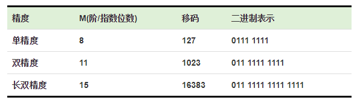
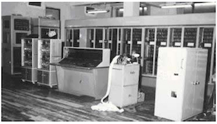
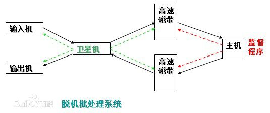
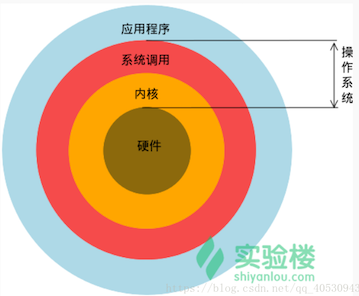
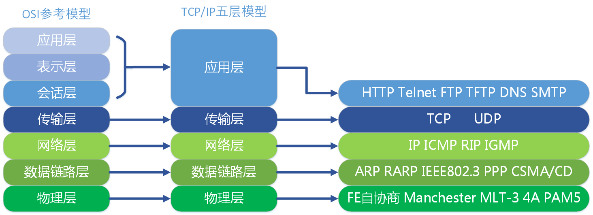

# 一、计算机基础知识

## 1.1 计算机的基本常识

### 1.1.1 计算机的产生与发展

  计算机的产生是20世纪最重要的科学技术大事件之一。世界上的第一台计算机（ENIAC）于1946年诞生在美国宾夕法尼亚大学，到目前为止，计算机的发展大致经历了四代：

1. 第一代：电子管计算机，始于1946年，结构上以CPU为中心，使用计算机语言，速度慢，存储量小，主要用于数值计算；1946年2月14号，取名为埃尼阿克(ENIAC)的第一台电子计算机在美国宾夕法尼亚大学诞生。但它体积庞大，并且属于程序外插型，使用起来并不方便。计算机运算几分钟或几小时，需要用几小时到几天来编插程序。第一台电子计算机是个庞然大物：长30.48米，宽6米，高2.4米，占地面积约170平方米，30个操作台，近18000个电子管，重达30英吨，耗电量150千瓦，造价48万美元。

   

2. 第二代：晶体管计算机，1954年，美国贝尔实验室研制成功第一台使用晶体管线路的计算机，取名“催迪克”（TRADIC），装有800个晶体管。1958年，美国的IBM公司制成了第一台全部使用晶体管的计算机RCA501型。晶体管计算机结构上以存储器为中心，使用高级语言，应用范围扩大到数据处理和工业控制。

   

3. 第三代：中小规模集成电路计算机，始于1964年，半导体工艺的发展，成功制造了集成电路。计算机也开始采用中小规模集成电路作为计算机的主要元件，结构上仍以存储器为中心，增加了多种外部设备，软件得到了一定的发展，文字图象处理功能加强；

   

4. 第四代：大规模和超大规模集成电路计算机，始于1971年，应用更广泛，很多核心部件可集成在一个或多个芯片上，从而出现了微型计算机。自1981年美国IBM公司推出第一代微型计算机IBM-PC以来，微型机以其执行结果精确、处理速度快捷、性价比高、轻便小巧等特点迅速进入社会各个领域，且技术不断更新、产品快速换代，从单纯的计算工具发展成为能够处理数字、符号、文字、语言、图形、图像、音频、视频等多种信息的强大多媒体工具。如今的微型机产品无论从运算速度、多媒体功能、软硬件支持还是易用性等方面都比早期产品有了很大飞跃。

   

我国从1956年开始电子计算机的科研和教学工作，1983年研制成功1亿/秒运算速度的“银河”巨型计算机，1992年11月研制成功10亿/秒运算速度的“银河II”巨型计算机，1997年研制了每秒130亿运算速度的“银河III”巨型计算机。目前计算机的发展向微型化和巨型化、多媒体化和网络化方向发展。计算机的通信产业已经成为新型的高科技产业。计算机网络的出现，改变了人们的工作方式、学习方式、思维方式和生活方式。

### 1.1.2 计算机系统组成

计算机系统由软件和硬件两部分组成。硬件即构成计算机的电子元器件；软件即程序和有关文档资料。


到目前为止,电子计算机的工作原理均采用**冯·诺依曼**的存储程序方式,即把程序存储在计算机内,由计算机自动存取指令（计算机可执行的命令=操作码+操作数）并执行它。它包括：**控制器、运算器、存储器、输入设备、输出设备**五个部分。工作原理图如下：


**(1)  计算机的主要硬件**

- **输入设备**：键盘、鼠标、扫描仪等。

- **输出设备**：显示器、打印机、绘图仪等。

- **中央处理器**（CPU）：包括**控制器**和**运算器**，可以进行算术运算和逻辑运算；控制器是计算机的指挥系统，它的操作过程是取指令——分析指令——执行指令。

- **存储器**：具有记忆功能的物理器件，用于存储信息。存储器分为内存和外存。存储器的两个重要技术指标：存取速度和存储容量。内存的存取速度最快(与CPU速 度相匹配)，软盘存取速度最慢。存储容量是指存储的信息量，它用字节(Byte)作为基本单位，1字节用8位二进制数表示，1KB=1024B，1MB=1024KB，lGB=1024MB。

  ①内存是半导体存储器(主存）：它分为只读存储器(ROM)和随机存储器(RAM)和高速缓冲存储器（Cache)

  * ROM:只能读，不能用普通方法写入，通常由厂家生产时写入，写入后数据不容易丢失，也可以用特殊方法（如紫外线擦除（EPROM)或电擦除(EEPROM_)存储器)；

  * RAM:可读可写，断电后内容全部丢失；

  * Cache:因为CPU读写RAM的时间需要等待，为了减少等待时间，在RAM和CPU间需要设置高速缓存Cache,断电后其内容丢失。

  ②外存：磁性存储器——软盘和硬盘；光电存储器——光盘，它们可以作为永久存器。

**(2)计算机的软件**

  计算机的软件主要分为系统软件和应用软件两类：

  ①系统软件：为了使用和管理计算机的软件，主要有操作系统软件如，WINDOWS 95／98／ 2000／NT4.0、DOS 6.0、UNIX等；WINDOWS 95／98／2000／NT4.0是多任务可视化图形界面，而DOS是字符命令形式的单任务的操作系统。

  ②应用软件：为了某个应用目的而编写的软件，主要有辅助教学软件(CAI)、辅助设计软件(CAD)、文 字处理软件、工具软件以及其他的应用软件。

### 1.1.3 计算机中有关数及编码的知识

#### 1.1.3.1 二进制数的运算法则

计算机就其本身来说是一个电器设备，为了能够快速存储、处理、传递信息，其内部采用了大量的电子元件，在这些电子元件中，电路的通和断、电压高低，这两种状态最容易实现，也最稳定、也最容易实现对电路本身的控制。我们将计算机所能表示这样的状态，用0，1来表示、即用二进制数表示计算机内部的所有运算和操作。

由于二进制数运算非常简单，电器元件容易实现，所以计算机内部都用二进制编码进行数据的传送和计算。其主要法则是：`0+0=0 0+1=1 1+0=1 1+1=0   0*0=0 0*1=0 1*0=0 1*1=1`

#### 1.1.3.2 十进制与其他进制之间的相互转换

1. **数的进制与基数**

   计数的进制不同，则它们的基数也不相同，如下表所示：

| 进制     | 基数                    | 特点       |
| -------- | ----------------------- | ---------- |
| 二进制   | 0 ,1                    | 逢二进一   |
| 八进制   | 0,1,2,3,4,5,6,7         | 逢八进一   |
| 十六进制 | 0,1,2,...,9,A,B,C,D,E,F | 逢十六进一 |
| 十进制   | 0,1,2,3,4,5,6,7,8,9     | 逢十进一   |

2. **数的权**

   不同进制的数，基数不同，每位上代表的值的大小（权）也不相同。如：

$$
\begin{align}
（219)10 &= 2*10^2 + 1*10^1 + 9*10^0\\
（11010)2 &= 1*2^4+1*2^3+0*2^2+1*2^1+1*2^0\\
（273)8 &= 2*8^2+7*8^1+3*8^0\\
（27AF)16 &= 2*16^3+7*16^2+10*16^1+15*16^0\\
\end{align}
$$

3. **十进制数转换任意进制**

- **整数转换**：将十进制整数除以所定的进制数,取余逆序。
     ` （39)10=(100111)2      (245)10=(365)8 ` 

     例如：把 (173)10 转换为二进制数


- **小数转换**：将十进制小数的**小数部分乘以进制数取整**，作为转换后的小数部分，直到**小数部分为零或精确到小数点后几位**。十进制小数转换成二进制小数，采用"**乘2取整，顺序排列**"法。具体做法是：用2乘十进制小数，可以得到积，将积的整数部分取出，再用2乘余下的小数部分，又得到一个积，再将积的整数部分取出，如此进行，直到积中的小数部分为零，或者达到所要求的精度为止，如：
     `（0.35)10=(0.01011)2        (0.125)10=(0.001)2`

     例如：把（0.8125）转换为二进制小数

     

4. 任意进制的数转换十进制
     按权值展开, 如:

$$
\begin{align}
   （219)10 &= 2*10^2+1*10^1+9*10^0 \\
   （11010)2 &= 1*2^4+1*2^3+0*2^2+1*2^1+1*2^0 = 26 \\
   （273)8 &= 2*8^2+7*8^1+3*8^0 = 187 \\
    (7AF)16 &= 7*16^2+10*16^1+15*16^0 = 1867 \\
  \end{align}
$$

#### 1.1.3.3 定点数与浮点数

1. **定点数**

   定点数是指数据中的小数点位置固定不变。通常将定点数据表示成纯小数或纯整数，为了将数表示成纯小数，通常把小数点固定在数值部分的最高位之前；而为了将数表示成纯整数，则把小数点固定在数值部分的最后面，如下图所示：

   

2. **浮点数**

   由于它受到字长范围的限制，所能表示的数的范围有限，计算结果容易溢出，一般计算机使用浮点数的形式，可写成：

$$
N = M*2^E
$$

   在内存中存储的形式为：


   **IEEE754标准**包含一组实数的二进制表示法，它有**符号位、指数位、尾数位**三部分组成。三种精度的浮点数各个部分位数如下：


   **正规化**：对于将某个实数表示为计算机浮点数，首先要将其正规化，也就是表示为形如：


   其中b是0或1，而p二进制数表示的指数位。

   - **数符**：浮点数的符号位，正数为0，负数为1。

   - **阶码**：或称**指数**，阶码的计算公式：阶数 + 移码（偏移量）,  阶码是需要作移码运算，在转换出来的二进制数里，阶数是111(十进制为7)，偏移量的计算是：2^(e-1)-1, e为阶码的位数，单精度阶码位数为8，因此偏移值是127（01111111)

   - **尾数**：小数点后面的数，即如1.0110010001*2^7，尾数为：0110010001。

     **注意**：可能有个疑问：小数点前面的1去哪里了？由于尾数部分是正规化表示，最左边部分**总是**`1`，所以这是直接隐藏掉，同时也节省了1个位出来存储小数，提高精度。

   **移码**：因为指数p有正有负，那么在8位的指数位中我们就要拿出第一位来指示符号，这样显然会造成不必要的浪费。给指数加上移码，就能保证结果总是一个非负数，也就可以将8个指数位都利用起来。对于有M个指数位的精度，其移码为：


   这样就得到上面三种精度的移码：



   以双精度(Double)的为例。双精度的指数位有11位。这样可以表示的数是从000 0000 0000到111 1111 1111，也就是指数加移码所表示的范围从0到2047，那么，减去移码1023，则可以表示的指数是-1023到1024。但是注意，-1023和1024作为他用（后面会说到）。所以实际上能表示数的指数是从-1022到1023。

   浮点数在C/C++中对应float和double类型，我们有必要知道浮点数在计算机中实际存储的内容。IEEE754标准中规定：

   - float单精度浮点数：用 1 位表示数字的符号，用 8 位来表示指数，用23 位来表示尾数，即小数部分。

   - double双精度浮点数：用 1 位表示符号，用 11 位表示指数，52 位表示尾数，其中指数域称为阶码。

     

例如：178.125

（1）先把浮点数分别把整数部分和小数部分转换成2进制

- 整数部分用除2取余的方法，求得：10110010

- 小数部分用乘2取整的方法，求得：001

  合起来即是：10110010.001。转换成二进制的浮点数，即把小数点移动到整数位只有1，即为：

  1.0110010001 * 2^111，111是二进制，由于左移了7位，所以是111

（2）把浮点数转换二进制后，这里基本已经可以得出对应3部分的值了

- **数符**：由于浮点数是正数，故为0。

- **阶码** : 阶数 + 偏移量 = 7 + 127 = (111)2 +( 01111111)2 = (10000110)2

- **尾数**：小数点后面的数，即0110010001

  那么最终的单精度实数，在内存中表示如下：

  


3. **非正规化：0的表示**

   从正规化中可知，无论如何浮点数都满足最左边是1。这就有一个严重问题：0没有办法被表示。为此，可以使用非正规化的表示方法，即让最左边默认为0，这样再另尾数也全部为0，就可以表示0了。

   新的问题又来了：根据什么判断是非正规化还是正规化呢？

   答案就是通过**指数部分**来反映。记得前面说过，双精度浮点数中，指数加移码的范围可以从0到2047，然而0和2047是作为他用的。在这里，**指数部分为0就代表着非正规化**。所以，当见到指数部分为0是，尾数部分就不再是1.bbbbb...而是0.bbbbb...了。再进一步，对于非正规化，可以看成是正规化中，小数点向左边跑了一位：1.bbbb....×2^-1023=0.1bbbb....×2×2^-1023==0.1bbbb....×2^-1022（只是概念上理解，小数第一位也不一定非要是1，如0.001010×2^-1022也可）。所以，非正规化下表示为：

   

   因为它的最左边不是1是0，实际上可以表示更小的数。双精度浮点数下，使用非正规化可以表示的**最小的正数**是
$$
0.00......01×2^{-1022} \\
即： \\
2^{-52} × 2^{-1022}= 2^{-1074} \\
$$


4. **无穷大与NaN**

   上面说到，在双精度浮点数中，指数为0表示非正规化，那么指数为2047（二进制是111 1111 1111b，即11位指数位全为1）就表示无穷大和NaN（Not a Number）。具体表现在，当指数是2047，当尾数,全为0就表示无穷大，当尾数不全为0就表示NaN。

#### 1.1.3.4 ASCII编码

由于计算机是电器设备，计算机内部用二进制数，这样对于从外部输入给计算机的所有信息必须用二进制数表示,并且对于各种命令、字符等都需要转换二进制数，这样就牵涉到信息符号转换成二进制数所采用的编码的问题，国际上统一用美国标准信息编码（ASCII）它可用7位二进制数表示，存储时用一个字节，它的最高位为0。因此基本的ASCII字符集有128个如:

| 字符 | ASCII值 | 二进制编码   |
| ---- | ------- | ------------ |
| 0-9  | 48-57   | 00110000-... |
| A-Z  | 65-90   | 01000001-... |
| a-z  | 97-122  | 01100000-... |

**ASCII编码如下：（ASCII中的0~31为控制字符；32~126为可显示字符；127为Delete(删除)命令）**

| **ASCII值** | **控制字符** | **ASCII值** | **控制字符** | **ASCII值** | **控制字符** | **ASCII值** | **控制字符** |
| ----------- | ------------ | ----------- | ------------ | ----------- | ------------ | ----------- | ------------ |
| 0           | NUL          | 32          | (space)      | 64          | @            | 96          | 、           |
| 1           | SOH          | 33          | ！           | 65          | A            | 97          | a            |
| 2           | STX          | 34          | ”            | 66          | B            | 98          | b            |
| 3           | ETX          | 35          | #            | 67          | C            | 99          | c            |
| 4           | EOT          | 36          | $            | 68          | D            | 100         | d            |
| 5           | ENQ          | 37          | %            | 69          | E            | 101         | e            |
| 6           | ACK          | 38          | &            | 70          | F            | 102         | f            |
| 7           | BEL          | 39          | '            | 71          | G            | 103         | g            |
| 8           | BS           | 40          | (            | 72          | H            | 104         | h            |
| 9           | HT           | 41          | )            | 73          | I            | 105         | i            |
| 10          | LF           | 42          | *            | 74          | J            | 106         | j            |
| 11          | VT           | 43          | +            | 75          | K            | 107         | k            |
| 12          | FF           | 44          | ,            | 76          | L            | 108         | l            |
| 13          | CR           | 45          | -            | 77          | M            | 109         | m            |
| 14          | SO           | 46          | .            | 78          | N            | 110         | n            |
| 15          | SI           | 47          | /            | 79          | O            | 111         | o            |
| 16          | DLE          | 48          | 0            | 80          | P            | 112         | p            |
| 17          | DCI          | 49          | 1            | 81          | Q            | 113         | q            |
| 18          | DC2          | 50          | 2            | 82          | R            | 114         | r            |
| 19          | DC3          | 51          | 3            | 83          | X            | 115         | s            |
| 20          | DC4          | 52          | 4            | 84          | T            | 116         | t            |
| 21          | NAK          | 53          | 5            | 85          | U            | 117         | u            |
| 22          | SYN          | 54          | 6            | 86          | V            | 118         | v            |
| 23          | TB           | 55          | 7            | 87          | W            | 119         | w            |
| 24          | CAN          | 56          | 8            | 88          | X            | 120         | x            |
| 25          | EM           | 57          | 9            | 89          | Y            | 121         | y            |
| 26          | SUB          | 58          | :            | 90          | Z            | 122         | z            |
| 27          | ESC          | 59          | ;            | 91          | [            | 123         | {            |
| 28          | FS           | 60          | <            | 92          | \            | 124         | \|           |
| 29          | GS           | 61          | =            | 93          | ]            | 125         | }            |
| 30          | RS           | 62          | >            | 94          | ^            | 126         | ~            |
| 31          | US           | 63          | ?            | 95          | —            | 127         | DEL          |

**下表为控制字符释义。**

| **十进制** | **十六进制** | **字符意义**  | **十进制** | **十六进制** | **字符**意义 |
| ---------- | ------------ | ------------- | ---------- | ------------ | ------------ |
| 0          | 00           | 空            | 16         | 10           | 数据链路转意 |
| 1          | 01           | 头标开始      | 17         | 11           | 设备控制 1   |
| 2          | 02           | 正文开始      | 18         | 12           | 设备控制 2   |
| 3          | 03           | 正文结束      | 19         | 13           | 设备控制 3   |
| 4          | 04           | 传输结束      | 20         | 14           | 设备控制 4   |
| 5          | 05           | 查询          | 21         | 15           | 反确认       |
| 6          | 06           | 确认          | 22         | 16           | 同步空闲     |
| 7          | 07           | 震铃          | 23         | 17           | 传输块结束   |
| 8          | 08           | backspace     | 24         | 18           | 取消         |
| 9          | 09           | 水平制表符    | 25         | 19           | 媒体结束     |
| 10         | 0A           | **换行/新行** | 26         | 1A           | 替换         |
| 11         | 0B           | 竖直制表符    | 27         | 1B           | 转意         |
| 12         | 0C           | 换页/新页     | 28         | 1C           | 文件分隔符   |
| 13         | 0D           | **回车**      | 29         | 1D           | 组分隔符     |
| 14         | 0E           | 移出          | 30         | 1E           | 记录分隔符   |
| 15         | 0F           | 移入          | 31         | 1F           | 单元分隔符   |

#### 1.1.3.5 汉字编码与汉字输入法

1. 机内码

   ASCII码不能表示汉字，因此要有汉字信息交换码，我国国家标准是GB2312，它也被称作国际码。它由两个字节组成，两个字节的最高位都为1。GB2312共收纳6763个汉字，其中，一级汉字（常用字）3755个按汉字拼音字母顺序排列，二级汉字3008个按部首笔画次序排列。

2. 汉字输入码（外码）

   目前，汉字输入法主要有键盘输入、文字识别和语音识别。键盘输入法是当前汉字输入的主要方法。它大体可以分为：

   - 流水码：如区位码、电报码、通信密码，优点重码律少，缺点难于记忆；
   - 音码：以汉语拼音为基准输入汉字，优点是容易掌握，但重码律高；
   - 形码：根据汉字的字型进行编码，优点重码少，但不容易掌握；
   - 音形码：将音码和形码结合起来，能减少重码律同时提高汉字输入速度。

3. 汉字字模

   供计算机输出汉字（显示和打印）用的二进制信息叫汉字字形信息也称字模。通用汉字字模点阵规格有16×16，24×24，32×32，48×48，64×64，每个点在存储器中用一个二进制位(bit)存储，如一个16×16点阵汉字需要32个字节的存储空间。

### 1.1.4 原码、反码与补码

#### 1.1.4.1 机器数和真值

在学习原码, 反码和补码之前, 需要先了解机器数和真值的概念.

1. 机器数

   一个数在计算机中的二进制表示形式,  叫做这个数的机器数。机器数是带符号的，在计算机用一个数的最高位存放符号, 正数为0, 负数为1。

   比如，十进制中的数 +3 ，计算机字长为8位，转换成二进制就是00000011。如果是 -3 ，就是 10000011 。那么，这里的 00000011 和 10000011 就是机器数。

2. 真值

   因为第一位是符号位，所以机器数的形式值就不等于真正的数值。例如上面的有符号数 10000011，其最高位1代表负，其真正数值是 -3 而不是形式值131（10000011转换成十进制等于131）。所以，为区别起见，将带符号位的机器数对应的真正数值称为机器数的真值。

   例：0000 0001的真值 = +000 0001 = +1； 1000 0001的真值 = –000 0001 = –1

#### 1.1.4.2 原码, 反码, 补码的基础概念

对于一个数, 计算机要使用一定的编码方式进行存储. 原码, 反码, 补码是机器存储一个具体数字的编码方式。

1. **原码**

   原码就是符号位加上真值的绝对值, 即用第一位表示符号, 其余位表示值。原码是人脑最容易理解和计算的表示方式。以8位二进制为:

   ~~~
   [+1]原 = 0000 0001
   [-1]原 = 1000 0001
   ~~~

   第一位是符号位. 因为第一位是符号位, 所以8位二进制数的取值范围就是:

   ` [1111 1111 , 0111 1111] ` 即 ` [-127 , 127] ` 

2. **反码**

   反码的表示方法是：正数的反码是其本身；负数的反码是在其原码的基础上, 符号位不变，其余各个位取反。

   ~~~
   [+1] = [00000001]原 = [00000001]反
   [-1] = [10000001]原 = [11111110]反
   ~~~

   可见如果一个反码表示的是负数, 人脑无法直观的看出来它的数值。通常要将其转换成原码再计算。

3. **补码**

   补码的表示方法是：正数的补码就是其本身；负数的补码是在其原码的基础上, 符号位不变, 其余各位取反, 最后+1. (即在**反码的基础上+1**)

   ~~~
   [+1] = [00000001]原 = [00000001]反 = [00000001]补
   [-1] = [10000001]原 = [11111110]反 = [11111111]补
   ~~~

   对于负数, 补码表示方式也是人脑无法直观看出其数值的，通常也需要转换成原码在计算其数值。

#### 1.1.4.3 为何要使用原码, 反码和补码

现在我们知道了计算机可以有三种编码方式表示一个数。对于正数因为三种编码方式的结果都相同；对于负数原码, 反码和补码是完全不同的：

~~~
[+1] = [00000001]原 = [00000001]反 = [00000001]补
[-1] = [10000001]原 = [11111110]反 = [11111111]补
~~~

既然原码才是被人脑直接识别并用于计算表示方式, 为何还会有反码和补码呢？

因为人脑可以知道第一位是符号位, 在计算的时候我们会根据符号位, 选择对真值区域的加减。但是对于计算机, 加减乘数已经是最基础的运算, 要设计的尽量简单。计算机辨别"符号位"显然会让计算机的基础电路设计变得十分复杂! 于是人们想出了将符号位也参与运算的方法。我们知道, 根据运算法则减去一个正数等于加上一个负数, 即: 1-1 = 1 + (-1) = 0 , 所以机器可以只有加法而没有减法, 这样计算机运算的设计就更简单了。

~~~
1 - 1 = 1 + (-1) = [00000001]原 + [10000001]原 = [10000010]原 = -2
~~~

如果用原码表示, 让符号位也参与计算, 显然对于减法来说, 结果是**不正确**的。这也就是为何计算机内部不使用原码表示一个数。为了解决原码做减法的问题, 出现了反码，计算十进制的表达式: 1-1=0：

~~~
1 - 1 = 1 + (-1) = [0000 0001]原 + [1000 0001]原 = [0000 0001]反 + [1111 1110]反 
      = [1111 1111]反 = [1000 0000]原 = -0 
~~~

发现用反码计算减法, 结果的真值部分是正确的. 而唯一的问题其实就出现在"0"这个特殊的数值上。虽然人们理解上+0和-0是一样的, 但是0带符号是没有任何意义的. 而且会有[0000 0000]原和[1000 0000]原两个编码表示0。

于是补码的出现, 解决了0的符号以及两个编码的问题:

~~~
1-1 = 1 + (-1) = [0000 0001]原 + [1000 0001]原 = [0000 0001]补 + [1111 1111]补 
    = [0000 0000]补=[0000 0000]原
~~~

这样0用[0000 0000]表示, 而以前出现问题的-0则不存在了.而且可以用[1000 0000]表示-128：

~~~
(-1) + (-127) = [1000 0001]原 + [1111 1111]原 = [1111 1111]补 + [1000 0001]补 
              = [1000 0000]补
~~~

-1-127的结果应该是-128, 在用补码运算的结果中, [1000 0000]补 就是-128. 但是注意因为实际上是使用以前的-0的补码来表示-128, 所以**-128并没有原码和反码表示**。(对-128的补码表示[1000 0000]补，算出来的原码是[0000 0000]原, 这是不正确的)

使用补码, 不仅仅修复了0的符号以及存在两个编码的问题, 而且还能够多表示一个最低数。这就是为什么8位二进制, 使用原码或反码表示的范围为[-127, +127], 而使用补码表示的范围为[-128, 127]。因为机器使用补码, 所以对于编程中常用到的32位int类型, 可以表示范围是: [-2^31, 2^31-1] 因为第一位表示的是符号位，而使用补码表示时又可以多保存一个最小值。

#### 1.1.4.4 原码、反码、补码计算原理

计算机巧妙地把符号位参与运算, 并且将减法变成了加法, 背后蕴含了怎样的数学原理呢?

将钟表想象成是一个1位的12进制数. 如果当前时间是6点, 我希望将时间设置成4点, 需要怎么做呢？我们可以：

~~~
1. 往回拨2个小时: 6 - 2 = 4
2. 往前拨10个小时: (6 + 10) mod 12 = 4
3. 往前拨10+12=22个小时: (6+22) mod 12 =4
~~~

2,3方法中的mod是指取模操作, 16 mod 12 =4 即用16除以12后的余数是4。所以钟表往回拨(减法)的结果可以用往前拨(加法)替代！

现在的焦点就落在了如何用一个正数, 来替代一个负数。上面的例子我们能感觉出来一些端倪, 发现一些规律。但是数学是严谨的，不能靠感觉。首先介绍一个数学中相关的概念：**同余**。

1. **同余的概念**

   两个整数a，b，若它们除以整数m所得的余数相等，则称a，b对于模m同余。

   记作 ` a ≡ b (mod m) `, 读作 a 与 b 关于模 m 同余。

   ```
   4  mod 12 = 4
   16 mod 12 = 4
   28 mod 12 = 4
   ```

   所以4, 16, 28关于模 12 同余。

2. **计算原理**

   回到时钟的问题上：

   ~~~
   回拨2小时 = 前拨10小时
   回拨4小时 = 前拨8小时
   回拨5小时 = 前拨7小时
   ~~~

   结合上面学到的同余的概念.实际上:

   ~~~
   (-2) mod 12 = 10
   10 mod 12 = 10
   ~~~

   -2与10是同余的。

   ~~~
   (-4) mod 12 = 8
   8 mod 12 = 8
   ~~~

   -4与8是同余的。

   其实，要实现用正数替代负数, 只需要运用同余数的两个定理:

   - 反身性:  

     ~~~
     a ≡ a (mod m) 
     ~~~

   - 线性运算定理：（想看这个定理的证明, 请看：[同余线性运算定理](http://baike.baidu.com/view/79282.htm)）

     ~~~
     如果a ≡ b (mod m)，c ≡ d (mod m) 那么:
     (1)a ± c ≡ b ± d (mod m)
     (2)a * c ≡ b * d (mod m)
     ~~~

   所以，现在我们为一个负数, 找到了它的正数同余数。但是并不是7-2 = 7+10, 而是 7 -2 ≡ 7 + 10 (mod 12) , 即计算结果的余数相等。

     ~~~
     7 ≡ 7 (mod 12)
     (-2) ≡ 10 (mod 12)
     7 -2 ≡ 7 + 10 (mod 12)
     ~~~

   接下来回到二进制的问题上, 看一下: 2-1=1 的问题。

     ~~~
   2-1=2+(-1) = [0000 0010]原 + [1000 0001]原 = [0000 0010]反 + [1111 1110]反
     ~~~

   -1的反码表示是1111 1110。如果这里将[1111 1110]认为是原码, 则[1111 1110]原 = -126, 这里将符号位除去, 即认为是126。发现有如下规律:

     ~~~
   (-1) mod 127 = 126
   126 mod 127 = 126
     ~~~

   即:

     ~~~
   (-1) ≡ 126 (mod 127)
   2-1 ≡ 2+126 (mod 127)
     ~~~

   我们发现：2-1 与 2+126 的余数结果是相同的! 而这个余数, 正式我们的期望的计算结果: 2-1=1

   所以说一个数的反码, 实际上是这个数对于一个膜的同余数。而**这个膜就是所能表示的最大值**! 这就和钟表一样, 转了一圈后总能找到在可表示范围内的一个正确的数值！而2+126很显然相当于钟表（127）转过了一轮, 而因为符号位是参与计算的, 正好和溢出的最高位形成正确的运算结果。

   既然反码可以将减法变成加法, 那么现在计算机使用的补码呢? 为什么在反码的基础上加1, 还能得到正确的结果?

     ~~~
   2-1=2+(-1) = [0000 0010]原 + [1000 0001]原 = [0000 0010]补 + [1111 1111]补
     ~~~

   如果把[1111 1111]当成原码, 去除符号位, 则:

     ~~~
   [0111 1111]原 = 127
     ~~~

   其实, 在反码的基础上+1, 只是相当于增加了膜的值：

     ~~~
   (-1) mod 128 = 127
   127  mod 128 = 127
   2-1 ≡ 2+127 (mod 128)
     ~~~

   此时, 表盘相当于每128个刻度转一轮。所以用补码表示的运算结果最小值和最大值应该是[-128, 128]。但是由于0的特殊情况, 没有办法表示128, 所以补码的取值范围是[-128, 127]

### 1.1.5 逻辑运算

1. 逻辑运算

   逻辑与：同真则真

   逻辑或：有真就真

   逻辑非：你真我假

   逻辑异或：不同则真

2. 按位运算

   按位与∩：同1则1 如10010101∩10110111=10010101

   按位或∪：有1则1 如10010101∪10110111=10110111

3. 逻辑化简
   （1）交换律： A + B = B + A ，A·B = B·A

   （2）结合律： （A + B）+ C = A + （B + C ）， （A·B）·C = A·（B·C）

   （3）幂等律： A·A = A ， A + A = A

   （4）吸收律： A·（A + B ）= A ， A +（A·B）= A

   （5）分配律： A·（B + C ）= A·B + A·C ， A +（B·C）=（A + B）·（A + C）

   （6）互补律： A + A = 1 ，A·A = 0

   （7）非深入：A + B = A·B， A·B = A +B

   （8）0-1律： A + 0 = A ， A + 1 = 1 ， A·1 = A ， A·0 = 0

   例：化简函数 Q = AD + AD + AB + ACEF。这个函数有5个自变量，化简过程如下：
$$
   \begin{align}
     Q &= AD + AD + AB + ACEF \\
   　　　　&= A + AB + ACEF \\
   　　　　&= A + ACEF \\
   　　　　&= A \\
   \end{align}
$$


## 1.2 操作系统

### 1.2.1 为什么要有操作系统

现代的计算机系统主要是由一个或者多个处理器，主存，硬盘，键盘，鼠标，显示器，打印机，网络接口及其他输入输出设备组成。一般而言，现代计算机系统是一个复杂的系统。

- 其一：如果每位应用程序员都必须掌握该系统所有的细节，那就不可能再编写代码了（严重影响了程序员的开发效率：全部掌握这些细节可能需要一万年....）

- 其二：并且管理这些部件并加以优化使用，是一件极富挑战性的工作，于是，计算安装了一层软件（系统软件），称为操作系统。它的任务就是为用户程序提供一个更好、更简单、更清晰的计算机模型，并管理刚才提到的所有设备。

**总结：**

**程序员无法把所有的硬件操作细节都了解到，管理这些硬件并且加以优化使用是非常繁琐的工作，这个繁琐的工作就是操作系统来干的，有了他，程序员就从这些繁琐的工作中解脱了出来，只需要考虑自己的应用软件的编写就可以了，应用软件直接使用操作系统提供的功能来间接使用硬件。**

### 1.2.2 什么是操作系统

**精简的说的话，操作系统就是一个协调、管理和控制计算机硬件资源和软件资源的控制程序。操作系统所处的位置如图**

> 操作系统位于计算机硬件与应用软件之间，本质也是一个软件。操作系统由操作系统的内核（运行于内核态，管理硬件资源）以及系统调用（运行于用户态，为应用程序员写的应用程序提供系统调用接口）两部分组成，所以，单纯的说操作系统是运行于内核态的，是不准确的。

操作系统（Operating System，简称OS）是管理计算机硬件资源，控制其他程序运行并为用户提供交互操作界面的系统软件的集合。操作系统是计算机系统的关键组成部分，负责管理与配置内存、决定系统资源供需的优先次序、控制输入与输出设备、操作网络与管理文件系统等基本任务。

操作系统的种类很多，各种设备安装的操作系统可从简单到复杂，可从手机的嵌入式操作系统到超级计算机的大型操作系统。目前流行的现代操作系统主要有Android、BSD、iOS、Linux、Mac OS X、Windows、Windows Phone和z/OS等，除了Windows和z/OS等少数操作系统，大部分操作系统都为类Unix操作系统。


**细说的话，操作系统应该分成两部分功能：**

1. 隐藏了丑陋的硬件调用接口，为应用程序员提供调用硬件资源的更好，更简单，更清晰的模型（系统调用接口）。应用程序员有了这些接口后，就不用再考虑操作硬件的细节，专心开发自己的应用程序即可。
   例如：操作系统提供了文件这个抽象概念，对文件的操作就是对磁盘的操作，有了文件我们无需再去考虑关于磁盘的读写控制（比如控制磁盘转动，移动磁头读写数据等细节）。

2. 将应用程序对硬件资源的竞态请求变得有序化
   例如：很多应用软件其实是共享一套计算机硬件，比方说有可能有三个应用程序同时需要申请打印机来输出内容，那么a程序竞争到了打印机资源就打印，然后可能是b竞争到打印机资源，也可能是c，这就导致了无序，打印机可能打印一段a的内容然后又去打印c...,操作系统的一个功能就是将这种无序变得有序。

   

计算机由电脑硬件与软件共同组成，电脑的硬件就是 一些看得见摸得着的机器组件；软件是指系统软件与应用软件，系统软件指操作系统，应用软件由编程语言等编写。应用软件主要帮助人们完成各种需求。他们的关系由下到上依次是：**硬件-操作系统-软件（应用程序）**

计算机操作系统的发展经历了两个阶段：

1. 第一个阶段：单用户、单任务的操作系统，CP/M操作系统之后，还出现了C-DOS、M-DOS、TRS-DOS、S-DOS和MS-DOS等磁盘操作系统。
2. 第二个阶段：多用户多道作业和分时系统。其典型代表有UNIX、XENIX、OS/2以及Windows操作系统。

### 1.2.3 计算机操作系统的发展

1. **手工操作 —— 穿孔卡片**
   1946年第一台计算机诞生--20世纪50年代中期，计算机工作还在采用手工操作方式。此时还没有操作系统的概念。

      

   程序员将对应于程序和数据的已穿孔的纸带（或卡片）装入输入机，然后启动输入机把程序和数据输入计算机内存，接着通过控制台开关启动程序针对数据运行；计算完毕，打印机输出计算结果；用户取走结果并卸下纸带（或卡片）后，才让下一个用户上机。

   手工操作方式两个特点：
   （1）用户独占全机。不会出现因资源已被其他用户占用而等待的现象，但资源的利用率低。
   （2）CPU 等待手工操作。CPU的利用不充分。

   20世纪50年代后期，出现人机矛盾：手工操作的慢速度和计算机的高速度之间形成了尖锐矛盾，手工操作方式已严重损害了系统资源的利用率（使资源利用率降为百分之几，甚至更低），不能容忍。唯一的解决办法：只有摆脱人的手工操作，实现作业的自动过渡。这样就出现了成[批处理](https://baike.baidu.com/item/%E6%89%B9%E5%A4%84%E7%90%86)。

2. **批处理 —— 磁带存储**

     批处理系统：加载在计算机上的一个[系统软件](https://baike.baidu.com/item/%E7%B3%BB%E7%BB%9F%E8%BD%AF%E4%BB%B6)，在它的控制下，计算机能够自动地、成批地处理一个或多个用户的作业（这作业包括程序、数据和命令）。

     **（1）联机批处理系统**

     　　首先出现的是联机批处理系统，即作业的输入/输出由CPU来处理。 

     　　主机与输入机之间增加一个存储设备——磁带，在运行于主机上的监督程序的自动控制下，计算机可自动完成：成批地把输入机上的用户作业读入磁带，依次把磁带上的用户作业读入主机内存并执行并把计算结果向输出机输出。完成了上一批作业后，监督程序又从输入机上输入另一批作业，保存在磁带上，并按上述步骤重复处理。

     监督程序不停地处理各个作业，从而实现了作业到作业的自动转接，减少了作业建立时间和手工操作时间，有效克服了人机矛盾，提高了计算机的利用率。

     但是，在作业输入和结果输出时，主机的高速CPU仍处于空闲状态，等待慢速的输入/输出设备完成工作： 主机处于“忙等”状态。

     **（2）脱机批处理系统**

     　　为克服与缓解：高速主机与慢速外设的矛盾，提高CPU的利用率，又引入了[脱机批处理系统](https://baike.baidu.com/item/%E8%84%B1%E6%9C%BA%E6%89%B9%E5%A4%84%E7%90%86%E7%B3%BB%E7%BB%9F)，即输入/输出脱离主机控制。
     　　
     　　

     卫星机：一台不与主机直接相连而专门用于与输入/输出设备打交道的。

     其功能是：

     　　（1）从输入机上读取用户作业并放到输入磁带上。

     　　（2）从输出磁带上读取执行结果并传给输出机。

     　　这样，主机不是直接与慢速的输入/输出设备打交道，而是与速度相对较快的磁带机发生关系，有效缓解了主机与设备的矛盾。主机与卫星机可并行工作，二者分工明确，可以充分发挥主机的高速计算能力。
     　　
     　　脱机批处理系统：20世纪60年代应用十分广泛，它极大缓解了人机矛盾及主机与外设的矛盾。

     　　**不足**：每次主机内存中仅存放一道作业，每当它运行期间发出输入/输出（I/O）请求后，高速的CPU便处于等待低速的I/O完成状态，致使CPU空闲。为改善CPU的利用率，又引入了多道程序系统。

3. **多道程序系统**

     **（1）多道程序设计技术**

     所谓多道程序设计技术，就是指允许多个程序同时进入内存并运行。即同时把多个程序放入内存，并允许它们交替在CPU中运行，它们共享系统中的各种硬、软件资源。当一道程序因I/O请求而暂停运行时，CPU便立即转去运行另一道程序。首先来看弹道程序工作示例：

     

     在A程序计算时，I/O空闲， A程序I/O操作时，CPU空闲（B程序也是同样）；必须A工作完成后，B才能进入内存中开始工作，两者是串行的，全部完成共需时间=T1+T2。

     将A、B两道程序同时存放在内存中，它们在系统的控制下，可相互穿插、交替地在CPU上运行：当A程序因请求I/O操作而放弃CPU时，B程序就可占用CPU运行，这样 CPU不再空闲，而正进行A I/O操作的I/O设备也不空闲，显然，CPU和I/O设备都处于“忙”状态，大大提高了资源的利用率，从而也提高了系统的效率，A、B全部完成所需时间<<T1+T2。

     ​      

     多道程序设计技术不仅使CPU得到充分利用，同时改善I/O设备和内存的利用率，从而提高了整个系统的资源利用率和系统吞吐量（单位时间内处理作业（程序）的个数），最终提高了整个系统的效率。

     单处理机系统中多道程序运行时的特点：

     - 多道：计算机内存中同时存放几道相互独立的程序；

     - 宏观上并行：同时进入系统的几道程序都处于运行过程中，即它们先后开始了各自的运行，但都未运行完毕；

     - 微观上串行：实际上，各道程序轮流地用CPU，并交替运行。

     多道程序系统的出现，标志着操作系统渐趋成熟的阶段，先后出现了作业调度管理、处理机管理、存储器管理、外部设备管理、文件系统管理等功能。由于多个程序同时在计算机中运行，开始有了空间隔离的概念，只有内存空间的隔离，才能让数据更加安全、稳定。出了空间隔离之外，多道技术还第一次体现了时空复用的特点，遇到IO操作就切换程序，使得cpu的利用率提高了，计算机的工作效率也随之提高。

     **（2）多道批处理系统**

     20世纪60年代中期，在前述的批处理系统中，引入多道程序设计技术后形成多道批处理系统（简称：批处理系统）。

     它有两个特点：

     - 多道：系统内可同时容纳多个作业。这些作业放在外存中，组成一个后备队列，系统按一定的调度原则每次从后备作业队列中选取一个或多个作业进入内存运行，运行作业结束、退出运行和后备作业进入运行均由系统自动实现，从而在系统中形成一个自动转接的、连续的作业流。
     - 成批：在系统运行过程中，不允许用户与其作业发生交互作用，即：作业一旦进入系统，用户就不能直接干预其作业的运行。

     批处理系统的追求目标：提高系统资源利用率和系统吞吐量，以及作业流程的自动化。

     批处理系统的一个重要缺点：不提供人机交互能力，给用户使用计算机带来不便。

     虽然用户独占全机资源，并且直接控制程序的运行，可以随时了解程序运行情况。但这种工作方式因独占全机造成资源效率极低。种新的追求目标：既能保证计算机效率，又能方便用户使用计算机。 20世纪60年代中期，计算机技术和软件技术的发展使这种追求成为可能。

4. **分时系统**

     由于CPU速度不断提高和采用分时技术，一台计算机可同时连接多个用户终端，而每个用户可在自己的终端上联机使用计算机，好象自己独占机器一样。

     ​      

     　　**分时技术**：把处理机的运行时间分成很短的时间片，按时间片轮流把处理机分配给各联机作业使用。

     　　若某个作业在分配给它的时间片内不能完成其计算，则该作业暂时中断，把处理机让给另一作业使用，等待下一轮时再继续其运行。由于计算机速度很快，作业运行轮转得很快，给每个用户的印象是，好象他独占了一台计算机。而每个用户可以通过自己的终端向系统发出各种操作控制命令，在充分的人机交互情况下，完成作业的运行。

     具有上述特征的计算机系统称为分时系统，它允许多个用户同时联机使用计算机。

     　　特点：

     　　（1）多路性。若干个用户同时使用一台计算机。微观上看是各用户轮流使用计算机；宏观上看是各用户并行工作。

     　　（2）交互性。用户可根据系统对请求的响应结果，进一步向系统提出新的请求。这种能使用户与系统进行人机对话的工作方式，明显地有别于批处理系统，因而，分时系统又被称为交互式系统。

     　　（3）独立性。用户之间可以相互独立操作，互不干扰。系统保证各用户程序运行的完整性，不会发生相互混淆或破坏现象。

     　　（4）及时性。系统可对用户的输入及时作出响应。分时系统性能的主要指标之一是响应时间，它是指：从终端发出命令到系统予以应答所需的时间。

     　　**分时系统的主要目标**：对用户响应的及时性，即不至于用户等待每一个命令的处理时间过长。

     分时系统可以同时接纳数十个甚至上百个用户，由于内存空间有限，往往采用对换（又称交换）方式的存储方法。即将未“轮到”的作业放入磁盘，一旦“轮到”，再将其调入内存；而时间片用完后，又将作业存回磁盘（俗称“滚进”、“滚出“法），使同一存储区域轮流为多个用户服务。

     多用户分时系统是当今计算机操作系统中最普遍使用的一类操作系统。

     ​      **注意：分时系统的分时间片工作，在没有遇到IO操作的时候就用完了自己的时间片被切走了，这样的切换工作其实并没有提高cpu的效率，反而使得计算机的效率降低了。但是我们牺牲了一点效率，却实现了多个程序共同执行的效果，这样你就可以在计算机上一边听音乐一边聊qq了。**

5. **实时系统**

     　　  虽然多道批处理系统和分时系统能获得较令人满意的资源利用率和系统响应时间，但却不能满足实时控制与实时信息处理两个应用领域的需求。于是就产生了实时系统，即系统能够及时响应随机发生的外部事件，并在严格的时间范围内完成对该事件的处理。

     实时系统在一个特定的应用中常作为一种控制设备来使用。

     实时系统可分成两类：

     （1）实时控制系统。当用于飞机飞行、导弹发射等的自动控制时，要求计算机能尽快处理测量系统测得的数据，及时地对飞机或导弹进行控制，或将有关信息通过显示终端提供给决策人员。当用于轧钢、石化等工业生产过程控制时，也要求计算机能及时处理由各类传感器送来的数据，然后控制相应的执行机构。

     （2）实时信息处理系统。当用于预定飞机票、查询有关航班、航线、票价等事宜时，或当用于银行系统、情报检索系统时，都要求计算机能对终端设备发来的服务请求及时予以正确的回答。此类对响应及时性的要求稍弱于第一类。

     **实时操作系统的主要特点**：

     （1）及时响应。每一个信息接收、分析处理和发送的过程必须在严格的时间限制内完成。

     （2）高可靠性。需采取冗余措施，双机系统前后台工作，也包括必要的保密措施等。

     > 分时——现在流行的PC，服务器都是采用这种运行模式，即把CPU的运行分成若干时间片分别处理不同的运算请求 linux系统
     > 实时——一般用于单片机上、PLC等，比如电梯的上下控制中，对于按键等动作要求进行实时处理

6. 通用操作系统

     操作系统的三种基本类型：多道批处理系统、分时系统、实时系统。**通用操作系统：具有多种类型操作特征的操作系统。可以同时兼有多道批处理、分时、实时处理的功能，或其中两种以上的功能。**

     例如：实时处理+批处理=实时批处理系统。首先保证优先处理实时任务，插空进行批处理作业。常把实时任务称为前台作业，批作业称为后台作业。再如：分时处理+批处理=分时批处理系统。即：时间要求不强的作业放入“后台”（批处理）处理，需频繁交互的作业在“前台”（分时）处理，处理机优先运行“前台”作业。

       从上世纪60年代中期，国际上开始研制一些大型的通用操作系统。这些系统试图达到功能齐全、可适应各种应用范围和操作方式变化多端的环境的目标。但是，这些系统过于复杂和庞大，不仅付出了巨大的代价，且在解决其可靠性、可维护性和可理解性方面都遇到很大的困难。相比之下，UNIX操作系统却是一个例外。这是一个通用的多用户分时交互型的操作系统。它首先建立的是一个精干的核心，而其功能却足以与许多大型的操作系统相媲美，在核心层以外，可以支持庞大的软件系统。它很快得到应用和推广，并不断完善，对现代操作系统有着重大的影响。至此，操作系统的基本概念、功能、基本结构和组成都已形成并渐趋完善。

       进入20世纪80年代，大规模集成电路工艺技术的飞跃发展，微处理机的出现和发展，掀起了计算机大发展大普及的浪潮。一方面迎来了个人计算机的时代，同时又向计算机网络、分布式处理、巨型计算机和智能化方向发展。于是，操作系统有了进一步的发展，如：个人计算机操作系统、网络操作系统、分布式操作系统等。

     **（1）个人计算机操作系统**

     个人计算机上的操作系统是联机交互的单用户操作系统，它提供的联机交互功能与通用分时系统提供的功能很相似。由于是个人专用，因此一些功能会简单得多。然而，由于个人计算机的应用普及，对于提供更方便友好的用户接口和丰富功能的文件系统的要求会愈来愈迫切。

     **（2）网络操作系统**

     计算机网络：通过通信设施，将地理上分散的、具有自治功能的多个计算机系统互连起来，实现信息交换、资源共享、互操作和协作处理的系统。

     网络操作系统：在原来各自计算机操作系统上，按照网络体系结构的各个协议标准增加网络管理模块，其中包括：通信、资源共享、系统安全和各种网络应用服务。

     **（3）分布式操作系统**

     表面上看，分布式系统与计算机网络系统没有多大区别。分布式操作系统也是通过通信网络，将地理上分散的具有自治功能的数据处理系统或计算机系统互连起来，实现信息交换和资源共享，协作完成任务。——硬件连接相同。

     但有如下一些明显的区别：

     - 分布式系统要求一个统一的操作系统，实现系统操作的统一性。

     - 分布式操作系统管理分布式系统中的所有资源，它负责全系统的资源分配和调度、任务划分、信息传输和控制协调工作，并为用户提供一个统一的界面。

     - 用户通过这一界面，实现所需要的操作和使用系统资源，至于操作定在哪一台计算机上执行，或使用哪台计算机的资源，则是操作系统完成的，用户不必知道，此谓：系统的透明性。

     - 分布式系统更强调分布式计算和处理，因此对于多机合作和系统重构、坚强性和容错能力有更高的要求，希望系统有：更短的响应时间、高吞吐量和高可靠性。

### 1.2.4 DOS操作系统

#### 1.2.4.1 DOS(Disk Operating System)的组成

MS—DOS采用模块结构，它由五部分组成：ROM中的BIOS模块、IO．SYS模块、

MSDOS．SYS模块、COMMAND．COM模块和引导程序。
(1)BIOS模块：在PC机主板上有一个ROM芯片，该芯片中存有系统自测试程序，
            CMOS设置程序和基本输入输出程序(BIOS)。BIOS是一组程序和参
            表，其中程序部份是可以通过中断方式调用的一组驱动程序，参数
            给出外设的地址和参数。BIOS是计算机硬件和操作系统之间的接口
            通过它操作系统管理计算机硬件资源。

(2)IO．SYS模块：IO．SYS是MS—DOS和ROMBIOS之间的接口程序。它和RON
                BIOS一起完成系统设备的管理。
(3)MSDOS.SYS模块： MSDOS．SYS用于实现文件管理，包括文件管理、目录管理、内存管理等功能。它以功能调用的形式实现用户和MS—DOS之间的程序级接口。

(4)COMMAND．COM模块：COMMAND．COM的主要功能是负责接收、识别、解释和执行用户从键盘输入的MS—DOS命令。
(5)引导程序：引导程序又叫“引导记录”，其作用是检查当前盘上是否有两个系统文件，若有系统文件则把DOS系统从磁盘装人内存。一张系统盘上应该包含有：引导记录、IO．SYS、MSDOS．SYS和COMMAND．COM等模块。

#### 1.2.4.2 DOS的文件和目录

1)文件概念：文件是指记录在存储介质(如磁盘、光盘)上的一组相关信息的集合。

2)文件标识:驱动器号+路径+文件名(1到8各字符)+扩展名(1到3个字符代表文件的类型)

3)通配符:*代表从该位置起的一个或多个合法字符；?代表所在位置的任一个合法字符。

4）树形目录：DOS采用树形目录结构。由一个根目录和若干层子目录组成。这种目

录结构一是能够解决文件重名问题，即不同的目录可以包含相同的文件名或目录名；二是能够解决文件多而根目录容量有限带来的问题。在查找某个子目录下的一个文件时，要使用目录路径。指定路径有两种方法：绝对路径和相对路径。绝对路径是从根目录开始到文件所在目录的路径。例如要查找UCDOS子目录下的二级子目录DATA下的README．TXT文件，绝对路径为：＼UCDOS＼DATA。路径中第一个“＼”符号代表根目录。相对路径是从当前目录开始到文件所在目录的路径。当前目录指在不特意指定路径情况下DOS命令所处理的目录。例如系统提示符为：“C：＼UCDOS＼DATA>”，则DATA是当前目录。

#### 1.2.4.3 DOS命令

1. 内部命令

   (1)内部命令：当启动DOS系统时，计算机引导程序将系统以及常用的命令处理模块驻留在计算机的内存中，我们称之为内部命令。

   (2)常用的内部命令：

   - 目录命令：
     DIR(显示文件目录)
     MD、CD、RD(子目录的建立、进入、删除命令
   - 文件操作命令：
     COPY(复制命令)、DEL(删除命令)、REN(更改文件名)
     TYPE(显示文本文件内容)
   - 其他内部命令
     DATA、TIME、VER、CLS等    

2. 外部命令

   (1)外部命令：存储在外存储器上的DOS可执行的文件，这些文件程序所占的存储容量比较大，当用户使用外部命令时，计算机从外存调入内存，当执行完外部命令，就自动从内存中退出。

   (2)常用的外部命令

   - 磁盘格式化命令：  FORMAT  盘符  [／S)I／V]
         **作用**：能够清除原盘中所有信息，并将磁盘规范成计算机所能接受的格式，以便有效存储信息。
   - 磁盘复制命令：  DISKCOPY  [盘符1：][盘符2：]
         **作用**：能够进行软盘之间的全盘复制(以磁道方式)，不仅可以复制系统文件而且可以复制隐含文件。

### 1.2.5 Windows操作系统

Windows是一个多任务图形用户界面，该环境可以在基于MS-DOS的计算机上运行，在多任务图形用户环境下，Windows提供了一个基于下拉菜单、屏幕窗口和鼠标的界面，在该环境下运行的应用程序必须进行专门的设计才能发挥这些特征的优点。

Windows能够充分发挥计算机的作用，其图形接口能够组织用户程序和文件、同时运行几个用户程序、在文档之间移动和复制信息、在平台上进行应用程序的切换等。为了提高效率，Windows还提供了一些辅助程序，如字处理器、画笔及其他标准应用程序等。Windows具有以下主要特点:
    (1)图形化的用户界面
    Windows提供了一种不同于DOS系统下命令行的工作方式，它通过对窗口、图标、选单、对话框、命令按钮、滚动框等图形符号与画面的操作来实现对计算机的各种操作。
(2)标准化的操作界面

在Windows中，所有的操作都是通过窗口中的图形界面进行的。
    (3)多任务机制和执行性能
    在Windows中，平稳的多任务机制可以同时运行多道程序以及执行多项任务，各程序与各任务之间不仅转换容易，而且还可以方便地交换数据。
    (4)充分利用内存
    Winddws利用虚拟内存技术，允许应用程序超过640阳常规内存的运行空间，从而最大限度地利用了计算机系统的所有内存资源，从而使内存较小的微机也能运行大型的应用程序。
    (5)强大的联网功能
    在Windows中，可以简单直观地实现网络的安装、配置、浏览，从而可以更加方便地实现网络管理和资源共享。
    (6)丰富的多媒体功能
    Windows提供大量辅助程序，用以实现文字、图形、图像、声音、视频等多媒体功能，同时还支持其他厂商基于Windows标准开发的各种相应软件。
    (7)TryType技术
    TryType(真实字体)属于内建式比例字体，可以任意平滑放大与缩小。这种字体能使屏幕上显示的效果与实际打印机输出的信息完全一致，这就是所谓的“所见即所得”。
复制隐含文件。

### 1.2.6 Linux操作系统

#### 1.2.6.1 Linux简介

Linux内核最初只是由芬兰人李纳斯·托瓦兹（Linus Torvalds）在赫尔辛基大学上学时出于个人爱好而编写的。

Linux是一套免费使用和自由传播的类Unix操作系统，是一个基于POSIX和UNIX的多用户、多任务、支持多线程和多CPU的操作系统。Linux能运行主要的UNIX工具软件、应用程序和网络协议。它支持32位和64位硬件。Linux继承了Unix以网络为核心的设计思想，是一个性能稳定的多用户网络操作系统。

1. **Linux的发行版**：是将Linux内核与应用软件做一个打包。目前市面上较知名的发行版有：Ubuntu、RedHat、CentOS、Debian、Fedora、SuSE、OpenSUSE、Arch Linux、SolusOS 等。

2. **Linux 特点**

   Linux是一个网络操作系统（Network Operating System，NOS）网络操作系统则在一般操作系统的功能上增加了网络功能，具体包括：
   （1）实现网络中各计算机之间的通信和资源共享；
   （2）提供多种网络服务软件；
   （3）提供网络用户的应用程序接口；
   （4）它是由以Linus Torvalds为首的一批Internet上的志愿者开发的，完全免费，并与著名的网络操作系统UNIX完全兼容，是一个具有很高性能价格比的网络操作系统；
   （5）由于开放源代码与良好的模块化设计，从而使嵌入式应用成为可能；

3. **Linux应用领域**：

   今天各种场合都有使用各种Linux发行版，从嵌入式设备到超级计算机，并且在服务器领域确定了地位，通常服务器使用LAMP（Linux + Apache + MySQL + PHP）或LNMP（Linux + Nginx+ MySQL + PHP）组合。

   目前Linux不仅在家庭与企业中使用，并且在政府中也很受欢迎。

   - 巴西联邦政府由于支持Linux而世界闻名。
   - 有新闻报道俄罗斯军队自己制造的Linux发布版的，做为G.H.ost项目已经取得成果.
   - 印度的Kerala联邦计划在向全联邦的高中推广使用Linux。
   - 中华人民共和国为取得技术独立，在龙芯过程中排他性地使用Linux。
   - 在西班牙的一些地区开发了自己的Linux发布版，并且在政府与教育领域广泛使用，如Extremadura地区的gnuLinEx和Andalusia地区的Guadalinex。
   - 葡萄牙同样使用自己的Linux发布版Caixa Mágica，用于Magalh?es笔记本电脑和e-escola政府软件。
   - 法国和德国同样开始逐步采用Linux。

4. **Linux和Windows的区别**

   目前国内Linux更多的是应用于服务器上，而桌面操作系统更多使用的是 Windows。主要区别如下：

   | 比较     | Windows                                                      | Linux                                                        |
   | -------- | :----------------------------------------------------------- | :----------------------------------------------------------- |
   | 界面     | 界面统一，外壳程序固定所有Windows程序菜单几乎一致，快捷键也几乎相同 | 图形界面风格依发布版不同而不同，可能互不兼容。GNU/Linux的终端机是从UNIX传承下来，基本命令和操作方法也几乎一致。 |
   | 驱动程序 | 驱动程序丰富，版本更新频繁。默认安装程序里面一般包含有该版本发布时流行的硬件驱动程序，之后所出的新硬件驱动依赖于硬件厂商提供。对于一些老硬件，如果没有了原配的驱动有时很难支持。另外，有时硬件厂商未提供所需版本的Windows下的驱动，也会比较头痛。 | 由志愿者开发，由Linux核心开发小组发布，很多硬件厂商基于版权考虑并未提供驱动程序，尽管多数无需手动安装，但是涉及安装则相对复杂，使得新用户面对驱动程序问题（是否存在和安装方法）会一筹莫展。但是在开源开发模式下，许多老硬件尽管在Windows下很难支持的也容易找到驱动。HP、Intel、AMD等硬件厂商逐步不同程度支持开源驱动，问题正在得到缓解。 |
   | 使用     | 使用比较简单，容易入门。图形化界面对没有计算机背景知识的用户使用十分有利。 | 图形界面使用简单，容易入门。文字界面，需要学习才能掌握。     |
   | 学习     | 系统构造复杂、变化频繁，且知识、技能淘汰快，深入学习困难。   | 系统构造简单、稳定，且知识、技能传承性好，深入学习相对容易。 |
   | 软件     | 每一种特定功能可能都需要商业软件的支持，需要购买相应的授权。 | 大部分软件都可以自由获取，同样功能的软件选择较少。           |
   | 收费     | Linux 免费或少许费用                                         | 最新正版 Windows 10，需要付费购买                            |

5. **Linux的历史**

   - 1965 年，Bell 实验室、MIT、GE（通用电气公司）准备开发 Multics 系统，为了同时支持 300 个终端访问主机，但是 1969 年失败了；

     > 那时候并没有鼠标、键盘，输入设备，只有卡片机。因此，如果要测试某个程序，则需要将读卡纸插入卡片机，如果有错误，还需要重新来过；Multics：Multiplexed Information and Computing Service；

   - 1969 年，Ken Thompson（C语言之父）利用汇编语言开发了 File Server System（Unics，即 UNIX 的原型）；

     > 因为汇编语言对于硬件的依赖性，因此只能针对特定硬件； 只是为了移植一款“太空旅游”的游戏；

   - 1973 年，Dennis Ritchie 和 Ken Thompson 发明了 C 语言，而后写出了 UNIX 的内核；

     > 将 B 语言改成 C 语言，由此产生了 C 语言之父；90% 的代码是 C 语言写的，10% 的代码用汇编语言写的，因此移植时只要修改那 10% 的代码即可；

   - 1977 年，Berkeley 大学的 Bill Joy 针对他的机器修改了 UNIX 源码，称为BSD（Berkeley Software Distribution）；Bill Joy 是 Sun 公司的创始人；
   - 1979 年，UNIX 发布 System V，用于个人计算机；
   - 1984 年，因为 UNIX 规定“不能对学生提供源码”，Tanenbaum 老师自己编写兼容于 UNIX 的 Minix，用于教学；
   - 1984 年，Stallman 开始 GNU（GNU's Not Unix）项目，创办 FSF（Free Software Foundation）基金会；

     > 产品：GCC、Emacs、Bash Shell、GLIBC；倡导“自由软件”；GNU 的软件缺乏一个开放的平台运行，只能在 UNIX 上运行；自由软件指用户可以对软件做任何修改，甚至再发行，但是始终要挂着 GPL 的版权；自由软件是可以卖的，但是不能只卖软件，而是卖服务、手册等；

   - 1985 年，为了避免 GNU 开发的自由软件被其他人用作专利软件，因此创建 GPL（General Public License）版权声明；
   - 1988 年，MIT 为了开发 GUI，成立了研发 XFree86 的组织；
   - 1991 年，芬兰赫尔辛基大学的研究生 Linus Torvalds 基于 gcc、bash 开发了针对 386 机器的 Linux 内核；
   - 1994 年，Torvalds 发布 Linux-v1.0；
   - 1996 年，Torvalds 发布 Linux-v2.0，确定了 Linux 的吉祥物：企鹅。

#### 1.2.6.2 Linux系统的基本结构
Linux 就是一个操作系统，就像你多少已经了解的 Windows（xp，7，8）和 Mac OS 。至于操作系统是什么，就不用过多解释了，如果你学习过前面的入门课程，应该会有个基本概念了，这里简单介绍一下操作系统在整个计算机系统中的角色。



相对于Windows 系统，Linux 本身是没有图形界面的，在 Linux 发行版上看到的图形界面实质上都是运行在 Linux 系统之上的软件，类似 Windows95 之前的 Windows 的图形界面只是运行在 DOS 环境的一套软件。而 Linux 上的这套软件以前是 XFree86，现在是 xorg（X.Org），这套软件是通过 X 窗口系统（X Window System，常被称为 X11 或 X）实现的，其本身只是工具包及架构协议，而 xorg 是 X 架构规范的一个实现体，即：它是实现了 X 协议规范的一个提供图形界面服务的服务器，就像实现了 http 协议提供 web 服务的 Apache 。

如果只有服务器则不能实现一个完整的桌面环境的，还需要一个客户端，我们称为 X Client，如目前最流行的实现客户端功能的桌面环境 KDE，GNOME，XFCE，LXDE等。这也意味着在 Linux 上你可以自己选择安装不同的桌面环境，甚至可以定制自己的专属桌面。


#### 1.2.6.3 Linux启动

linux启动时我们会看到许多启动信息。

Linux系统的启动过程并不是大家想象中的那么复杂，其过程可以分为5个阶段：

- 内核的引导。
- 运行 init。
- 系统初始化。
- 建立终端 。
- 用户登录系统。

> init程序的类型：
>
> - **SysV:** init, CentOS 5之前, 配置文件： /etc/inittab。
> - **Upstart:** init,CentOS 6, 配置文件： /etc/inittab, /etc/init/*.conf。
> - **Systemd：** systemd, CentOS 7,配置文件： /usr/lib/systemd/system、 /etc/systemd/system。

1. **内核引导**

   当计算机打开电源后，首先是BIOS开机自检，按照BIOS中设置的启动设备（通常是硬盘）来启动。

   操作系统接管硬件以后，首先读入 /boot 目录下的内核文件。

   

2. **运行init**

   init 进程是系统所有进程的起点，你可以把它比拟成系统所有进程的老祖宗，没有这个进程，系统中任何进程都不会启动。init 程序首先是需要读取配置文件 /etc/inittab。

   

   **运行级别**

   许多程序需要开机启动。它们在Windows叫做"服务"（service），在Linux就叫做"守护进程"（daemon）。init进程的一大任务，就是去运行这些开机启动的程序。但是，不同的场合需要启动不同的程序，比如用作服务器时，需要启动Apache，用作桌面就不需要。Linux允许为不同的场合，分配不同的开机启动程序，这就叫做"运行级别"（runlevel）。也就是说，启动时根据"运行级别"，确定要运行哪些程序。

   

   Linux系统有7个运行级别(runlevel)：

   - 运行级别0：系统停机状态，系统默认运行级别不能设为0，否则不能正常启动

   - 运行级别1：单用户工作状态，root权限，用于系统维护，禁止远程登陆
   - 运行级别2：多用户状态(没有NFS)
   - 运行级别3：完全的多用户状态(有NFS)，登陆后进入控制台命令行模式
   - 运行级别4：系统未使用，保留
   - 运行级别5：X11控制台，登陆后进入图形GUI模式
   - 运行级别6：系统正常关闭并重启，默认运行级别不能设为6，否则不能正常启动

3. **系统初始化**

   在init的配置文件中有这么一行： si::sysinit:/etc/rc.d/rc.sysinit　它调用执行了/etc/rc.d/rc.sysinit，而rc.sysinit是一个bash shell的脚本，它主要是完成一些系统初始化的工作，rc.sysinit是每一个运行级别都要首先运行的重要脚本。

   它主要完成的工作有：激活交换分区，检查磁盘，加载硬件模块以及其它一些需要优先执行任务。

   ```
   l5:5:wait:/etc/rc.d/rc 5
   ```

   这一行表示以5为参数运行/etc/rc.d/rc，/etc/rc.d/rc是一个Shell脚本，它接受5作为参数，去执行/etc/rc.d/rc5.d/目录下的所有的rc启动脚本，/etc/rc.d/rc5.d/目录中的这些启动脚本实际上都是一些连接文件，而不是真正的rc启动脚本，真正的rc启动脚本实际上都是放在/etc/rc.d/init.d/目录下。

   而这些rc启动脚本有着类似的用法，它们一般能接受start、stop、restart、status等参数。

   /etc/rc.d/rc5.d/中的rc启动脚本通常是K或S开头的连接文件，对于以 S 开头的启动脚本，将以start参数来运行。

   而如果发现存在相应的脚本也存在K打头的连接，而且已经处于运行态了(以/var/lock/subsys/下的文件作为标志)，则将首先以stop为参数停止这些已经启动了的守护进程，然后再重新运行。

   这样做是为了保证是当init改变运行级别时，所有相关的守护进程都将重启。

   至于在每个运行级中将运行哪些守护进程，用户可以通过chkconfig或setup中的"System Services"来自行设定。

   

4. **建立终端**

   rc执行完毕后，返回init。这时基本系统环境已经设置好了，各种守护进程也已经启动了。

   init接下来会打开6个终端，以便用户登录系统。在inittab中的以下6行就是定义了6个终端：

   ```
   1:2345:respawn:/sbin/mingetty tty1
   2:2345:respawn:/sbin/mingetty tty2
   3:2345:respawn:/sbin/mingetty tty3
   4:2345:respawn:/sbin/mingetty tty4
   5:2345:respawn:/sbin/mingetty tty5
   6:2345:respawn:/sbin/mingetty tty6
   ```

   从上面可以看出在2、3、4、5的运行级别中都将以respawn方式运行mingetty程序，mingetty程序能打开终端、设置模式。

   同时它会显示一个文本登录界面，这个界面就是我们经常看到的登录界面，在这个登录界面中会提示用户输入用户名，而用户输入的用户将作为参数传给login程序来验证用户的身份。

5. **用户登录系统**

   一般来说，用户的登录方式有三种：

   - （1）命令行登录
   - （2）ssh登录
   - （3）图形界面登录

   

   对于运行级别为5的图形方式用户来说，他们的登录是通过一个图形化的登录界面。登录成功后可以直接进入 KDE、Gnome 等窗口管理器。而本文主要讲的还是文本方式登录的情况：当我们看到mingetty的登录界面时，我们就可以输入用户名和密码来登录系统了。

   Linux 的账号验证程序是 login，login 会接收 mingetty 传来的用户名作为用户名参数。

   然后 login 会对用户名进行分析：如果用户名不是 root，且存在 /etc/nologin 文件，login 将输出 nologin 文件的内容，然后退出。

   这通常用来系统维护时防止非root用户登录。只有/etc/securetty中登记了的终端才允许 root 用户登录，如果不存在这个文件，则 root 用户可以在任何终端上登录。/etc/usertty文件用于对用户作出附加访问限制，如果不存在这个文件，则没有其他限制。

6. **图形模式与文字模式的切换方式**

   Linux预设提供了六个命令窗口终端机让我们来登录。

   默认我们登录的就是第一个窗口，也就是tty1，这个六个窗口分别为tty1,tty2 … tty6，你可以按下Ctrl + Alt + F1 ~ F6 来切换它们。

   如果你安装了图形界面，默认情况下是进入图形界面的，此时你就可以按Ctrl + Alt + F1 ~ F6来进入其中一个命令窗口界面。

   当你进入命令窗口界面后再返回图形界面只要按下Ctrl + Alt + F7 就回来了。

   如果你用的vmware 虚拟机，命令窗口切换的快捷键为 Alt + Space + F1~F6. 如果你在图形界面下请按Alt + Shift + Ctrl + F1~F6 切换至命令窗口。 

   

7. **Linux 关机**

   在linux领域内大多用在服务器上，很少遇到关机的操作。毕竟服务器上跑一个服务是永无止境的，除非特殊情况下，不得已才会关机。

   正确的关机流程为：sync > shutdown > reboot > halt

   关机指令为：shutdown ，你可以man shutdown 来看一下帮助文档。

   例如你可以运行如下命令关机：

   ```
   sync 将数据由内存同步到硬盘中。
   
   shutdown 关机指令，你可以man shutdown 来看一下帮助文档。例如你可以运行如下命令关机：
   
   shutdown –h 10 ‘This server will shutdown after 10 mins’ 这个命令告诉大家，计算机将在10分钟后关机，并且会显示在登陆用户的当前屏幕中。
   
   shutdown –h now 立马关机
   
   shutdown –h 20:25 系统会在今天20:25关机
   
   shutdown –h +10 十分钟后关机
   
   shutdown –r now 系统立马重启
   
   shutdown –r +10 系统十分钟后重启
   
   reboot 就是重启，等同于 shutdown –r now
   
   halt 关闭系统，等同于shutdown –h now 和 poweroff
   ```

   最后总结一下，不管是重启系统还是关闭系统，首先要运行 **sync** 命令，把内存中的数据写到磁盘中。

   关机的命令有 **shutdown –h now halt poweroff** 和 **init 0** , 重启系统的命令有 **shutdown –r now reboot init 6**。

#### 1.2.6.4 Linux目录和文件

   1. Linux目录结构

      登录系统后，在当前命令窗口下输入命令：

      ```
       ls / 
      ```

      你会看到如下图所示:

      

      树状目录结构：

      

      以下是对这些目录的解释：

      - **/bin**：
        bin是Binary的缩写, 这个目录存放着最经常使用的命令。

      - **/boot：**
        这里存放的是启动Linux时使用的一些核心文件，包括一些连接文件以及镜像文件。

      - **/dev ：**
        dev是Device(设备)的缩写, 该目录下存放的是Linux的外部设备，在Linux中访问设备的方式和访问文件的方式是相同的。

      - **/etc：**
        这个目录用来存放所有的系统管理所需要的配置文件和子目录。

      - **/home**：
        用户的主目录，在Linux中，每个用户都有一个自己的目录，一般该目录名是以用户的账号命名的。

      - **/lib**：
        这个目录里存放着系统最基本的动态连接共享库，其作用类似于Windows里的DLL文件。几乎所有的应用程序都需要用到这些共享库。

      - **/lost+found**：
        这个目录一般情况下是空的，当系统非法关机后，这里就存放了一些文件。

      - **/media**：
        linux系统会自动识别一些设备，例如U盘、光驱等等，当识别后，linux会把识别的设备挂载到这个目录下。

      - **/mnt**：
        系统提供该目录是为了让用户临时挂载别的文件系统的，我们可以将光驱挂载在/mnt/上，然后进入该目录就可以查看光驱里的内容了。

      - **/opt**：
        这是给主机额外安装软件所摆放的目录。比如你安装一个ORACLE数据库则就可以放到这个目录下。默认是空的。

      - **/proc**：
        这个目录是一个虚拟的目录，它是系统内存的映射，我们可以通过直接访问这个目录来获取系统信息。
        这个目录的内容不在硬盘上而是在内存里，我们也可以直接修改里面的某些文件，比如可以通过下面的命令来屏蔽主机的ping命令，使别人无法ping你的机器：

        ```
        echo 1 > /proc/sys/net/ipv4/icmp_echo_ignore_all
        ```

      - **/root**：
        该目录为系统管理员，也称作超级权限者的用户主目录。

      - **/sbin**：
        s就是Super User的意思，这里存放的是系统管理员使用的系统管理程序。

      - **/selinux**：
        这个目录是Redhat/CentOS所特有的目录，Selinux是一个安全机制，类似于windows的防火墙，但是这套机制比较复杂，这个目录就是存放selinux相关的文件的。

      - **/srv**：
         该目录存放一些服务启动之后需要提取的数据。

      - **/sys**：

        这是linux2.6内核的一个很大的变化。该目录下安装了2.6内核中新出现的一个文件系统 sysfs 。sysfs文件系统集成了下面3种文件系统的信息：针对进程信息的proc文件系统、针对设备的devfs文件系统以及针对伪终端的devpts文件系统。

        该文件系统是内核设备树的一个直观反映。当一个内核对象被创建的时候，对应的文件和目录也在内核对象子系统中被创建。

      - **/tmp**：
        这个目录是用来存放一些临时文件的。

      - **/usr**：
         这是一个非常重要的目录，用户的很多应用程序和文件都放在这个目录下，类似于windows下的program files目录。

      - **/usr/bin：**
        系统用户使用的应用程序。

      - **/usr/sbin：**
        超级用户使用的比较高级的管理程序和系统守护程序。

      - **/usr/src：**
        内核源代码默认的放置目录。

      - **/var**：
        这个目录中存放着在不断扩充着的东西，我们习惯将那些经常被修改的目录放在这个目录下。包括各种日志文件。

      - **/run**：
        是一个临时文件系统，存储系统启动以来的信息。当系统重启时，这个目录下的文件应该被删掉或清除。如果你的系统上有 /var/run 目录，应该让它指向 run。

      在 Linux 系统中，有几个目录是比较重要的，平时需要注意不要误删除或者随意更改内部文件。

      **/etc**： 上边也提到了，这个是系统中的配置文件，如果你更改了该目录下的某个文件可能会导致系统不能启动。

      **/bin, /sbin, /usr/bin, /usr/sbin**: 这是系统预设的执行文件的放置目录，比如 ls 就是在/bin/ls 目录下的。值得提出的是，/bin, /usr/bin 是给系统用户使用的指令（除root外的通用户），而/sbin, /usr/sbin 则是给root使用的指令。 

      **/var**： 这是一个非常重要的目录，系统上跑了很多程序，那么每个程序都会有相应的日志产生，而这些日志就被记录到这个目录下，具体在/var/log 目录下，另外mail的预设放置也是在这里。

   2. Linux 文件与目录管理

      我们知道Linux的目录结构为树状结构，最顶级的目录为根目录 /。其他目录通过挂载可以将它们添加到树中，通过解除挂载可以移除它们。Linux文件和目录路径分为：绝对路径与相对路径。

      - **绝对路径：**
        路径的写法，由根目录 / 写起，例如： /usr/share/doc 这个目录。
      - **相对路径：**
        路径的写法，不是由 / 写起，例如由 /usr/share/doc 要到 /usr/share/man 底下时，可以写成： cd ../man 这就是相对路径的写法啦！

   3. 文件基本属性

      Linux系统是一种典型的多用户系统，不同的用户处于不同的地位，拥有不同的权限。为了保护系统的安全性，Linux系统对不同的用户访问同一文件（包括目录文件）的权限做了不同的规定。

      在Linux中我们可以使用ll或者ls –l命令来显示一个文件的属性以及文件所属的用户和组，如：

      ```
      [root@www /]# ls -l
      total 64
      dr-xr-xr-x   2 root root 4096 Dec 14  2012 bin
      dr-xr-xr-x   4 root root 4096 Apr 19  2012 boot
      ……
      ```

      实例中，bin文件的第一个属性用"d"表示。"d"在Linux中代表该文件是一个目录文件。

      在Linux中第一个字符代表这个文件是目录、文件或链接文件等等。

      - 当为[ **d** ]则是目录
      - 当为[ **-** ]则是文件；
      - 若是[ **l** ]则表示为链接文档(link file)；
      - 若是[ **b** ]则表示为装置文件里面的可供储存的接口设备(可随机存取装置)；
      - 若是[ **c** ]则表示为装置文件里面的串行端口设备，例如键盘、鼠标(一次性读取装置)。

      接下来的字符中，以三个为一组，且均为『rwx』 的三个参数的组合。其中，[ r ]代表可读(read)、[ w ]代表可写(write)、[ x ]代表可执行(execute)。 要注意的是，这三个权限的位置不会改变，如果没有权限，就会出现减号[ - ]而已。每个文件的属性由左边第一部分的10个字符来确定（如下图）。

      

      

      从左至右用0-9这些数字来表示。

      第0位确定文件类型，第1-3位确定属主（该文件的所有者）拥有该文件的权限。

      第4-6位确定属组（所有者的同组用户）拥有该文件的权限，第7-9位确定其他用户拥有该文件的权限。

      其中，第1、4、7位表示读权限，如果用"r"字符表示，则有读权限，如果用"-"字符表示，则没有读权限；第2、5、8位表示写权限，如果用"w"字符表示，则有写权限，如果用"-"字符表示没有写权限；第3、6、9位表示可执行权限，如果用"x"字符表示，则有执行权限，如果用"-"字符表示，则没有执行权限。

   4. Linux文件属主和属组

      ```
      [root@www /]# ls -l
      total 64
      drwxr-xr-x 2 root  root  4096 Feb 15 14:46 cron
      drwxr-xr-x 3 mysql mysql 4096 Apr 21  2014 mysql
      ……
      ```

      对于文件来说，它都有一个特定的所有者，也就是对该文件具有所有权的用户。

      同时，在Linux系统中，用户是按组分类的，一个用户属于一个或多个组。

      文件所有者以外的用户又可以分为文件所有者的同组用户和其他用户。

      因此，Linux系统按文件所有者、文件所有者同组用户和其他用户来规定了不同的文件访问权限。

      在以上实例中，mysql 文件是一个目录文件，属主和属组都为 mysql，属主有可读、可写、可执行的权限；与属主同组的其他用户有可读和可执行的权限；其他用户也有可读和可执行的权限。

      对于 root 用户来说，一般情况下，文件的权限对其不起作用。

#### 1.2.6.5 Linux常用命令

1. **处理目录的常用命令**

      接下来我们就来看几个常见的处理目录的命令吧：

      - ls: 列出目录
      - cd：切换目录
      - pwd：显示目前的目录
      - mkdir：创建一个新的目录
      - rmdir：删除一个空的目录
      - cp: 复制文件或目录
      - rm: 移除文件或目录
      - mv: 移动文件与目录，或修改文件与目录的名称

      你可以使用 *man [命令]* 来查看各个命令的使用文档，如 ：man cp。

      **ls (列出目录)**

      在Linux系统当中， ls 命令可能是最常被运行的。

      语法：

      ```
      [root@www ~]# ls [-aAdfFhilnrRSt] 目录名称
      [root@www ~]# ls [--color={never,auto,always}] 目录名称
      [root@www ~]# ls [--full-time] 目录名称
      ```

      选项与参数：

      - -a ：全部的文件，连同隐藏档( 开头为 . 的文件) 一起列出来(常用)
      - -d ：仅列出目录本身，而不是列出目录内的文件数据(常用)
      - -l ：长数据串列出，包含文件的属性与权限等等数据；(常用)

      将家目录下的所有文件列出来(含属性与隐藏档)

      ```
      [root@www ~]# ls -al ~
      ```

      **cd (切换目录)**

      cd是Change Directory的缩写，这是用来变换工作目录的命令。

      语法：

      ```
       cd [相对路径或绝对路径]
      #使用 mkdir 命令创建 runoob 目录
      [root@www ~]# mkdir runoob
      
      #使用绝对路径切换到 runoob 目录
      [root@www ~]# cd /root/runoob/
      
      #使用相对路径切换到 runoob 目录
      [root@www ~]# cd ./runoob/
      
      # 表示回到自己的家目录，亦即是 /root 这个目录
      [root@www runoob]# cd ~
      
      # 表示去到目前的上一级目录，亦即是 /root 的上一级目录的意思；
      [root@www ~]# cd ..
      ```

      

      **pwd (显示目前所在的目录)**

      pwd 是 **Print Working Directory** 的缩写，也就是显示目前所在目录的命令。

      ```
      [root@www ~]# pwd [-P]
      ```

      选项与参数：

      - **-P** ：显示出确实的路径，而非使用连结 (link) 路径。

      实例：单纯显示出目前的工作目录：

      ```
      [root@www ~]# pwd
      /root   <== 显示出目录啦～
      ```

      实例显示出实际的工作目录，而非连结档本身的目录名而已。

      ```
      [root@www ~]# cd /var/mail   <==注意，/var/mail是一个连结档
      [root@www mail]# pwd
      /var/mail         <==列出目前的工作目录
      [root@www mail]# pwd -P
      /var/spool/mail   <==怎么回事？有没有加 -P 差很多～
      [root@www mail]# ls -ld /var/mail
      lrwxrwxrwx 1 root root 10 Sep  4 17:54 /var/mail -> spool/mail
      # 看到这里应该知道为啥了吧？因为 /var/mail 是连结档，连结到 /var/spool/mail 
      # 所以，加上 pwd -P 的选项后，会不以连结档的数据显示，而是显示正确的完整路径啊！
      ```

      

      **mkdir (创建新目录)**

      如果想要创建新的目录的话，那么就使用mkdir (make directory)吧。

      语法：

      ```
      mkdir [-mp] 目录名称
      ```

      选项与参数：

      - -m ：配置文件的权限喔！直接配置，不需要看默认权限 (umask) 的脸色～
      - -p ：帮助你直接将所需要的目录(包含上一级目录)递归创建起来！

      实例：请到/tmp底下尝试创建数个新目录看看：

      ```
      [root@www ~]# cd /tmp
      [root@www tmp]# mkdir test    <==创建一名为 test 的新目录
      [root@www tmp]# mkdir test1/test2/test3/test4
      mkdir: cannot create directory `test1/test2/test3/test4': 
      No such file or directory       <== 没办法直接创建此目录啊！
      [root@www tmp]# mkdir -p test1/test2/test3/test4
      ```

      加了这个 -p 的选项，可以自行帮你创建多层目录！

      实例：创建权限为 **rwx--x--x** 的目录。

      ```
      [root@www tmp]# mkdir -m 711 test2
      [root@www tmp]# ls -l
      drwxr-xr-x  3 root  root 4096 Jul 18 12:50 test
      drwxr-xr-x  3 root  root 4096 Jul 18 12:53 test1
      drwx--x--x  2 root  root 4096 Jul 18 12:54 test2
      ```

      上面的权限部分，如果没有加上 -m 来强制配置属性，系统会使用默认属性。

      如果我们使用 -m ，如上例我们给予 -m 711 来给予新的目录 drwx--x--x 的权限。

      **rmdir (删除空的目录)**

      语法：

      ```
       rmdir [-p] 目录名称
      ```

      选项与参数：

      - **-p ：**连同上一级『空的』目录也一起删除

      删除 runoob 目录

      ```
      [root@www tmp]# rmdir runoob/
      ```

      将 mkdir 实例中创建的目录(/tmp 底下)删除掉！

      ```
      [root@www tmp]# ls -l   <==看看有多少目录存在？
      drwxr-xr-x  3 root  root 4096 Jul 18 12:50 test
      drwxr-xr-x  3 root  root 4096 Jul 18 12:53 test1
      drwx--x--x  2 root  root 4096 Jul 18 12:54 test2
      [root@www tmp]# rmdir test   <==可直接删除掉，没问题
      [root@www tmp]# rmdir test1  <==因为尚有内容，所以无法删除！
      rmdir: `test1': Directory not empty
      [root@www tmp]# rmdir -p test1/test2/test3/test4
      [root@www tmp]# ls -l        <==您看看，底下的输出中test与test1不见了！
      drwx--x--x  2 root  root 4096 Jul 18 12:54 test2
      ```

      利用 -p 这个选项，立刻就可以将 test1/test2/test3/test4 一次删除。

      不过要注意的是，这个 rmdir 仅能删除空的目录，你可以使用 rm 命令来删除非空目录。

      

      **cp (复制文件或目录)**

      cp 即拷贝文件和目录。

      语法:

      ```
      [root@www ~]# cp [-adfilprsu] 来源档(source) 目标档(destination)
      [root@www ~]# cp [options] source1 source2 source3 .... directory
      ```

      选项与参数：

      - **-a：**相当於 -pdr 的意思，至於 pdr 请参考下列说明；(常用)
      - **-d：**若来源档为连结档的属性(link file)，则复制连结档属性而非文件本身；
      - **-f：**为强制(force)的意思，若目标文件已经存在且无法开启，则移除后再尝试一次；
      - **-i：**若目标档(destination)已经存在时，在覆盖时会先询问动作的进行(常用)
      - **-l：**进行硬式连结(hard link)的连结档创建，而非复制文件本身；
      - **-p：**连同文件的属性一起复制过去，而非使用默认属性(备份常用)；
      - **-r：**递归持续复制，用於目录的复制行为；(常用)
      - **-s：**复制成为符号连结档 (symbolic link)，亦即『捷径』文件；
      - **-u：**若 destination 比 source 旧才升级 destination ！

      用 root 身份，将 root 目录下的 .bashrc 复制到 /tmp 下，并命名为 bashrc

      ```
      [root@www ~]# cp ~/.bashrc /tmp/bashrc
      [root@www ~]# cp -i ~/.bashrc /tmp/bashrc
      cp: overwrite `/tmp/bashrc'? n  <==n不覆盖，y为覆盖
      ```

      

      **rm (移除文件或目录)**

      语法：

      ```
       rm [-fir] 文件或目录
      ```

      选项与参数：

      - -f ：就是 force 的意思，忽略不存在的文件，不会出现警告信息；
      - -i ：互动模式，在删除前会询问使用者是否动作
      - -r ：递归删除啊！最常用在目录的删除了！这是非常危险的选项！！！
      - 

      将刚刚在 cp 的实例中创建的 bashrc 删除掉！

      ```
      [root@www tmp]# rm -i bashrc
      rm: remove regular file `bashrc'? y
      ```

      如果加上 -i 的选项就会主动询问喔，避免你删除到错误的档名！

      

      **mv (移动文件与目录，或修改名称)**

      语法：

      ```
      [root@www ~]# mv [-fiu] source destination
      [root@www ~]# mv [options] source1 source2 source3 .... directory
      ```

      选项与参数：

      - -f ：force 强制的意思，如果目标文件已经存在，不会询问而直接覆盖；
      - -i ：若目标文件 (destination) 已经存在时，就会询问是否覆盖！
      - -u ：若目标文件已经存在，且 source 比较新，才会升级 (update)

      复制一文件，创建一目录，将文件移动到目录中

      ```
      [root@www ~]# cd /tmp
      [root@www tmp]# cp ~/.bashrc bashrc
      [root@www tmp]# mkdir mvtest
      [root@www tmp]# mv bashrc mvtest
      ```

      将某个文件移动到某个目录去，就是这样做！

      将刚刚的目录名称更名为 mvtest2

      ```
      [root@www tmp]# mv mvtest mvtest2
      ```

2. **Linux 文件内容查看**

      Linux系统中使用以下命令来查看文件的内容：

      - cat  由第一行开始显示文件内容
      - tac  从最后一行开始显示，可以看出 tac 是 cat 的倒著写！
      - nl   显示的时候，顺道输出行号！
      - more 一页一页的显示文件内容
      - less 与 more 类似，但是比 more 更好的是，他可以往前翻页！
      - head 只看头几行
      - tail 只看尾巴几行

      可以使用 *man [命令]*来查看各个命令的使用文档，如 ：man cp。

      **cat**

      由第一行开始显示文件内容

      语法：

      ```
      cat [-AbEnTv]
      ```

      选项与参数：

      - -A ：相当於 -vET 的整合选项，可列出一些特殊字符而不是空白而已；
      - -b ：列出行号，仅针对非空白行做行号显示，空白行不标行号！
      - -E ：将结尾的断行字节 $ 显示出来；
      - -n ：列印出行号，连同空白行也会有行号，与 -b 的选项不同；
      - -T ：将 [tab] 按键以 ^I 显示出来；
      - -v ：列出一些看不出来的特殊字符

      检看 /etc/issue 这个文件的内容：

      ```
      [root@www ~]# cat /etc/issue
      CentOS release 6.4 (Final)
      Kernel \r on an \m
      ```

      **tac**

      tac与cat命令刚好相反，文件内容从最后一行开始显示，可以看出 tac 是 cat 的倒着写！如：

      ```
      [root@www ~]# tac /etc/issue
      
      Kernel \r on an \m
      CentOS release 6.4 (Final)
      ```

      **nl**

      显示行号

      语法：

      ```
      nl [-bnw] 文件
      ```

      选项与参数：

      - -b ：指定行号指定的方式，主要有两种：
        -b a ：表示不论是否为空行，也同样列出行号(类似 cat -n)；
        -b t ：如果有空行，空的那一行不要列出行号(默认值)；
      - -n ：列出行号表示的方法，主要有三种：
        -n ln ：行号在荧幕的最左方显示；
        -n rn ：行号在自己栏位的最右方显示，且不加 0 ；
        -n rz ：行号在自己栏位的最右方显示，且加 0 ；
      - -w ：行号栏位的占用的位数。

      实例一：用 nl 列出 /etc/issue 的内容 

      ```
      [root@www ~]# nl /etc/issue
           1  CentOS release 6.4 (Final)
           2  Kernel \r on an \m
      ```

      **more**

      一页一页翻动

      ```
      [root@www ~]# more /etc/man_db.config 
      #
      # Generated automatically from man.conf.in by the
      # configure script.
      #
      # man.conf from man-1.6d
      ....(中间省略)....
      --More--(28%)  <== 重点在这一行喔！你的光标也会在这里等待你的命令
      ```

      在 more 这个程序的运行过程中，你有几个按键可以按的：

      - 空白键 (space)：代表向下翻一页；
      - Enter         ：代表向下翻『一行』；
      - /字串         ：代表在这个显示的内容当中，向下搜寻『字串』这个关键字；
      - :f            ：立刻显示出档名以及目前显示的行数；
      - q             ：代表立刻离开 more ，不再显示该文件内容。
      - b 或 [ctrl]-b ：代表往回翻页，不过这动作只对文件有用，对管线无用。

      **less**

      一页一页翻动，以下实例输出/etc/man.config文件的内容：

      ```
      [root@www ~]# less /etc/man.config
      #
      # Generated automatically from man.conf.in by the
      # configure script.
      #
      # man.conf from man-1.6d
      ....(中间省略)....
      :   <== 这里可以等待你输入命令！
      ```

      less运行时可以输入的命令有：

      - 空白键    ：向下翻动一页；
      - [pagedown]：向下翻动一页；
      - [pageup]  ：向上翻动一页；
      - /字串     ：向下搜寻『字串』的功能；
      - ?字串     ：向上搜寻『字串』的功能；
      - n         ：重复前一个搜寻 (与 / 或 ? 有关！)
      - N         ：反向的重复前一个搜寻 (与 / 或 ? 有关！)
      - q         ：离开 less 这个程序；

      **head** 

      取出文件前面几行

      语法：

      ```
      head [-n number] 文件 
      ```

      选项与参数：

      - -n ：后面接数字，代表显示几行的意思

      ```
      [root@www ~]# head /etc/man.config
      ```

      默认的情况中，显示前面 10 行！若要显示前 20 行，就得要这样：

      ```
      [root@www ~]# head -n 20 /etc/man.config
      ```

      **tail** 

      取出文件后面几行

      语法：

      ```
      tail [-n number] 文件 
      ```

      选项与参数：

      - -n ：后面接数字，代表显示几行的意思
      - -f ：表示持续侦测后面所接的档名，要等到按下[ctrl]-c才会结束tail的侦测

      ```
      [root@www ~]# tail /etc/man.config
      # 默认的情况中，显示最后的十行！若要显示最后的 20 行，就得要这样：
      [root@www ~]# tail -n 20 /etc/man.config
      ```

      

3. **更改文件属性**

      **1、chgrp：更改文件属组**

      语法：

      ```
      chgrp [-R] 属组名 文件名
      ```

      参数选项

      - -R：递归更改文件属组，就是在更改某个目录文件的属组时，如果加上-R的参数，那么该目录下的所有文件的属组都会更改。

      **2、chown：更改文件属主，也可以同时更改文件属组**

      语法：

      ```
      chown [–R] 属主名 文件名
      chown [-R] 属主名：属组名 文件名
      ```

      进入 /root 目录（~）将install.log的拥有者改为bin这个账号：

      ```
      [root@www ~] cd ~
      [root@www ~]# chown bin install.log
      [root@www ~]# ls -l
      -rw-r--r--  1 bin  users 68495 Jun 25 08:53 install.log
      ```

      将install.log的拥有者与群组改回为root：

      ```
      [root@www ~]# chown root:root install.log
      [root@www ~]# ls -l
      -rw-r--r--  1 root root 68495 Jun 25 08:53 install.log
      ```

      **3、chmod：更改文件9个属性**

      Linux文件属性有两种设置方法，一种是数字，一种是符号。

      Linux文件的基本权限就有九个，分别是owner/group/others三种身份各有自己的read/write/execute权限。

      先复习一下刚刚上面提到的数据：文件的权限字符为：『-rwxrwxrwx』， 这九个权限是三个三个一组的！其中，我们可以使用数字来代表各个权限，各权限的分数对照表如下：

      - r:4
      - w:2
      - x:1

      每种身份(owner/group/others)各自的三个权限(r/w/x)分数是需要累加的，例如当权限为： [-rwxrwx---] 分数则是：

      - owner = rwx = 4+2+1 = 7
      - group = rwx = 4+2+1 = 7
      - others= --- = 0+0+0 = 0

      所以等一下我们设定权限的变更时，该文件的权限数字就是770啦！变更权限的指令chmod的语法是这样的：

      ```
       chmod [-R] xyz 文件或目录
      ```

      选项与参数：

      - xyz : 就是刚刚提到的数字类型的权限属性，为 rwx 属性数值的相加。
      - -R : 进行递归(recursive)的持续变更，亦即连同次目录下的所有文件都会变更

      举例来说，如果要将.bashrc这个文件所有的权限都设定启用，那么命令如下：

      ```
      [root@www ~]# ls -al .bashrc
      -rw-r--r--  1 root root 395 Jul  4 11:45 .bashrc
      [root@www ~]# chmod 777 .bashrc
      [root@www ~]# ls -al .bashrc
      -rwxrwxrwx  1 root root 395 Jul  4 11:45 .bashrc
      ```

      那如果要将权限变成 *-rwxr-xr--* 呢？那么权限的分数就成为 [4+2+1][4+0+1][4+0+0]=754。

      **符号类型改变文件权限**

      还有一个改变权限的方法，从之前的介绍中我们可以发现，基本上就九个权限分别是：

      - (1)user
      - (2)group 
      - (3)others

      那么我们就可以使用 **u, g, o** 来代表三种身份的权限！

      此外， **a** 则代表 **all**，即全部的身份。读写的权限可以写成 **r, w, x**，也就是可以使用下表的方式来看：

      

      如果我们需要将文件权限设置为 **-rwxr-xr--** ，可以使用 **chmod u=rwx,g=rx,o=r 文件名** 来设定:

      ```
      #  touch test1    // 创建 test1 文件
      # ls -al test1    // 查看 test1 默认权限
      -rw-r--r-- 1 root root 0 Nov 15 10:32 test1
      # chmod u=rwx,g=rx,o=r  test1    // 修改 test1 权限
      # ls -al test1
      -rwxr-xr-- 1 root root 0 Nov 15 10:32 test1
      ```

      而如果是要将权限去掉而不改变其他已存在的权限呢？例如要拿掉全部人的可执行权限，则：

      ```
      #  chmod  a-x test1
      # ls -al test1
      -rw-r--r-- 1 root root 0 Nov 15 10:32 test1
      ```

#### 1.2.6.6 Linux 用户和用户组管理

Linux系统是一个多用户多任务的分时操作系统，任何一个要使用系统资源的用户，都必须首先向系统管理员申请一个账号，然后以这个账号的身份进入系统。

用户的账号一方面可以帮助系统管理员对使用系统的用户进行跟踪，并控制他们对系统资源的访问；另一方面也可以帮助用户组织文件，并为用户提供安全性保护。

每个用户账号都拥有一个惟一的用户名和各自的口令。

用户在登录时键入正确的用户名和口令后，就能够进入系统和自己的主目录。 

实现用户账号的管理，要完成的工作主要有如下几个方面：

- 用户账号的添加、删除与修改。 
- 用户口令的管理。
- 用户组的管理。 

1. **Linux系统用户账号的管理**

   用户账号的管理工作主要涉及到用户账号的添加、修改和删除。

   添加用户账号就是在系统中创建一个新账号，然后为新账号分配用户号、用户组、主目录和登录Shell等资源。刚添加的账号是被锁定的，无法使用。

   **（1）添加新的用户账号使用useradd命令**，其语法如下：

   ```
   useradd 选项 用户名
   ```

   参数说明：

   - 选项:

     - -c comment 指定一段注释性描述。
     - -d 目录 指定用户主目录，如果此目录不存在，则同时使用-m选项，可以创建主目录。
     - -g 用户组 指定用户所属的用户组。
     - -G 用户组，用户组 指定用户所属的附加组。
     - -s Shell文件 指定用户的登录Shell。
     - -u 用户号 指定用户的用户号，如果同时有-o选项，则可以重复使用其他用户的标识号。

   - 用户名: 

     指定新账号的登录名。

   **实例1**

   ```
   # useradd –d /usr/sam -m sam
   ```

   此命令创建了一个用户sam，其中-d和-m选项用来为登录名sam产生一个主目录/usr/sam（/usr为默认的用户主目录所在的父目录）。

   **实例2**

   ```
   # useradd -s /bin/sh -g group –G adm,root gem
   ```

   此命令新建了一个用户gem，该用户的登录Shell是 `/bin/sh`，它属于group用户组，同时又属于adm和root用户组，其中group用户组是其主组。

   这里可能新建组：`#groupadd group及groupadd adm`

   增加用户账号就是在/etc/passwd文件中为新用户增加一条记录，同时更新其他系统文件如/etc/shadow, /etc/group等。

   Linux提供了集成的系统管理工具userconf，它可以用来对用户账号进行统一管理。

   **（2）删除帐号**

   如果一个用户的账号不再使用，可以从系统中删除。删除用户账号就是要将/etc/passwd等系统文件中的该用户记录删除，必要时还删除用户的主目录。

   删除一个已有的用户账号使用`userdel`命令，其格式如下：

   ```
   userdel 选项 用户名
   ```

   常用的选项是 **-r**，它的作用是把用户的主目录一起删除。

   例如：

   ```
   # userdel -r sam
   ```

   此命令删除用户sam在系统文件中（主要是/etc/passwd, /etc/shadow, /etc/group等）的记录，同时删除用户的主目录。

   **（3）修改帐号**

   修改用户账号就是根据实际情况更改用户的有关属性，如用户号、主目录、用户组、登录Shell等。

   修改已有用户的信息使用`usermod`命令，其格式如下：

   ```
   usermod 选项 用户名
   ```

   常用的选项包括`-c, -d, -m, -g, -G, -s, -u以及-o等`，这些选项的意义与`useradd`命令中的选项一样，可以为用户指定新的资源值。

   另外，有些系统可以使用选项：-l 新用户名

   这个选项指定一个新的账号，即将原来的用户名改为新的用户名。

   例如：

   ```
   # usermod -s /bin/ksh -d /home/z –g developer sam
   ```

   此命令将用户sam的登录Shell修改为ksh，主目录改为/home/z，用户组改为developer。

   **（4）用户口令的管理**

   用户管理的一项重要内容是用户口令的管理。用户账号刚创建时没有口令，但是被系统锁定，无法使用，必须为其指定口令后才可以使用，即使是指定空口令。

   指定和修改用户口令的Shell命令是`passwd`。超级用户可以为自己和其他用户指定口令，普通用户只能用它修改自己的口令。命令的格式为：

   ```
   passwd 选项 用户名
   ```

   可使用的选项：

   - -l 锁定口令，即禁用账号。
   - -u 口令解锁。
   - -d 使账号无口令。
   - -f 强迫用户下次登录时修改口令。

   如果默认用户名，则修改当前用户的口令。

   例如，假设当前用户是sam，则下面的命令修改该用户自己的口令：

   ```
   $ passwd 
   Old password:****** 
   New password:******* 
   Re-enter new password:*******
   ```

   如果是超级用户，可以用下列形式指定任何用户的口令：

   ```
   # passwd sam 
   New password:******* 
   Re-enter new password:*******
   ```

   普通用户修改自己的口令时，passwd命令会先询问原口令，验证后再要求用户输入两遍新口令，如果两次输入的口令一致，则将这个口令指定给用户；而超级用户为用户指定口令时，就不需要知道原口令。

   为了系统安全起见，用户应该选择比较复杂的口令，例如最好使用8位长的口令，口令中包含有大写、小写字母和数字，并且应该与姓名、生日等不相同。

   为用户指定空口令时，执行下列形式的命令：

   ```
   # passwd -d sam
   ```

   此命令将用户sam的口令删除，这样用户sam下一次登录时，系统就不再询问口令。

   passwd命令还可以用-l(lock)选项锁定某一用户，使其不能登录，例如：

   ```
   # passwd -l sam
   ```

2. **Linux系统用户组的管理**

   每个用户都有一个用户组，系统可以对一个用户组中的所有用户进行集中管理。不同Linux 系统对用户组的规定有所不同，如Linux下的用户属于与它同名的用户组，这个用户组在创建用户时同时创建。

   用户组的管理涉及用户组的添加、删除和修改。组的增加、删除和修改实际上就是对/etc/group文件的更新。

   **（1）增加一个新的用户组使用groupadd命令**。其格式如下：

   ```
   groupadd 选项 用户组
   ```

   可以使用的选项有：

   - -g GID 指定新用户组的组标识号（GID）。
   - -o 一般与-g选项同时使用，表示新用户组的GID可以与系统已有用户组的GID相同。

   **实例1**：

   ```
   # groupadd group1
   ```

   此命令向系统中增加了一个新组group1，新组的组标识号是在当前已有的最大组标识号的基础上加1。

   **实例2**：

   ```
   # groupadd -g 101 group2
   ```

   此命令向系统中增加了一个新组group2，同时指定新组的组标识号是101。

   **（2）如果要删除一个已有的用户组，使用groupdel命令**，其格式如下：

   ```
   groupdel 用户组
   ```

   **例如**：

   ```
   # groupdel group1
   ```

   此命令从系统中删除组group1。

   **（3）修改用户组的属性使用groupmod命令**。其语法如下：

   ```
   groupmod 选项 用户组
   ```

   常用的选项有：

   - -g GID 为用户组指定新的组标识号。
   - -o 与-g选项同时使用，用户组的新GID可以与系统已有用户组的GID相同。
   - -n新用户组 将用户组的名字改为新名字

   **实例1**：

   ```
   # groupmod -g 102 group2
   ```

   此命令将组group2的组标识号修改为102。

   **实例2**：

   ```
   # groupmod –g 10000 -n group3 group2
   ```

   此命令将组group2的标识号改为10000，组名修改为group3。

   **（4）如果一个用户同时属于多个用户组，那么用户可以在用户组之间切换，以便具有其他用户组的权限**。

   用户可以在登录后，使用命令newgrp切换到其他用户组，这个命令的参数就是目的用户组。例如：

   ```
   $ newgrp root
   ```

   这条命令将当前用户切换到root用户组，前提条件是root用户组确实是该用户的主组或附加组。类似于用户账号的管理，用户组的管理也可以通过集成的系统管理工具来完成。

3. 与用户账号有关的系统文件

   完成用户管理的工作有许多种方法，但是每一种方法实际上都是对有关的系统文件进行修改。

   与用户和用户组相关的信息都存放在一些系统文件中，这些文件包括/etc/passwd, /etc/shadow, /etc/group等。

   下面分别介绍这些文件的内容。

   ### 1、/etc/passwd文件是用户管理工作涉及的最重要的一个文件。

   Linux系统中的每个用户都在/etc/passwd文件中有一个对应的记录行，它记录了这个用户的一些基本属性。

   这个文件对所有用户都是可读的。它的内容类似下面的例子：

   ```
   ＃ cat /etc/passwd
   
   root:x:0:0:Superuser:/:
   daemon:x:1:1:System daemons:/etc:
   bin:x:2:2:Owner of system commands:/bin:
   sys:x:3:3:Owner of system files:/usr/sys:
   adm:x:4:4:System accounting:/usr/adm:
   uucp:x:5:5:UUCP administrator:/usr/lib/uucp:
   auth:x:7:21:Authentication administrator:/tcb/files/auth:
   cron:x:9:16:Cron daemon:/usr/spool/cron:
   listen:x:37:4:Network daemon:/usr/net/nls:
   lp:x:71:18:Printer administrator:/usr/spool/lp:
   sam:x:200:50:Sam san:/usr/sam:/bin/sh
   ```

   从上面的例子我们可以看到，/etc/passwd中一行记录对应着一个用户，每行记录又被冒号(:)分隔为7个字段，其格式和具体含义如下：

   ```
   用户名:口令:用户标识号:组标识号:注释性描述:主目录:登录Shell
   ```

   **（1）"用户名"是代表用户账号的字符串。**

   通常长度不超过8个字符，并且由大小写字母和/或数字组成。登录名中不能有冒号(:)，因为冒号在这里是分隔符。

   为了兼容起见，登录名中最好不要包含点字符(.)，并且不使用连字符(-)和加号(+)打头。

   **（2）“口令”一些系统中，存放着加密后的用户口令字。**

   虽然这个字段存放的只是用户口令的加密串，不是明文，但是由于/etc/passwd文件对所有用户都可读，所以这仍是一个安全隐患。因此，现在许多Linux 系统（如SVR4）都使用了shadow技术，把真正的加密后的用户口令字存放到/etc/shadow文件中，而在/etc/passwd文件的口令字段中只存放一个特殊的字符，例如“x”或者“*”。

   **（3）“用户标识号”是一个整数，系统内部用它来标识用户。**

   一般情况下它与用户名是一一对应的。如果几个用户名对应的用户标识号是一样的，系统内部将把它们视为同一个用户，但是它们可以有不同的口令、不同的主目录以及不同的登录Shell等。

   通常用户标识号的取值范围是0～65 535。0是超级用户root的标识号，1～99由系统保留，作为管理账号，普通用户的标识号从100开始。在Linux系统中，这个界限是500。

   **（4）“组标识号”字段记录的是用户所属的用户组。**

   它对应着/etc/group文件中的一条记录。

   **（5）“注释性描述”字段记录着用户的一些个人情况。**

   例如用户的真实姓名、电话、地址等，这个字段并没有什么实际的用途。在不同的Linux 系统中，这个字段的格式并没有统一。在许多Linux系统中，这个字段存放的是一段任意的注释性描述文字，用做finger命令的输出。

   **（6）“主目录”，也就是用户的起始工作目录。**

   它是用户在登录到系统之后所处的目录。在大多数系统中，各用户的主目录都被组织在同一个特定的目录下，而用户主目录的名称就是该用户的登录名。各用户对自己的主目录有读、写、执行（搜索）权限，其他用户对此目录的访问权限则根据具体情况设置。

   **（7）用户登录后，要启动一个进程，负责将用户的操作传给内核，这个进程是用户登录到系统后运行的命令解释器或某个特定的程序，即Shell。**

   Shell是用户与Linux系统之间的接口。Linux的Shell有许多种，每种都有不同的特点。常用的有sh(Bourne Shell), csh(C Shell), ksh(Korn Shell), tcsh(TENEX/TOPS-20 type C Shell), bash(Bourne Again Shell)等。

   系统管理员可以根据系统情况和用户习惯为用户指定某个Shell。如果不指定Shell，那么系统使用sh为默认的登录Shell，即这个字段的值为/bin/sh。

   用户的登录Shell也可以指定为某个特定的程序（此程序不是一个命令解释器）。

   利用这一特点，我们可以限制用户只能运行指定的应用程序，在该应用程序运行结束后，用户就自动退出了系统。有些Linux 系统要求只有那些在系统中登记了的程序才能出现在这个字段中。

   **（8）系统中有一类用户称为伪用户（pseudo users）。**

   这些用户在/etc/passwd文件中也占有一条记录，但是不能登录，因为它们的登录Shell为空。它们的存在主要是方便系统管理，满足相应的系统进程对文件属主的要求。

   常见的伪用户如下所示：

   ```
   伪 用 户 含 义 
   bin 拥有可执行的用户命令文件 
   sys 拥有系统文件 
   adm 拥有帐户文件 
   uucp UUCP使用 
   lp lp或lpd子系统使用 
   nobody NFS使用
   ```

   

4. **拥有帐户文件**

   **1、除了上面列出的伪用户外，还有许多标准的伪用户，例如：audit, cron, mail, usenet等，它们也都各自为相关的进程和文件所需要。**

   由于/etc/passwd文件是所有用户都可读的，如果用户的密码太简单或规律比较明显的话，一台普通的计算机就能够很容易地将它破解，因此对安全性要求较高的Linux系统都把加密后的口令字分离出来，单独存放在一个文件中，这个文件是/etc/shadow文件。 有超级用户才拥有该文件读权限，这就保证了用户密码的安全性。

   **2、/etc/shadow中的记录行与/etc/passwd中的一一对应，它由pwconv命令根据/etc/passwd中的数据自动产生**

   它的文件格式与/etc/passwd类似，由若干个字段组成，字段之间用":"隔开。这些字段是：

   ```
   登录名:加密口令:最后一次修改时间:最小时间间隔:最大时间间隔:警告时间:不活动时间:失效时间:标志
   ```

   1. "登录名"是与/etc/passwd文件中的登录名相一致的用户账号
   2. "口令"字段存放的是加密后的用户口令字，长度为13个字符。如果为空，则对应用户没有口令，登录时不需要口令；如果含有不属于集合 { ./0-9A-Za-z }中的字符，则对应的用户不能登录。
   3. "最后一次修改时间"表示的是从某个时刻起，到用户最后一次修改口令时的天数。时间起点对不同的系统可能不一样。例如在SCO Linux 中，这个时间起点是1970年1月1日。
   4. "最小时间间隔"指的是两次修改口令之间所需的最小天数。
   5. "最大时间间隔"指的是口令保持有效的最大天数。
   6. "警告时间"字段表示的是从系统开始警告用户到用户密码正式失效之间的天数。
   7. "不活动时间"表示的是用户没有登录活动但账号仍能保持有效的最大天数。
   8. "失效时间"字段给出的是一个绝对的天数，如果使用了这个字段，那么就给出相应账号的生存期。期满后，该账号就不再是一个合法的账号，也就不能再用来登录了。

   下面是/etc/shadow的一个例子：

   ```
   ＃ cat /etc/shadow
   
   root:Dnakfw28zf38w:8764:0:168:7:::
   daemon:*::0:0::::
   bin:*::0:0::::
   sys:*::0:0::::
   adm:*::0:0::::
   uucp:*::0:0::::
   nuucp:*::0:0::::
   auth:*::0:0::::
   cron:*::0:0::::
   listen:*::0:0::::
   lp:*::0:0::::
   sam:EkdiSECLWPdSa:9740:0:0::::
   ```

   **3、用户组的所有信息都存放在/etc/group文件中。**

   将用户分组是Linux 系统中对用户进行管理及控制访问权限的一种手段。

   每个用户都属于某个用户组；一个组中可以有多个用户，一个用户也可以属于不同的组。

   当一个用户同时是多个组中的成员时，在/etc/passwd文件中记录的是用户所属的主组，也就是登录时所属的默认组，而其他组称为附加组。

   用户要访问属于附加组的文件时，必须首先使用newgrp命令使自己成为所要访问的组中的成员。

   用户组的所有信息都存放在/etc/group文件中。此文件的格式也类似于/etc/passwd文件，由冒号(:)隔开若干个字段，这些字段有：

   ```
   组名:口令:组标识号:组内用户列表
   ```

   1. "组名"是用户组的名称，由字母或数字构成。与/etc/passwd中的登录名一样，组名不应重复。
   2. "口令"字段存放的是用户组加密后的口令字。一般Linux 系统的用户组都没有口令，即这个字段一般为空，或者是*。
   3. "组标识号"与用户标识号类似，也是一个整数，被系统内部用来标识组。
   4. "组内用户列表"是属于这个组的所有用户的列表/b]，不同用户之间用逗号(,)分隔。这个用户组可能是用户的主组，也可能是附加组。

   /etc/group文件的一个例子如下：

   ```
   root::0:root
   bin::2:root,bin
   sys::3:root,uucp
   adm::4:root,adm
   daemon::5:root,daemon
   lp::7:root,lp
   users::20:root,sam
   ```

5. **批量用户添加**

   添加和删除用户对每位Linux系统管理员都是轻而易举的事，比较棘手的是如果要添加几十个、上百个甚至上千个用户时，我们不太可能还使用useradd一个一个地添加，必然要找一种简便的创建大量用户的方法。Linux系统提供了创建大量用户的工具，可以让您立即创建大量用户，方法如下：

   **（1）先编辑一个文本用户文件。**

   每一列按照`/etc/passwd`密码文件的格式书写，要注意每个用户的用户名、UID、宿主目录都不可以相同，其中密码栏可以留做空白或输入x号。一个范例文件user.txt内容如下：

   ```
   user001::600:100:user:/home/user001:/bin/bash
   user002::601:100:user:/home/user002:/bin/bash
   user003::602:100:user:/home/user003:/bin/bash
   user004::603:100:user:/home/user004:/bin/bash
   user005::604:100:user:/home/user005:/bin/bash
   user006::605:100:user:/home/user006:/bin/bash
   ```

   **（2）以root身份执行命令 `/usr/sbin/newusers`，从刚创建的用户文件`user.txt`中导入数据**，创建用户：

   ```
   # newusers < user.txt
   ```

   然后可以执行命令 `vipw` 或 `vi /etc/passwd` 检查 `/etc/passwd` 文件是否已经出现这些用户的数据，并且用户的宿主目录是否已经创建。

   **（3）执行命令/usr/sbin/pwunconv。**

   将 `/etc/shadow` 产生的 `shadow` 密码解码，然后回写到 `/etc/passwd` 中，并将`/etc/shadow`的`shadow`密码栏删掉。这是为了方便下一步的密码转换工作，即先取消 `shadow password` 功能。

   ```
   # pwunconv
   ```

   **（4）编辑每个用户的密码对照文件。**

   范例文件 `passwd.txt` 内容如下：

   ```
   user001:密码
   user002:密码
   user003:密码
   user004:密码
   user005:密码
   user006:密码
   ```

   **（5）以root身份执行命令 `/usr/sbin/chpasswd`。**

   创建用户密码，`chpasswd` 会将经过 `/usr/bin/passwd` 命令编码过的密码写入 `/etc/passwd` 的密码栏。

   ```
   # chpasswd < passwd.txt
   ```

   **（6）确定密码经编码写入/etc/passwd的密码栏后。**

   执行命令 `/usr/sbin/pwconv` 将密码编码为 `shadow password`，并将结果写入 `/etc/shadow`。

   ```
   # pwconv
   ```

   这样就完成了大量用户的创建了，之后您可以到/home下检查这些用户宿主目录的权限设置是否都正确，并登录验证用户密码是否正确。

## 1.3 计算机网络常识

### 1.3.1 网络基础知识

**1.网络的概念**

计算机网络是将地理位置不同的计算机,用通信链路连接起来,共同遵守一定的协议,以实现计算机软硬件资源共享为目标的通信系统。

**2.网络的组成**

计算机网络由网络硬件和网络软件组成。

- 网络软件包括网络操作系统、通信软件、通信协议（计算机之间实现数据通信共同遵守的相关规定）。

- 网络硬件包括网络的拓扑结构、网络服务器、网络工作站、传输介质和设备。

**3.网络的分类**

（1）按通信距离分:

局域网（LAN）:局限于某个范围(10公里左右)的网络连接情（校园网）。

广域网（WAN）:跨地区的局域网，Internet是覆盖全球的广域网。

（2）按网络的使用目的分：

共享资源网：使用者可分享网络的各种资源（如Internet）。

数据处理网：用于数据处理（企业经营管理用的网络）。

数据传输网：用于数据的收集、交换和传输（情报检索网络）。

（3）按网络的拓扑结构分：

星形网：以一台计算机为中心，以放射状连接若干台计算机。

环形网：传输线路构成一个封闭的环，入网的计算机连到这个环形线路上。

总线网：用一条通信线路作主干，入网的计算机通过相应接口连到线路上。

**4.开放系统互联 模型 (OSI模型)**   

OSI模型分**7层**，各层功能如下:   

   

- 1．物理层

  物理层与移动二进制数和维护物理连接有关。

- 2．数据链路层

  数据链路层通过帧在一个给定的物理链路传输分组（报文），保持帧的有序以及发现检测到的各种错误，包括传输错误，但是数据链路层只了解在链路另一端的对等实体。数据链路层的地址是为了将网络中一点的数据帧送到另一点。

- 3．网络层

  网络层知道每个数据链路的对等进程，并负责在链路间移动分组，把它送到目的地。网络层地址是为了把单一分组从网络的一端送到目的地。

- 4．传输层

  传输层注意的是整个网络，该层是第一个端到端层。其对等实体位于分组的最终目的地。传输层依靠网络层经过中间节点移动分组。传输层地址是为了把网络一端进程的完整信息送到最终目的地的对等进程。

- 5-7．会话层、表示层和应用层提供了如下功能： 

  处理计算机间数据表示的差别。确保数据在网络传输中不被窃取和泄露，并且确保网络不允许未经授权就访问数据。

最高效地使用网络资源通过应用程序及活动同步来管理对话和活动。在网络节点间共享数据。

### 1.3.2 Internet简介

Internet英文直译为“互联网”，中文名为“因特网”。是世界上众多计算机网络的集合起源于20世纪80年代。

**1.Internet的IP地址、IP地址类型和主机域名**

   （1） 在Internet网上采用统一的网络协议TCP/IP,与Internet相连的计算机必须具有唯一的主机地址,称IP地址。IP地址采用分段地址方式，使用数字表示；如：207.46.130.14,其中由三个点隔开的四个数是十进制,其大小是0-255,每个数对应一个8位二进制数,所以IP地址用32位二进制位存放站4个字节。

   （2）IP地址类型:最初设计互联网络时，为了便于寻址以及层次化构造网络，每个IP地址包括两个标识码（ID），即网络ID和主机ID。同一个物理网络上的所有主机都使用同一个网络ID，网络上的一个主机（包括网络上工作站，服务器和路由器等）有一个主机ID与其对应。IP地址根据网络ID的不同分为5种类型，A类地址、B类地址、C类地址、D类地址和E类地址。

​     **A类IP地址**

​     一个A类IP地址由1字节的网络地址和3字节主机地址组成，网络地址的最高位必须是“0”， 地址范围从      1.0.0.0 到126.0.0.0。可用的A类网络有126个，每个网络能容纳1亿多个主机。

​    **B类IP地址**

​    一个B类IP地址由2个字节的网络地址和2个字节的主机地址组成，网络地址的最高位必须是“10”，地址范围从128.0.0.0到191.255.255.255。可用的B类网络有16382个，每个网络能容纳6万多个主机 。

​     **C类IP地址**

​    一个C类IP地址由3字节的网络地址和1字节的主机地址组成，网络地址的最高位必须是“110”。范围从192.0.0.0到223.255.255.255。C类网络可达209万余个，每个网络能容纳254个主机。

​    **D类地址用于多点广播**（Multicast）。

​    D类IP地址第一个字节以“lll0”开始，它是一个专门保留的地址。它并不指向特定的网络，目前这一类地址被用在多点广播（Multicast）中。多点广播地址用来一次寻址一组计算机，它标识共享同一协议的一组计算机。

​    **E类IP地址**

​    以“llll0”开始，为将来使用保留。

​    全零（“0．0．0．0”）地址对应于当前主机。全“1”的IP地址（“255．255．255．255”）是当前子网的广播地址。

​    在IP地址3种主要类型里，各保留了3个区域作为私有地址，其地址范围如下：

​    A类地址：10.0.0.0～10.255.255.255

​    B类地址：172.16.0.0～172.31.255.255

​    C类地址：192.168.0.0～192.168.255.255

   （3）为了使用方便，在访问Internet上的主机时，通常使用主机域名而不是IP地址，但主机域名和IP地址一一对应，它由圆点分隔的一序列单词组成如“Public.bta.net.cn"。

IP地址如同电脑的身份证号码,而域名相当电脑的姓名。

**2.Internet的功能**

   （1）信息浏览(WWW)

WWW(World Wide Web),中文名为”万维网“，是基于超文本的、方便用户信息浏览和信息搜索的信息服务系统。用户在浏览器中输入网址即可得到需要的信息。人们常用的浏览器有网景公司的Netscape浏览器和Microsoft公司的Internet Explorer浏览器。网址的输入是使用协议提供的服务＋服务器地址（IP地址或主机域名）如http：//198.105.232.1；

ftp：//zsqz.com

​    (2)文件传输(FTP)

​    FTP(File Transfer Protocol)是Internet的一种标准协议,这一协议使用户能在联网的计算机之间传送文件如上载(UPLOAD把本地计算机上地文件复制到远程计算机上)和下载(DOWNLOAD把远程计算机上的文件复制到本地计算机上)。

​    (3)传送电子邮件（E－mail）

电子邮件地址＝用户名＋@+主机域名；如：zhangming@yahoo.com

   （4）电子公告牌（BBS）

   （5）远程登录（telnet）

   （6）电子商务等

**3.TCP/IP参考模型**

TCP/IP协议的开发研制人员将Internet分为五个层次，以便于理解，它也称为互联网分层模型或互联网分层参考模型，各层简要说明如下:   


- 物理层：对应于网络的基本硬件，这也是Internet物理构成，即我们可以看得见的硬件设备，如PC机、互连网服务器、网络设备等，必须对这些硬件设备的电气特性作一个规范，使这些设备都能够互相连接并兼容使用。
- 网络接口层：它定义了将数据组成正确帧的规程和在网络中传输帧的规程，帧是指一串数据，它是数据在网络中传输的单位。
- 互联网层：本层定义了互联网中传输的“信息包”格式，以及从一个用户通过一个或多个路由器到最终目标的""信息包""转发机制。
- 传输层：为两个用户进程之间建立、管理和拆除可靠而又有效的端到端连接。
- 应用层：它定义了应用程序使用互联网的规程。

在每一层都工作着不同的设备，比如我们常用的交换机就工作在数据链路层的，一般的路由器是工作在网络层的。


在每一层实现的协议也各不同，即每一层的服务也不同，下图列出了每层主要的协议。



## 1.4 计算机信息安全基础知识

### 1.4.1 计算机的网络安全

1、不同环境和应用中的网络安全

　　运行系统安全，即保证信息处理和传输系统的安全。它侧重于保证系统正常运行，避免因为系统的崩溃和损坏而对系统存贮、处理和传输的信息造成破坏和损失，避免由于电磁泄漏，产生信息泄露，干扰他人，受他人干扰。

　　网络上系统信息的安全。包括用户口令鉴别，用户存取权限控制，数据存取权限、方式控制，安全审计，安全问题跟踪，计算机病毒防治，数据加密。

　　网络上信息传播安全，即信息传播后果的安全。包括信息过滤等。它侧重于防止和控制非法、有害的信息进行传播后的后果。避免公用网络上大量自由传输的信息失控。

　　网络上信息内容的安全。它侧重于保护信息的保密性、真实性和完整性。避免攻击者利用系统的安全漏洞进行窃听、冒充、诈骗等有损于合法用户的行为。本质上是保护用户的利益和隐私。

网络安全的特征

2、网络安全应具有以下四个方面的特征：

　　保密性：信息不泄露给非授权用户、实体或过程，或供其利用的特性。

　　完整性：数据未经授权不能进行改变的特性。即信息在存储或传输过程中保持不被修改、不被破坏和丢失的特性。

　　可用性：可被授权实体访问并按需求使用的特性。即当需要时能否存取所需的信息。例如网络环境下拒绝服务、破坏网络和有关系统的正常运行等都属于对可用性的攻击；

3、主要的网络安全威胁

- 自然灾害、意外事故；

- 计算机犯罪；

- 人为行为，比如使用不当，安全意识差等；

- “黑客” 行为：由于黑客的入侵或侵扰，比如非法访问、拒绝服务计算机病毒、非法连接等；

- 内部泄密；

- 外部泄密；

- 信息丢失；

- 电子谍报，比如信息流量分析、信息窃取等；

- 信息战；

- 网络协议中的缺陷，例如TCP/IP协议的安全问题等等。

4、黑客常用的信息收集工具

信息收集是突破网络系统的第一步。黑客可以使用下面几种工具来收集所需信息：

- SNMP协议，用来查阅非安全路由器的路由表，从而了解目标机构网络拓扑的内部细节。

- TraceRoute程序，得出到达目标主机所经过的网络数和路由器数。

- Whois协议，它是一种信息服务，能够提供有关所有DNS域和负责各个域的系统管理员数据。（不过这些数据常常是过时的）。

- DNS服务器，可以访问主机的IP地址表和它们对应的主机名。

- Finger协议，能够提供特定主机上用户们的详细信息（注册名、电话号码、最后一次注册的时间等）。

- Ping实用程序，可以用来确定一个指定的主机的位置并确定其是否可达。把这个简单的工具用在扫描程序中，可以Ping网络上每个可能的主机地址，从而可以构造出实际驻留在网络上的主机清单。

### 1.4.2 计算机病毒

计算机病毒是一种程序,是人为设计的具有破坏性的程序。计算机病毒具有破坏性、传播性、可激发性、潜伏性、隐蔽性等特点。病毒主要有以下分类：

**(1)按病毒设计者的意图和破坏性大小，可将计算机病毒分为良性病毒和恶性病毒。**

- ①良性病毒：这种病毒的目的不是为了破坏计算机系统，而只是为了编制者表现自己。此类病毒破坏性较小，只是造成系统运行速度降低，干扰用户正常工作。
- ②恶性病毒：这类病毒的目的是人为的破坏计算机系统的数据。具有明显破坏目标，其破坏和危害性都很大，可能删除文件或对硬盘进行非法的格式化。

**(2)计算机病毒按照寄生方式可以分为下列四类：**

- ①源码病毒：在源程序被编译之前，就插入到用高级语言编写的源程序当中。编写这种病毒程序较困难。但是，一旦插入，其破坏性和危害性都很大。
- ②入侵病毒：是把病毒程序的一部分插入到主程序中。这种病毒程序也难编写，一旦入侵，难以清除。
- ③操作系统病毒：是把病毒程序加入或替代部分操作系统进行工作的病毒。这种病毒攻击力强、常见、破坏性和危害性最大。
- ④外壳病毒：是把病毒程序置放在主程序周围，一般不修改源程序的一种病毒。它大多是感染DOS下的可执行程序。这种病毒占一半以上，易编制，也易于检测和消除。

在日常维护中应隔离计算机病毒的来源，经常要用杀毒软件检查计算机系统和存储器。

