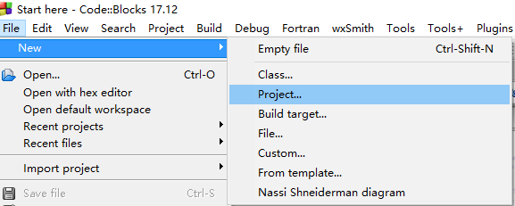
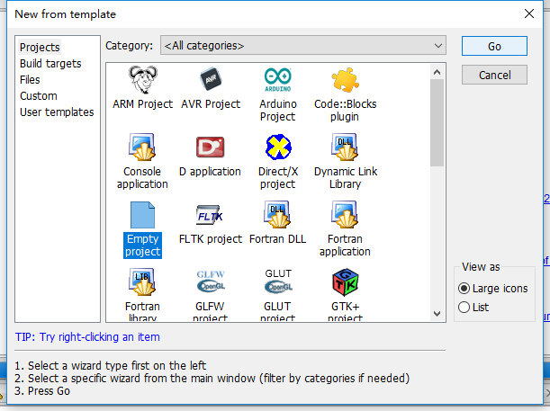
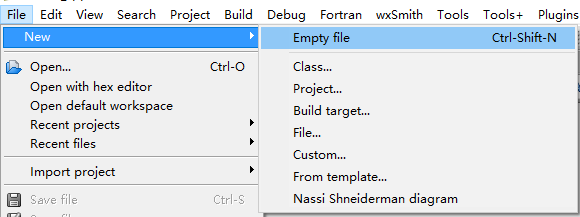
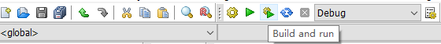

# C++基础入门

## 1. C++初识

### 1.1 第一个C++程序

编写一个C++程序总共分为以下几个步骤

- 创建项目

- 添加文件

- 编写代码

- 运行程序

  以下为以Code::Blocks为例，Visual Studio参见[附录](./appendix.md)

#### 1.1.1 创建项目 

#### 1.1.2 添加文件

#### 1.1.3 编写代码

~~~c++
#include <iostream>

using namespace std;

int main()
{
    cout << "hello world" << endl;

    return 0;
}
~~~

#### 1.1.4 运行程序

### 1.2 注释

**作用**：在代码中加一些解释和说明，方便自己或他人阅读代码

**两种格式**：

1. **单行注释**： // 描述信息

   · 通常放在一行代码的上方，或一条语句的结尾，对该行代码说明

2. **多行注释**：/* 描述信息 */

   · 通常放在一段代码的上方，对该段代码说明

### 1.3 变量

**作用**：给一段制定的内存空间起名，方便操作这段内存

**语法**：数据类型 变量名 = 初始值；

**示例**：

~~~c++
#include <iostream>

using namespace std;

int main()
{
    //定义一个变量a,并初始化为10
    int a = 10;
    
    //打印出a的值
	cout << "a = " << a << endl;
        
    return 0;
}
~~~
