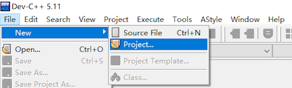
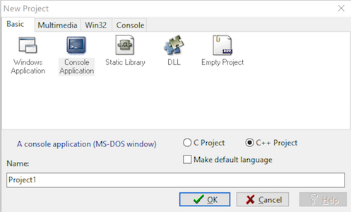
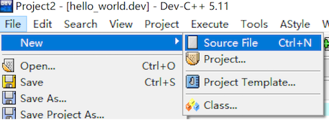
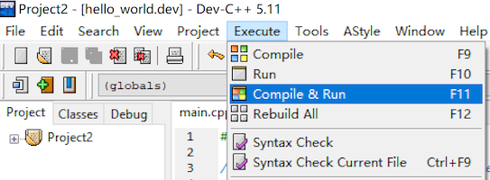
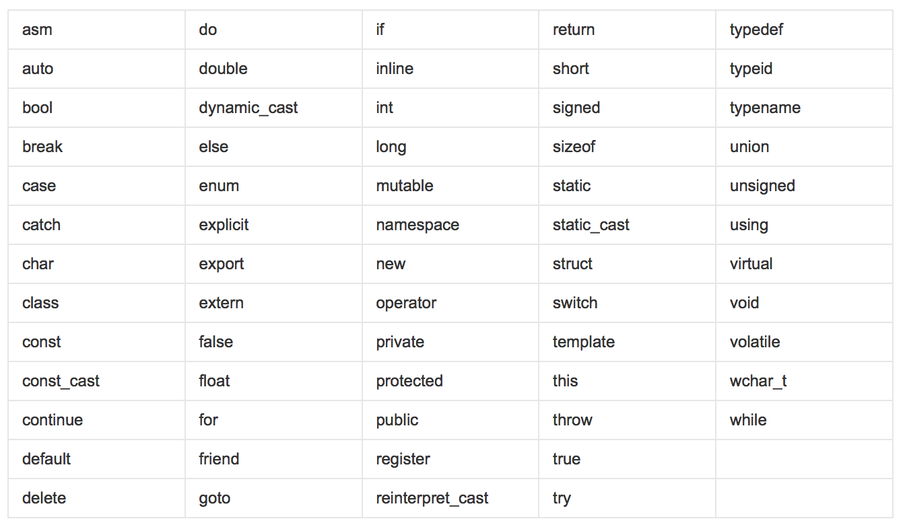

# 3.1 C++概述

### 3.1.1 第一个C++程序

编写一个C++程序总共分为以下几个步骤

- 创建项目

- 添加文件

- 编写代码

- 运行程序

  以下为以Dev-C++为例，其他编译器参见[附录](../appendix.md)

#### 3.1.1.1 创建项目 

1. 新建项目：文件 -> 新建 ->项目



2. 选择新建项目的类型：命令行应用程序（Console Application）



3. 选择项目保存的路径，并定义项目名（这个程序的名字，如游戏），尽量使用英文

   

#### 3.1.1.2 添加文件

1. 在文件 -> 新建 -> 源文件，创建新的C++文件或者头文件，并保存。



2. 保存文件


#### 3.1.1.3 编写代码

```c++
#include <iostream>

using namespace std;
/* run this program using the console pauser or add your own getch, system("pause") or input loop */

int main(int argc, char** argv) {
	
	cout << " hello world!" <<endl;
	
	return 0;
}
```

#### 3.1.1.4 运行程序

运行程序选择工具栏运行图标，或者选择菜单栏：运行 -> 编译&运行。


或者在菜单栏中选择：运行 -> 编译&运行



### 3.1.2 注释

**作用**：在代码中加一些解释和说明，方便自己或他人阅读代码

**两种格式**：

1. **单行注释**：<font color=red> // </font>描述信息

   · 通常放在一行代码的上方，或一条语句的结尾，<font color=green>对该行代码说明</font>

2. **多行注释**：<font color=red>/* </font>描述信息 <font color=red>*/</font>

   · 通常放在一段代码的上方，<font color=green>对该段代码说明</font>

### 3.1.3 变量

**作用**：给一段制定的内存空间起名，方便操作这段内存

**语法**：数据类型 变量名 = 初始值；

**示例**：

```c++
#include <iostream>

using namespace std;

int main()
{
    //定义一个变量a,并初始化为10
    int a = 10;
    
    //打印出a的值
	  cout << "a = " << a << endl;
        
    return 0;
}
```

### 3.1.4 常量

作用：用于记录程序中不可更改的数据。

1. **#define**宏常量：`#define 常量名 常量值`

   · 通常在文件上方定义，表示一个常量

2. **const**修饰的变量，`const 数据类型 变量名 = 变量值`

   · 通常在变量定义前加关键字const，修饰该变量为常量，不可修改变量值

**示例**

```c++
#define day 7
int main()
{
    //days = 8; 报错 
    cout << "A week has " << day << "(define) days" <<endl;
    
    // const 修饰的变量，设置常量
    const int mouth = 12;  
    // mouth = 24; 报错
    cout << "A year has " << mouth << "(const) mouths" <<endl;  
  
}
```


### 3.1.5 关键字

**作用**：关键字是C++预先保留的单词（标识符）

·**在定义变量或常量时，不能使用关键字**

`C++关键字如下`：



> 提示：在给变量或常量起名字的时候，不能使用关键字，否则会产生歧义，报错


### 3.1.6 标识符命名规则

#### 3.1.6.1 命名规则

**作用**：C++给标识符（变量或常量）命名的时候，有一套自己的规则：

- 标识符不能是关键字
- 标识符只能由字母、数字和下划线（"_"）组成
- 第一个字符必须是字母或下划线
- 标识符中字母区分大小写

> 建议：给标识符命名时，争取做到见名知意的效果，方便别人阅读。

#### 3.1.6.2 命名风格约定

**作用**：最重要的一致性规则是命名管理. 命名的风格能让我们在不需要去查找类型声明的条件下快速地了解某个名字代表的含义: 类型, 变量, 函数, 常量, 宏, 等等, 甚至. 我们大脑中的模式匹配引擎非常依赖这些命名规则.

1. 通用命名规则

   > 函数命名, 变量命名, 文件命名要有描述性; 少用缩写.

   尽可能使用描述性的命名, 别心疼空间, 毕竟相比之下让代码易于新读者理解更重要. 不要用只有项目开发者能理解的缩写, 也不要通过砍掉几个字母来缩写单词.

   > 注意, 一些特定的广为人知的缩写是允许的, 例如用 i 表示迭代变量和用 T 表示模板参数.

   模板参数的命名应当遵循对应的分类: 类型模板参数应当遵循 类型命名 的规则, 而非类型模板应当遵循 变量命名 的规则.

2. 文件命名

   > 文件名要全部小写, 可以包含下划线"_"或连字符"-", 依照项目的约定

   文件命名如下：

   > my_useful_class.cc
   > my-useful-class.cc
   > myusefulclass.cc

   不要使用已经存在于 /usr/include 下的文件名 (即编译器搜索系统头文件的路径), 如 db.h.

   通常应尽量让文件名更加明确. http_server_logs.h 就比 logs.h 要好. 定义类时文件名一般成对出现, 如 foo_bar.h 和 foo_bar.cc, 对应于类 FooBar.

3. 类型命名

   > 所有类型命名 —— 类, 结构体, 类型定义 (typedef), 枚举, 类型模板参数——均使用相同约定, 即以大写字母开始, 每个单词首字母均大写, 不包含下划线..

   例如:

   ```c++
   // 类和结构体
   class UrlTable { ...
   class UrlTableTester { ...
   struct UrlTableProperties { ...
   
   // 类型定义
   typedef hash_map<UrlTableProperties *, string> PropertiesMap;
   
   // using 别名
   using PropertiesMap = hash_map<UrlTableProperties *, string>;
   
   // 枚举
   enum UrlTableErrors { ...
     
   ```

   

4. 变量命名

   变量 (包括函数参数) 和数据成员名一律小写, 单词之间用下划线连接. 类的成员变量以下划线结尾, 但结构体的就不用, 如: a_local_variable, a_struct_data_member, a_class_data_member_.

   4.1 普通变量命名

   ```c++
   string table_name;  // 用下划线.
   string tablename;   // 全小写.
   ```

   4.2 类数据成员

   不管是静态的还是非静态的, 类数据成员都可以和普通变量一样, 但要下划线结尾.

   ```c++
   class TableInfo {
     ...
    private:
     string table_name_;  // 后加下划线.
     string tablename_;   // 
     static Pool<TableInfo>* pool_; 
   };
   ```

   4.3 结构体变量

   不管是静态的还是非静态的, 结构体数据成员都可以和普通变量一样, 不用像类那样接下划线.

   ```c++
   struct UrlTableProperties {
     string name;
     int num_entries;
     static Pool<UrlTableProperties>* pool;
   };
   ```

5. 常量命名

   声明为 constexpr 或 const 的变量, 或在程序运行期间其值始终保持不变的, 命名时以 “k” 开头, 大小写混合，首字母大写. 例如:

   ```c++
   const int kDaysInAWeek = 7;
   ```

6. 函数命名

   常规函数使用大小写混合, 函数名的每个单词首字母大写 (即 “大驼峰命名法” 或 “Pascal命名法”), 没有下划线.取值和设值函数则要求与变量名匹配: MyExcitingFunction(), MyExcitingMethod(), my_exciting_member_variable(), set_my_exciting_member_variable().
   一般来说, 对于首字母缩写的单词, 更倾向于将它们视作一个单词进行首字母大写 (例如, 写作 StartRpc() 而非 StartRPC()).

   ```c++
   AddTableEntry()
   DeleteUrl()
   
   ```

7. 命名空间命名

   命名空间以小写字母命名. 最高级命名空间的名字取决于项目名称. 要注意避免嵌套命名空间的名字之间和常见的顶级命名空间的名字之间发生冲突.

8. 枚举命名

   枚举的命名一般常量命名一致: kEnumName。

   ```c++
   enum UrlTableErrors {
       kOK = 0,
       kErrorOutOfMemory,
       kErrorMalformedInput,
   };
   ```

9. 宏命名

   宏命名由大写字母和下划线组成，通常*不应该*使用宏. 如果不得不用, 其命名全部大写, 使用下划线。

   ```c++
   #define ROUND(x) ...
   #define PI_ROUNDED 3.0
   ```

10. 命名规则的特例

    如果命名的实体与已有 C/C++ 实体相似, 可参考现有命名策略.

    > bigopen(): 函数名, 参照 open() 的形式
    > uint: typedef
    > bigpos: struct 或 class, 参照 pos 的形式
    > sparse_hash_map: STL 型实体; 参照 STL 命名约定
    > LONGLONG_MAX: 常量, 如同 INT_MAX

