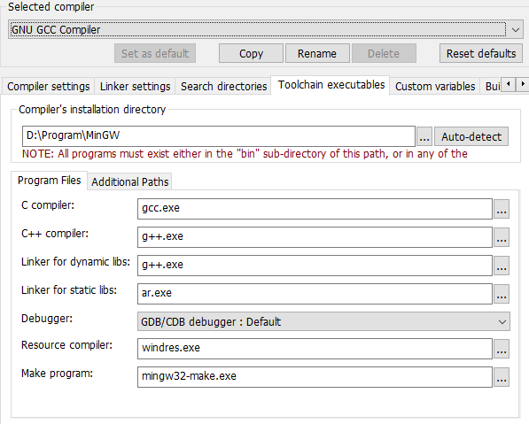

# 1. Code::Blocks Configuration

## 1.1 Compiler

Settings -> Compiler

### 1.1.1 ToolChain 

### 1.1.2 Search directory

"lib/gcc/x86_64-w64-mingw32/8.1.0/include/c++", 
"lib/gcc/x86_64-w64-mingw32/8.1.0/include/c++/x86_64-w64-mingw32", 
"lib/gcc/x86_64-w64-mingw32/8.1.0/include/c++/backward", 
"lib/gcc/x86_64-w64-mingw32/8.1.0/include", 
 "include", 
 "x86_64-w64-mingw32/include", 
 "lib/gcc/x86_64-w64-mingw32/8.1.0/include-fixed" 

