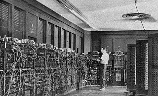
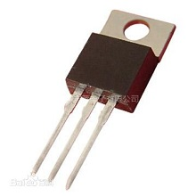
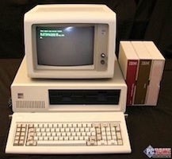

# 1.1. 计算机入门

## 1.1.1 计算机的产生与发展

  计算机的产生是20世纪最重要的科学技术大事件之一。世界上的第一台计算机（ENIAC）于1946年诞生在美国宾夕法尼亚大学，到目前为止，计算机的发展大致经历了四代：

1. 第一代：电子管计算机，始于1946年，结构上以CPU为中心，使用计算机语言，速度慢，存储量小，主要用于数值计算；1946年2月14号，取名为埃尼阿克(ENIAC)的第一台电子计算机在美国宾夕法尼亚大学诞生。但它体积庞大，并且属于程序外插型，使用起来并不方便。计算机运算几分钟或几小时，需要用几小时到几天来编插程序。第一台电子计算机是个庞然大物：长30.48米，宽6米，高2.4米，占地面积约170平方米，30个操作台，近18000个电子管，重达30英吨，耗电量150千瓦，造价48万美元。

   

2. 第二代：晶体管计算机，1954年，美国贝尔实验室研制成功第一台使用晶体管线路的计算机，取名“催迪克”（TRADIC），装有800个晶体管。1958年，美国的IBM公司制成了第一台全部使用晶体管的计算机RCA501型。晶体管计算机结构上以存储器为中心，使用高级语言，应用范围扩大到数据处理和工业控制。

   

3. 第三代：中小规模集成电路计算机，始于1964年，半导体工艺的发展，成功制造了集成电路。计算机也开始采用中小规模集成电路作为计算机的主要元件，结构上仍以存储器为中心，增加了多种外部设备，软件得到了一定的发展，文字图象处理功能加强；

   

4. 第四代：大规模和超大规模集成电路计算机，始于1971年，应用更广泛，很多核心部件可集成在一个或多个芯片上，从而出现了微型计算机。自1981年美国IBM公司推出第一代微型计算机IBM-PC以来，微型机以其执行结果精确、处理速度快捷、性价比高、轻便小巧等特点迅速进入社会各个领域，且技术不断更新、产品快速换代，从单纯的计算工具发展成为能够处理数字、符号、文字、语言、图形、图像、音频、视频等多种信息的强大多媒体工具。如今的微型机产品无论从运算速度、多媒体功能、软硬件支持还是易用性等方面都比早期产品有了很大飞跃。

   

我国从1956年开始电子计算机的科研和教学工作，1983年研制成功1亿/秒运算速度的“银河”巨型计算机，1992年11月研制成功10亿/秒运算速度的“银河II”巨型计算机，1997年研制了每秒130亿运算速度的“银河III”巨型计算机。目前计算机的发展向微型化和巨型化、多媒体化和网络化方向发展。计算机的通信产业已经成为新型的高科技产业。计算机网络的出现，改变了人们的工作方式、学习方式、思维方式和生活方式。

## 1.1.2 计算机系统组成

计算机系统由软件和硬件两部分组成。硬件即构成计算机的电子元器件；软件即程序和有关文档资料。

到目前为止,电子计算机的工作原理均采用**冯·诺依曼**的存储程序方式,即把程序存储在计算机内,由计算机自动存取指令（计算机可执行的命令=操作码+操作数）并执行它。它包括：**控制器、运算器、存储器、输入设备、输出设备**五个部分。工作原理图如下：

**(1)  计算机的主要硬件**

- **输入设备**：键盘、鼠标、扫描仪等。

- **输出设备**：显示器、打印机、绘图仪等。

- **中央处理器**（CPU）：包括**控制器**和**运算器**，可以进行算术运算和逻辑运算；控制器是计算机的指挥系统，它的操作过程是取指令——分析指令——执行指令。

- **存储器**：具有记忆功能的物理器件，用于存储信息。存储器分为内存和外存。存储器的两个重要技术指标：存取速度和存储容量。内存的存取速度最快(与CPU速 度相匹配)，软盘存取速度最慢。存储容量是指存储的信息量，它用字节(Byte)作为基本单位，1字节用8位二进制数表示，1KB=1024B，1MB=1024KB，lGB=1024MB。

  ①内存是半导体存储器(主存）：它分为只读存储器(ROM)和随机存储器(RAM)和高速缓冲存储器（Cache)

  - ROM:只能读，不能用普通方法写入，通常由厂家生产时写入，写入后数据不容易丢失，也可以用特殊方法（如紫外线擦除（EPROM)或电擦除(EEPROM)存储器)；
  - RAM:可读可写，断电后内容全部丢失；
  - Cache:因为CPU读写RAM的时间需要等待，为了减少等待时间，在RAM和CPU间需要设置高速缓存Cache,断电后其内容丢失。

  ②外存：磁性存储器——软盘和硬盘；光电存储器——光盘，它们可以作为永久存器。

**(2)计算机的软件**

  计算机的软件主要分为系统软件和应用软件两类：

  ①系统软件：为了使用和管理计算机的软件，主要有操作系统软件如，WINDOWS 95／98／ 2000／NT4.0、DOS 6.0、UNIX等；WINDOWS 95／98／2000／NT4.0是多任务可视化图形界面，而DOS是字符命令形式的单任务的操作系统。

  ②应用软件：为了某个应用目的而编写的软件，主要有辅助教学软件(CAI)、辅助设计软件(CAD)、文 字处理软件、工具软件以及其他的应用软件。