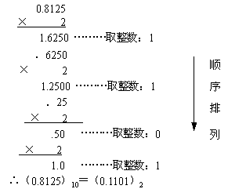
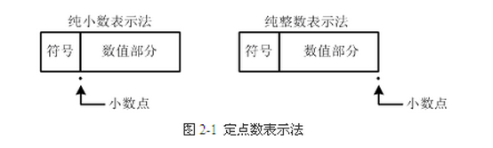
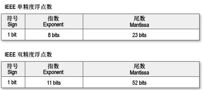

## 1.2. 进制与编码

### 1.2.1 二进制数的运算法则

计算机就其本身来说是一个电器设备，为了能够快速存储、处理、传递信息，其内部采用了大量的电子元件，在这些电子元件中，电路的通和断、电压高低，这两种状态最容易实现，也最稳定、也最容易实现对电路本身的控制。我们将计算机所能表示这样的状态，用0，1来表示、即用二进制数表示计算机内部的所有运算和操作。

由于二进制数运算非常简单，电器元件容易实现，所以计算机内部都用二进制编码进行数据的传送和计算。其主要法则是：`0+0=0 0+1=1 1+0=1 1+1=0   0*0=0 0*1=0 1*0=0 1*1=1`

### 1.2.2 十进制与其他进制之间的相互转换

1. **数的进制与基数**

   计数的进制不同，则它们的基数也不相同，如下表所示：

| 进制     | 基数                    | 特点       |
| -------- | ----------------------- | ---------- |
| 二进制   | 0 ,1                    | 逢二进一   |
| 八进制   | 0,1,2,3,4,5,6,7         | 逢八进一   |
| 十六进制 | 0,1,2,...,9,A,B,C,D,E,F | 逢十六进一 |
| 十进制   | 0,1,2,3,4,5,6,7,8,9     | 逢十进一   |

2. **数的权**

   不同进制的数，基数不同，每位上代表的值的大小（权）也不相同。如：

$$
\begin{aligned}
(219)10 &= 2 \times 10^2 + 1 \times 10^1 + 9 \times 10^0\\
(11010)2 &= 1 \times 2^4+1 \times 2^3+0 \times 2^2+1 \times 2^1+1 \times 2^0\\
(273)8 &= 2 \times 8^2+7 \times 8^1+3 \times 8^0\\
(27AF)16 &= 2 \times 16^3+7 \times 16^2+10 \times 16^1+15 \times 16^0 
\end{aligned}
$$

3. **十进制数转换任意进制**

- **整数转换**：将十进制整数除以所定的进制数,取余逆序。
  ` （39)10=(100111)2      (245)10=(365)8 ` 

  例如：把 (173)10 转换为二进制数

- **小数转换**：将十进制小数的**小数部分乘以进制数取整**，作为转换后的小数部分，直到**小数部分为零或精确到小数点后几位**。十进制小数转换成二进制小数，采用"**乘2取整，顺序排列**"法。具体做法是：用2乘十进制小数，可以得到积，将积的整数部分取出，再用2乘余下的小数部分，又得到一个积，再将积的整数部分取出，如此进行，直到积中的小数部分为零，或者达到所要求的精度为止，如：
  `（0.35)10=(0.01011)2        (0.125)10=(0.001)2`

  例如：把（0.8125）转换为二进制小数

  

4. 任意进制的数转换十进制
   按权值展开, 如:

$$
\begin{aligned}
(219)10 &= 2 \times 10^2+1 \times 10^1+9 \times 10^0 \\
(11010)2 &= 1 \times 2^4+1 \times 2^3+0 \times 2^2+1 \times 2^1+1 \times 2^0 = 26 \\
(273)8 &= 2 \times 8^2+7 \times 8^1+3 \times 8^0 = 187 \\
(7AF)16 &= 7 \times 16^2+10 \times 16^1+15 \times 16^0 = 1867 
\end{aligned}
$$

### 1.2.3 定点数与浮点数

1. **定点数**

   定点数是指数据中的小数点位置固定不变。通常将定点数据表示成纯小数或纯整数，为了将数表示成纯小数，通常把小数点固定在数值部分的最高位之前；而为了将数表示成纯整数，则把小数点固定在数值部分的最后面，如下图所示：

   

2. **浮点数**

   由于它受到字长范围的限制，所能表示的数的范围有限，计算结果容易溢出，一般计算机使用浮点数的形式，可写成：$$ N = M \times {2^E} $$

   在内存中存储的形式为：

   **IEEE754标准**包含一组实数的二进制表示法，它有**符号位、指数位、尾数位**三部分组成。三种精度的浮点数各个部分位数如下：

   **正规化**：对于将某个实数表示为计算机浮点数，首先要将其正规化，也就是表示为形如：
$$
\pm 1.bbbb \cdots  \times 2^p
$$
   其中b是0或1，而p二进制数表示的指数位。

- **数符**：浮点数的符号位，正数为0，负数为1。

- **阶码**：或称**指数**，阶码的计算公式：阶数 + 移码（偏移量）,  阶码是需要作移码运算，在转换出来的二进制数里，阶数是111(十进制为7)，偏移量的计算是：2^(e-1)-1, e为阶码的位数，单精度阶码位数为8，因此偏移值是127（01111111)

- **尾数**：小数点后面的数，即如 $$ 1.0110010001 \times 2^7 $$，尾数为：0110010001。

  **注意**：可能有个疑问：小数点前面的1去哪里了？由于尾数部分是正规化表示，最左边部分**总是**`1`，所以这是直接隐藏掉，同时也节省了1个位出来存储小数，提高精度。

   **移码**：因为指数p有正有负，那么在8位的指数位中我们就要拿出第一位来指示符号，这样显然会造成不必要的浪费。给指数加上移码，就能保证结果总是一个非负数，也就可以将8个指数位都利用起来。对于有M个指数位的精度，其移码为：
$$
2^{M-1} -1
$$
   这样就得到上面三种精度的移码：

   以双精度(Double)的为例。双精度的指数位有11位。这样可以表示的数是从000 0000 0000到111 1111 1111，也就是指数加移码所表示的范围从0到2047，那么，减去移码1023，则可以表示的指数是-1023到1024。但是注意，-1023和1024作为他用（后面会说到）。所以实际上能表示数的指数是从-1022到1023。

   浮点数在C/C++中对应float和double类型，我们有必要知道浮点数在计算机中实际存储的内容。IEEE754标准中规定：

- float单精度浮点数：用 1 位表示数字的符号，用 8 位来表示指数，用23 位来表示尾数，即小数部分。

- double双精度浮点数：用 1 位表示符号，用 11 位表示指数，52 位表示尾数，其中指数域称为阶码。

  

例如：178.125

（1）先把浮点数分别把整数部分和小数部分转换成2进制

- 整数部分用除2取余的方法，求得：10110010

- 小数部分用乘2取整的方法，求得：001

  合起来即是：10110010.001。转换成二进制的浮点数，即把小数点移动到整数位只有1，即为：

  $$ 1.0110010001 \times 2^{111} $$，111是二进制，由于左移了7位，所以是111

（2）把浮点数转换二进制后，这里基本已经可以得出对应3部分的值了

- **数符**：由于浮点数是正数，故为0。

- **阶码** : 阶数 + 偏移量 = 7 + 127 = (111)2 +( 01111111)2 = (10000110)2

- **尾数**：小数点后面的数，即0110010001

  那么最终的单精度实数，在内存中表示如下：

  

3. **非正规化：0的表示**

   从正规化中可知，无论如何浮点数都满足最左边是1。这就有一个严重问题：0没有办法被表示。为此，可以使用非正规化的表示方法，即让最左边默认为0，这样再另尾数也全部为0，就可以表示0了。

   新的问题又来了：根据什么判断是非正规化还是正规化呢？

   答案就是通过**指数部分**来反映。记得前面说过，双精度浮点数中，指数加移码的范围可以从0到2047，然而0和2047是作为他用的。在这里，**指数部分为0就代表着非正规化**。所以，当见到指数部分为0是，尾数部分就不再是1.bbbbb...而是0.bbbbb...了。再进一步，对于非正规化，可以看成是正规化中，小数点向左边跑了一位：$$ 1.bbbb\cdots \times 2^{-1023} = 0.1bbbb\cdots \times 2 \times 2^{-1023} == 0.1bbbb\cdots \times 2^{-1022} $$（只是概念上理解，小数第一位也不一定非要是1，如$$ 0.001010 \times 2^-1022 $$也可）。所以，非正规化下表示为：

   因为它的最左边不是1是0，实际上可以表示更小的数。双精度浮点数下，使用非正规化可以表示的**最小的正数**是$$ 0.00......01 \times 2^{-1022} $$ 即：$$ 2^{-52} \times 2^{-1022}= 2^{-1074} $$

4. **无穷大与NaN**

   上面说到，在双精度浮点数中，指数为0表示非正规化，那么指数为2047（二进制是111 1111 1111b，即11位指数位全为1）就表示无穷大和NaN（Not a Number）。具体表现在，当指数是2047，当尾数,全为0就表示无穷大，当尾数不全为0就表示NaN。

### 1.2.4 ASCII编码

由于计算机是电器设备，计算机内部用二进制数，这样对于从外部输入给计算机的所有信息必须用二进制数表示,并且对于各种命令、字符等都需要转换二进制数，这样就牵涉到信息符号转换成二进制数所采用的编码的问题，国际上统一用美国标准信息编码（ASCII）它可用7位二进制数表示，存储时用一个字节，它的最高位为0。因此基本的ASCII字符集有128个如:

| 字符 | ASCII值 | 二进制编码   |
| ---- | ------- | ------------ |
| 0-9  | 48-57   | 00110000-... |
| A-Z  | 65-90   | 01000001-... |
| a-z  | 97-122  | 01100000-... |

**ASCII编码如下：（ASCII中的0~31为控制字符；32~126为可显示字符；127为Delete(删除)命令）**

| **ASCII值** | **控制字符** | **ASCII值** | **控制字符** | **ASCII值** | **控制字符** | **ASCII值** | **控制字符** |
| ----------- | ------------ | ----------- | ------------ | ----------- | ------------ | ----------- | ------------ |
| 0           | NUL          | 32          | (space)      | 64          | @            | 96          | 、           |
| 1           | SOH          | 33          | ！           | 65          | A            | 97          | a            |
| 2           | STX          | 34          | ”            | 66          | B            | 98          | b            |
| 3           | ETX          | 35          | #            | 67          | C            | 99          | c            |
| 4           | EOT          | 36          | $            | 68          | D            | 100         | d            |
| 5           | ENQ          | 37          | %            | 69          | E            | 101         | e            |
| 6           | ACK          | 38          | &            | 70          | F            | 102         | f            |
| 7           | BEL          | 39          | '            | 71          | G            | 103         | g            |
| 8           | BS           | 40          | (            | 72          | H            | 104         | h            |
| 9           | HT           | 41          | )            | 73          | I            | 105         | i            |
| 10          | LF           | 42          | *            | 74          | J            | 106         | j            |
| 11          | VT           | 43          | +            | 75          | K            | 107         | k            |
| 12          | FF           | 44          | ,            | 76          | L            | 108         | l            |
| 13          | CR           | 45          | -            | 77          | M            | 109         | m            |
| 14          | SO           | 46          | .            | 78          | N            | 110         | n            |
| 15          | SI           | 47          | /            | 79          | O            | 111         | o            |
| 16          | DLE          | 48          | 0            | 80          | P            | 112         | p            |
| 17          | DCI          | 49          | 1            | 81          | Q            | 113         | q            |
| 18          | DC2          | 50          | 2            | 82          | R            | 114         | r            |
| 19          | DC3          | 51          | 3            | 83          | X            | 115         | s            |
| 20          | DC4          | 52          | 4            | 84          | T            | 116         | t            |
| 21          | NAK          | 53          | 5            | 85          | U            | 117         | u            |
| 22          | SYN          | 54          | 6            | 86          | V            | 118         | v            |
| 23          | TB           | 55          | 7            | 87          | W            | 119         | w            |
| 24          | CAN          | 56          | 8            | 88          | X            | 120         | x            |
| 25          | EM           | 57          | 9            | 89          | Y            | 121         | y            |
| 26          | SUB          | 58          | :            | 90          | Z            | 122         | z            |
| 27          | ESC          | 59          | ;            | 91          | [            | 123         | {            |
| 28          | FS           | 60          | <            | 92          | \            | 124         | \|           |
| 29          | GS           | 61          | =            | 93          | ]            | 125         | }            |
| 30          | RS           | 62          | >            | 94          | ^            | 126         | ~            |
| 31          | US           | 63          | ?            | 95          | —            | 127         | DEL          |

**下表为控制字符释义。**

| **十进制** | **十六进制** | **字符意义**  | **十进制** | **十六进制** | **字符**意义 |
| ---------- | ------------ | ------------- | ---------- | ------------ | ------------ |
| 0          | 00           | 空            | 16         | 10           | 数据链路转意 |
| 1          | 01           | 头标开始      | 17         | 11           | 设备控制 1   |
| 2          | 02           | 正文开始      | 18         | 12           | 设备控制 2   |
| 3          | 03           | 正文结束      | 19         | 13           | 设备控制 3   |
| 4          | 04           | 传输结束      | 20         | 14           | 设备控制 4   |
| 5          | 05           | 查询          | 21         | 15           | 反确认       |
| 6          | 06           | 确认          | 22         | 16           | 同步空闲     |
| 7          | 07           | 震铃          | 23         | 17           | 传输块结束   |
| 8          | 08           | backspace     | 24         | 18           | 取消         |
| 9          | 09           | 水平制表符    | 25         | 19           | 媒体结束     |
| 10         | 0A           | **换行/新行** | 26         | 1A           | 替换         |
| 11         | 0B           | 竖直制表符    | 27         | 1B           | 转意         |
| 12         | 0C           | 换页/新页     | 28         | 1C           | 文件分隔符   |
| 13         | 0D           | **回车**      | 29         | 1D           | 组分隔符     |
| 14         | 0E           | 移出          | 30         | 1E           | 记录分隔符   |
| 15         | 0F           | 移入          | 31         | 1F           | 单元分隔符   |

### 1.2.5 汉字编码与汉字输入法

1. 机内码

   ASCII码不能表示汉字，因此要有汉字信息交换码，我国国家标准是GB2312，它也被称作国际码。它由两个字节组成，两个字节的最高位都为1。GB2312共收纳6763个汉字，其中，一级汉字（常用字）3755个按汉字拼音字母顺序排列，二级汉字3008个按部首笔画次序排列。

2. 汉字输入码（外码）

   目前，汉字输入法主要有键盘输入、文字识别和语音识别。键盘输入法是当前汉字输入的主要方法。它大体可以分为：

   - 流水码：如区位码、电报码、通信密码，优点重码律少，缺点难于记忆；
   - 音码：以汉语拼音为基准输入汉字，优点是容易掌握，但重码律高；
   - 形码：根据汉字的字型进行编码，优点重码少，但不容易掌握；
   - 音形码：将音码和形码结合起来，能减少重码律同时提高汉字输入速度。

3. 汉字字模

   供计算机输出汉字（显示和打印）用的二进制信息叫汉字字形信息也称字模。通用汉字字模点阵规格有16×16，24×24，32×32，48×48，64×64，每个点在存储器中用一个二进制位(bit)存储，如一个16×16点阵汉字需要32个字节的存储空间。