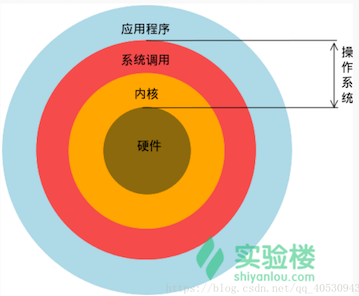
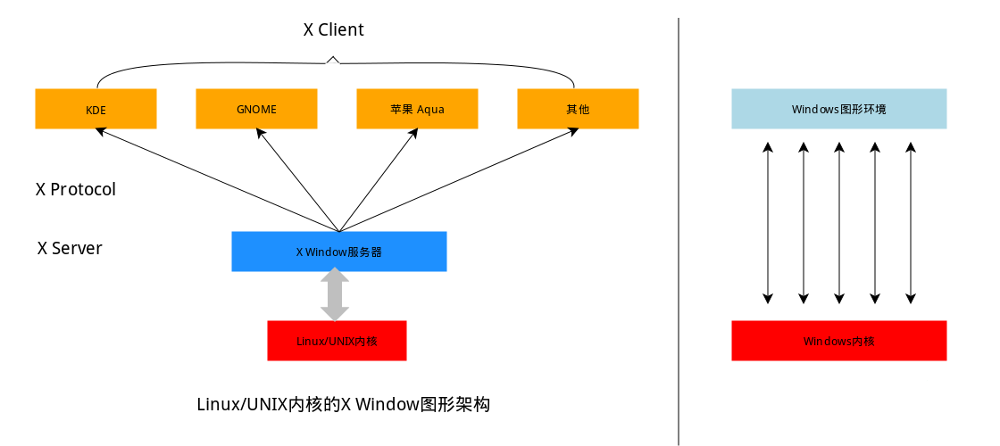
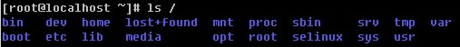

# 2.2. Linux操作系统

## 2.2.1 Linux简介

Linux内核最初只是由芬兰人李纳斯·托瓦兹（Linus Torvalds）在赫尔辛基大学上学时出于个人爱好而编写的。

Linux是一套免费使用和自由传播的类Unix操作系统，是一个基于POSIX和UNIX的多用户、多任务、支持多线程和多CPU的操作系统。Linux能运行主要的UNIX工具软件、应用程序和网络协议。它支持32位和64位硬件。Linux继承了Unix以网络为核心的设计思想，是一个性能稳定的多用户网络操作系统。

1. **Linux的发行版**：是将Linux内核与应用软件做一个打包。目前市面上较知名的发行版有：Ubuntu、RedHat、CentOS、Debian、Fedora、SuSE、OpenSUSE、Arch Linux、SolusOS 等。

2. **Linux 特点**

   Linux是一个网络操作系统（Network Operating System，NOS）网络操作系统则在一般操作系统的功能上增加了网络功能，具体包括：
   （1）实现网络中各计算机之间的通信和资源共享；
   （2）提供多种网络服务软件；
   （3）提供网络用户的应用程序接口；
   （4）它是由以Linus Torvalds为首的一批Internet上的志愿者开发的，完全免费，并与著名的网络操作系统UNIX完全兼容，是一个具有很高性能价格比的网络操作系统；
   （5）由于开放源代码与良好的模块化设计，从而使嵌入式应用成为可能；

3. **Linux应用领域**：

   今天各种场合都有使用各种Linux发行版，从嵌入式设备到超级计算机，并且在服务器领域确定了地位，通常服务器使用LAMP（Linux + Apache + MySQL + PHP）或LNMP（Linux + Nginx+ MySQL + PHP）组合。

   目前Linux不仅在家庭与企业中使用，并且在政府中也很受欢迎。

   - 巴西联邦政府由于支持Linux而世界闻名。
   - 有新闻报道俄罗斯军队自己制造的Linux发布版的，做为G.H.ost项目已经取得成果.
   - 印度的Kerala联邦计划在向全联邦的高中推广使用Linux。
   - 中华人民共和国为取得技术独立，在龙芯过程中排他性地使用Linux。
   - 在西班牙的一些地区开发了自己的Linux发布版，并且在政府与教育领域广泛使用，如Extremadura地区的gnuLinEx和Andalusia地区的Guadalinex。
   - 葡萄牙同样使用自己的Linux发布版Caixa Mágica，用于Magalh?es笔记本电脑和e-escola政府软件。
   - 法国和德国同样开始逐步采用Linux。

4. **Linux和Windows的区别**

   目前国内Linux更多的是应用于服务器上，而桌面操作系统更多使用的是 Windows。主要区别如下：

| 比较     | Windows                                                      | Linux                                                        |
| -------- | ------------------------------------------------------------ | ------------------------------------------------------------ |
| 界面     | 界面统一，外壳程序固定所有Windows程序菜单几乎一致，快捷键也几乎相同 | 图形界面风格依发布版不同而不同，可能互不兼容。GNU/Linux的终端机是从UNIX传承下来，基本命令和操作方法也几乎一致。 |
| 驱动程序 | 驱动程序丰富，版本更新频繁。默认安装程序里面一般包含有该版本发布时流行的硬件驱动程序，之后所出的新硬件驱动依赖于硬件厂商提供。对于一些老硬件，如果没有了原配的驱动有时很难支持。另外，有时硬件厂商未提供所需版本的Windows下的驱动，也会比较头痛 | 由志愿者开发，由Linux核心开发小组发布，很多硬件厂商基于版权考虑并未提供驱动程序，尽管多数无需手动安装，但是涉及安装则相对复杂，使得新用户面对驱动程序问题（是否存在和安装方法）会一筹莫展。但是在开源开发模式下，许多老硬件尽管在Windows下很难支持的也容易找到驱动。HP、Intel、AMD等硬件厂商逐步不同程度支持开源驱动，问题正在得到缓解 |
| 使用     | 使用比较简单，容易入门。图形化界面对没有计算机背景知识的用户使用十分有利 | 图形界面使用简单，容易入门。文字界面，需要学习才能掌握       |
| 学习     | 系统构造复杂、变化频繁，且知识、技能淘汰快，深入学习困难     | 系统构造简单、稳定，且知识、技能传承性好，深入学习相对容易   |
| 软件     | 每一种特定功能可能都需要商业软件的支持，需要购买相应的授权   | 大部分软件都可以自由获取，同样功能的软件选择较少             |
| 收费     | 最新正版 Windows 10，需要付费购买                            | Linux 免费或少许费用                                         |

   

5. **Linux的历史**

   - 1965 年，Bell 实验室、MIT、GE（通用电气公司）准备开发 Multics 系统，为了同时支持 300 个终端访问主机，但是 1969 年失败了；

     > 那时候并没有鼠标、键盘，输入设备，只有卡片机。因此，如果要测试某个程序，则需要将读卡纸插入卡片机，如果有错误，还需要重新来过；Multics：Multiplexed Information and Computing Service；

   - 1969 年，Ken Thompson（C语言之父）利用汇编语言开发了 File Server System（Unics，即 UNIX 的原型）；

     > 因为汇编语言对于硬件的依赖性，因此只能针对特定硬件；只是为了移植一款“太空旅游”的游戏；

   - 1973 年，Dennis Ritchie 和 Ken Thompson 发明了 C 语言，而后写出了 UNIX 的内核；

     > 将 B 语言改成 C 语言，由此产生了 C 语言之父；90% 的代码是 C 语言写的，10% 的代码用汇编语言写的，因此移植时只要修改那 10% 的代码即可；

   - 1977 年，Berkeley 大学的 Bill Joy 针对他的机器修改了 UNIX 源码，称为BSD（Berkeley Software Distribution）；Bill Joy 是 Sun 公司的创始人；

   - 1979 年，UNIX 发布 System V，用于个人计算机；

   - 1984 年，因为 UNIX 规定“不能对学生提供源码”，Tanenbaum 老师自己编写兼容于 UNIX 的 Minix，用于教学；

   - 1984 年，Stallman 开始 GNU（GNU's Not Unix）项目，创办 FSF（Free Software Foundation）基金会；

     > 产品：GCC、Emacs、Bash Shell、GLIBC；倡导“自由软件”；GNU 的软件缺乏一个开放的平台运行，只能在 UNIX 上运行；自由软件指用户可以对软件做任何修改，甚至再发行，但是始终要挂着 GPL 的版权；自由软件是可以卖的，但是不能只卖软件，而是卖服务、手册等；

   - 1985 年，为了避免 GNU 开发的自由软件被其他人用作专利软件，因此创建 GPL（General Public License）版权声明；

   - 1988 年，MIT 为了开发 GUI，成立了研发 XFree86 的组织；

   - 1991 年，芬兰赫尔辛基大学的研究生 Linus Torvalds 基于 gcc、bash 开发了针对 386 机器的 Linux 内核；

   - 1994 年，Torvalds 发布 Linux-v1.0；

   - 1996 年，Torvalds 发布 Linux-v2.0，确定了 Linux 的吉祥物：企鹅。

## 2.2.2 Linux系统的基本结构

Linux 就是一个操作系统，就像你多少已经了解的 Windows（xp，7，8）和 Mac OS 。至于操作系统是什么，就不用过多解释了，如果你学习过前面的入门课程，应该会有个基本概念了，这里简单介绍一下操作系统在整个计算机系统中的角色。



相对于Windows 系统，Linux 本身是没有图形界面的，在 Linux 发行版上看到的图形界面实质上都是运行在 Linux 系统之上的软件，类似 Windows95 之前的 Windows 的图形界面只是运行在 DOS 环境的一套软件。而 Linux 上的这套软件以前是 XFree86，现在是 xorg（X.Org），这套软件是通过 X 窗口系统（X Window System，常被称为 X11 或 X）实现的，其本身只是工具包及架构协议，而 xorg 是 X 架构规范的一个实现体，即：它是实现了 X 协议规范的一个提供图形界面服务的服务器，就像实现了 http 协议提供 web 服务的 Apache 。

如果只有服务器则不能实现一个完整的桌面环境的，还需要一个客户端，我们称为 X Client，如目前最流行的实现客户端功能的桌面环境 KDE，GNOME，XFCE，LXDE等。这也意味着在 Linux 上你可以自己选择安装不同的桌面环境，甚至可以定制自己的专属桌面。



## 2.2.3 Linux启动

linux启动时我们会看到许多启动信息。

Linux系统的启动过程并不是大家想象中的那么复杂，其过程可以分为5个阶段：

- 内核的引导。
- 运行 init。
- 系统初始化。
- 建立终端 。
- 用户登录系统。

> init程序的类型：
>
> - **SysV:** init, CentOS 5之前, 配置文件： /etc/inittab。
> - **Upstart:** init,CentOS 6, 配置文件： /etc/inittab, /etc/init/*.conf。
> - **Systemd：** systemd, CentOS 7,配置文件： /usr/lib/systemd/system、 /etc/systemd/system。

1. **内核引导**

   当计算机打开电源后，首先是BIOS开机自检，按照BIOS中设置的启动设备（通常是硬盘）来启动。

   操作系统接管硬件以后，首先读入 /boot 目录下的内核文件。

   

2. **运行init**

   init 进程是系统所有进程的起点，你可以把它比拟成系统所有进程的老祖宗，没有这个进程，系统中任何进程都不会启动。init 程序首先是需要读取配置文件 /etc/inittab。

   

   **运行级别**

   许多程序需要开机启动。它们在Windows叫做"服务"（service），在Linux就叫做"守护进程"（daemon）。init进程的一大任务，就是去运行这些开机启动的程序。但是，不同的场合需要启动不同的程序，比如用作服务器时，需要启动Apache，用作桌面就不需要。Linux允许为不同的场合，分配不同的开机启动程序，这就叫做"运行级别"（runlevel）。也就是说，启动时根据"运行级别"，确定要运行哪些程序。

   

   Linux系统有7个运行级别(runlevel)：

   - 运行级别0：系统停机状态，系统默认运行级别不能设为0，否则不能正常启动
   - 运行级别1：单用户工作状态，root权限，用于系统维护，禁止远程登陆
   - 运行级别2：多用户状态(没有NFS)
   - 运行级别3：完全的多用户状态(有NFS)，登陆后进入控制台命令行模式
   - 运行级别4：系统未使用，保留
   - 运行级别5：X11控制台，登陆后进入图形GUI模式
   - 运行级别6：系统正常关闭并重启，默认运行级别不能设为6，否则不能正常启动

3. **系统初始化**

   在init的配置文件中有这么一行： si::sysinit:/etc/rc.d/rc.sysinit　它调用执行了/etc/rc.d/rc.sysinit，而rc.sysinit是一个bash shell的脚本，它主要是完成一些系统初始化的工作，rc.sysinit是每一个运行级别都要首先运行的重要脚本。

   它主要完成的工作有：激活交换分区，检查磁盘，加载硬件模块以及其它一些需要优先执行任务。

   ~~~shell
   l5:5:wait:/etc/rc.d/rc 5
   ~~~

   这一行表示以5为参数运行/etc/rc.d/rc，/etc/rc.d/rc是一个Shell脚本，它接受5作为参数，去执行/etc/rc.d/rc5.d/目录下的所有的rc启动脚本，/etc/rc.d/rc5.d/目录中的这些启动脚本实际上都是一些连接文件，而不是真正的rc启动脚本，真正的rc启动脚本实际上都是放在/etc/rc.d/init.d/目录下。

   而这些rc启动脚本有着类似的用法，它们一般能接受start、stop、restart、status等参数。

   /etc/rc.d/rc5.d/中的rc启动脚本通常是K或S开头的连接文件，对于以 S 开头的启动脚本，将以start参数来运行。

   而如果发现存在相应的脚本也存在K打头的连接，而且已经处于运行态了(以/var/lock/subsys/下的文件作为标志)，则将首先以stop为参数停止这些已经启动了的守护进程，然后再重新运行。

   这样做是为了保证是当init改变运行级别时，所有相关的守护进程都将重启。

   至于在每个运行级中将运行哪些守护进程，用户可以通过chkconfig或setup中的"System Services"来自行设定。

   

4. **建立终端**

   rc执行完毕后，返回init。这时基本系统环境已经设置好了，各种守护进程也已经启动了。

   init接下来会打开6个终端，以便用户登录系统。在inittab中的以下6行就是定义了6个终端：

   ```shell
   1:2345:respawn:/sbin/mingetty tty1
   2:2345:respawn:/sbin/mingetty tty2
   3:2345:respawn:/sbin/mingetty tty3
   4:2345:respawn:/sbin/mingetty tty4
   5:2345:respawn:/sbin/mingetty tty5
   6:2345:respawn:/sbin/mingetty tty6
   ```

   从上面可以看出在2、3、4、5的运行级别中都将以respawn方式运行mingetty程序，mingetty程序能打开终端、设置模式。

   同时它会显示一个文本登录界面，这个界面就是我们经常看到的登录界面，在这个登录界面中会提示用户输入用户名，而用户输入的用户将作为参数传给login程序来验证用户的身份。

5. **用户登录系统**

   一般来说，用户的登录方式有三种：

   - （1）命令行登录
   - （2）ssh登录
   - （3）图形界面登录

   

   对于运行级别为5的图形方式用户来说，他们的登录是通过一个图形化的登录界面。登录成功后可以直接进入 KDE、Gnome 等窗口管理器。而本文主要讲的还是文本方式登录的情况：当我们看到mingetty的登录界面时，我们就可以输入用户名和密码来登录系统了。

   Linux 的账号验证程序是 login，login 会接收 mingetty 传来的用户名作为用户名参数。

   然后 login 会对用户名进行分析：如果用户名不是 root，且存在 /etc/nologin 文件，login 将输出 nologin 文件的内容，然后退出。

   这通常用来系统维护时防止非root用户登录。只有/etc/securetty中登记了的终端才允许 root 用户登录，如果不存在这个文件，则 root 用户可以在任何终端上登录。/etc/usertty文件用于对用户作出附加访问限制，如果不存在这个文件，则没有其他限制。

6. **图形模式与文字模式的切换方式**

   Linux预设提供了六个命令窗口终端机让我们来登录。

   默认我们登录的就是第一个窗口，也就是tty1，这个六个窗口分别为tty1,tty2 … tty6，你可以按下Ctrl + Alt + F1 ~ F6 来切换它们。

   如果你安装了图形界面，默认情况下是进入图形界面的，此时你就可以按Ctrl + Alt + F1 ~ F6来进入其中一个命令窗口界面。

   当你进入命令窗口界面后再返回图形界面只要按下Ctrl + Alt + F7 就回来了。

   如果你用的vmware 虚拟机，命令窗口切换的快捷键为 Alt + Space + F1~F6. 如果你在图形界面下请按Alt + Shift + Ctrl + F1~F6 切换至命令窗口。 

   

7. **Linux 关机**

   在linux领域内大多用在服务器上，很少遇到关机的操作。毕竟服务器上跑一个服务是永无止境的，除非特殊情况下，不得已才会关机。

   正确的关机流程为：sync > shutdown > reboot > halt

   关机指令为：shutdown ，你可以man shutdown 来看一下帮助文档。

   例如你可以运行如下命令关机：

   ```
   sync 将数据由内存同步到硬盘中。
   
   shutdown 关机指令，你可以man shutdown 来看一下帮助文档。例如你可以运行如下命令关机：
   
   shutdown –h 10 ‘This server will shutdown after 10 mins’ 这个命令告诉大家，计算机将在10分钟后关机，并且会显示在登陆用户的当前屏幕中。
   
   shutdown –h now 立马关机
   
   shutdown –h 20:25 系统会在今天20:25关机
   
   shutdown –h +10 十分钟后关机
   
   shutdown –r now 系统立马重启
   
   shutdown –r +10 系统十分钟后重启
   
   reboot 就是重启，等同于 shutdown –r now
   
   halt 关闭系统，等同于shutdown –h now 和 poweroff
   ```

   最后总结一下，不管是重启系统还是关闭系统，首先要运行 **sync** 命令，把内存中的数据写到磁盘中。

   关机的命令有 **shutdown –h now halt poweroff** 和 **init 0** , 重启系统的命令有 **shutdown –r now reboot init 6**。

## 2.2.4 Linux目录和文件

1. Linux目录结构

   登录系统后，在当前命令窗口下输入命令：

   ```
    ls / 
   ```

   你会看到如下图所示:

   

   树状目录结构：

   

   以下是对这些目录的解释：

   - **/bin**：
     bin是Binary的缩写, 这个目录存放着最经常使用的命令。

   - **/boot：**
     这里存放的是启动Linux时使用的一些核心文件，包括一些连接文件以及镜像文件。

   - **/dev ：**
     dev是Device(设备)的缩写, 该目录下存放的是Linux的外部设备，在Linux中访问设备的方式和访问文件的方式是相同的。

   - **/etc：**
     这个目录用来存放所有的系统管理所需要的配置文件和子目录。

   - **/home**：
     用户的主目录，在Linux中，每个用户都有一个自己的目录，一般该目录名是以用户的账号命名的。

   - **/lib**：
     这个目录里存放着系统最基本的动态连接共享库，其作用类似于Windows里的DLL文件。几乎所有的应用程序都需要用到这些共享库。

   - **/lost+found**：
     这个目录一般情况下是空的，当系统非法关机后，这里就存放了一些文件。

   - **/media**：
     linux系统会自动识别一些设备，例如U盘、光驱等等，当识别后，linux会把识别的设备挂载到这个目录下。

   - **/mnt**：
     系统提供该目录是为了让用户临时挂载别的文件系统的，我们可以将光驱挂载在/mnt/上，然后进入该目录就可以查看光驱里的内容了。

   - **/opt**：
     这是给主机额外安装软件所摆放的目录。比如你安装一个ORACLE数据库则就可以放到这个目录下。默认是空的。

   - **/proc**：
     这个目录是一个虚拟的目录，它是系统内存的映射，我们可以通过直接访问这个目录来获取系统信息。
     这个目录的内容不在硬盘上而是在内存里，我们也可以直接修改里面的某些文件，比如可以通过下面的命令来屏蔽主机的ping命令，使别人无法ping你的机器：

     ~~~shell
     echo 1 > /proc/sys/net/ipv4/icmp_echo_ignore_all
     ~~~

   - **/root**：
     该目录为系统管理员，也称作超级权限者的用户主目录。

   - **/sbin**：
     s就是Super User的意思，这里存放的是系统管理员使用的系统管理程序。

   - **/selinux**：
     这个目录是Redhat/CentOS所特有的目录，Selinux是一个安全机制，类似于windows的防火墙，但是这套机制比较复杂，这个目录就是存放selinux相关的文件的。

   - **/srv**：
     该目录存放一些服务启动之后需要提取的数据。

   - **/sys**：

     这是linux2.6内核的一个很大的变化。该目录下安装了2.6内核中新出现的一个文件系统 sysfs 。sysfs文件系统集成了下面3种文件系统的信息：针对进程信息的proc文件系统、针对设备的devfs文件系统以及针对伪终端的devpts文件系统。

     该文件系统是内核设备树的一个直观反映。当一个内核对象被创建的时候，对应的文件和目录也在内核对象子系统中被创建。

   - **/tmp**：
     这个目录是用来存放一些临时文件的。

   - **/usr**：
     这是一个非常重要的目录，用户的很多应用程序和文件都放在这个目录下，类似于windows下的program files目录。

   - **/usr/bin：**
     系统用户使用的应用程序。

   - **/usr/sbin：**
     超级用户使用的比较高级的管理程序和系统守护程序。

   - **/usr/src：**
     内核源代码默认的放置目录。

   - **/var**：
     这个目录中存放着在不断扩充着的东西，我们习惯将那些经常被修改的目录放在这个目录下。包括各种日志文件。

   - **/run**：
     是一个临时文件系统，存储系统启动以来的信息。当系统重启时，这个目录下的文件应该被删掉或清除。如果你的系统上有 /var/run 目录，应该让它指向 run。

   在 Linux 系统中，有几个目录是比较重要的，平时需要注意不要误删除或者随意更改内部文件。

   **/etc**： 上边也提到了，这个是系统中的配置文件，如果你更改了该目录下的某个文件可能会导致系统不能启动。

   **/bin, /sbin, /usr/bin, /usr/sbin**: 这是系统预设的执行文件的放置目录，比如 ls 就是在/bin/ls 目录下的。值得提出的是，/bin, /usr/bin 是给系统用户使用的指令（除root外的通用户），而/sbin, /usr/sbin 则是给root使用的指令。 

   **/var**： 这是一个非常重要的目录，系统上跑了很多程序，那么每个程序都会有相应的日志产生，而这些日志就被记录到这个目录下，具体在/var/log 目录下，另外mail的预设放置也是在这里。

2. Linux 文件与目录管理

   我们知道Linux的目录结构为树状结构，最顶级的目录为根目录 /。其他目录通过挂载可以将它们添加到树中，通过解除挂载可以移除它们。Linux文件和目录路径分为：绝对路径与相对路径。

   - **绝对路径：**
     路径的写法，由根目录 / 写起，例如： /usr/share/doc 这个目录。
   - **相对路径：**
     路径的写法，不是由 / 写起，例如由 /usr/share/doc 要到 /usr/share/man 底下时，可以写成： cd ../man 这就是相对路径的写法啦！

3. 文件基本属性

   Linux系统是一种典型的多用户系统，不同的用户处于不同的地位，拥有不同的权限。为了保护系统的安全性，Linux系统对不同的用户访问同一文件（包括目录文件）的权限做了不同的规定。

   在Linux中我们可以使用ll或者ls –l命令来显示一个文件的属性以及文件所属的用户和组，如：

   ```
   [root@www /]# ls -l
   total 64
   dr-xr-xr-x   2 root root 4096 Dec 14  2012 bin
   dr-xr-xr-x   4 root root 4096 Apr 19  2012 boot
   ……
   ```

   实例中，bin文件的第一个属性用"d"表示。"d"在Linux中代表该文件是一个目录文件。

   在Linux中第一个字符代表这个文件是目录、文件或链接文件等等。

   - 当为[ **d** ]则是目录
   - 当为[ **-** ]则是文件；
   - 若是[ **l** ]则表示为链接文档(link file)；
   - 若是[ **b** ]则表示为装置文件里面的可供储存的接口设备(可随机存取装置)；
   - 若是[ **c** ]则表示为装置文件里面的串行端口设备，例如键盘、鼠标(一次性读取装置)。

   接下来的字符中，以三个为一组，且均为『rwx』 的三个参数的组合。其中，[ r ]代表可读(read)、[ w ]代表可写(write)、[ x ]代表可执行(execute)。 要注意的是，这三个权限的位置不会改变，如果没有权限，就会出现减号[ - ]而已。每个文件的属性由左边第一部分的10个字符来确定（如下图）。

   

   

   从左至右用0-9这些数字来表示。

   第0位确定文件类型，第1-3位确定属主（该文件的所有者）拥有该文件的权限。

   第4-6位确定属组（所有者的同组用户）拥有该文件的权限，第7-9位确定其他用户拥有该文件的权限。

   其中，第1、4、7位表示读权限，如果用"r"字符表示，则有读权限，如果用"-"字符表示，则没有读权限；第2、5、8位表示写权限，如果用"w"字符表示，则有写权限，如果用"-"字符表示没有写权限；第3、6、9位表示可执行权限，如果用"x"字符表示，则有执行权限，如果用"-"字符表示，则没有执行权限。

4. Linux文件属主和属组

   ~~~shell
   [root@www /]# ls -l
   total 64
   drwxr-xr-x 2 root  root  4096 Feb 15 14:46 cron
   drwxr-xr-x 3 mysql mysql 4096 Apr 21  2014 mysql
   ……
   ~~~

   对于文件来说，它都有一个特定的所有者，也就是对该文件具有所有权的用户。

   同时，在Linux系统中，用户是按组分类的，一个用户属于一个或多个组。

   文件所有者以外的用户又可以分为文件所有者的同组用户和其他用户。

   因此，Linux系统按文件所有者、文件所有者同组用户和其他用户来规定了不同的文件访问权限。

   在以上实例中，mysql 文件是一个目录文件，属主和属组都为 mysql，属主有可读、可写、可执行的权限；与属主同组的其他用户有可读和可执行的权限；其他用户也有可读和可执行的权限。

   对于 root 用户来说，一般情况下，文件的权限对其不起作用。

## 2.2.5 Linux常用命令

1. **处理目录的常用命令**

   接下来我们就来看几个常见的处理目录的命令吧：

   - ls: 列出目录
   - cd：切换目录
   - pwd：显示目前的目录
   - mkdir：创建一个新的目录
   - rmdir：删除一个空的目录
   - cp: 复制文件或目录
   - rm: 移除文件或目录
   - mv: 移动文件与目录，或修改文件与目录的名称

   你可以使用 *man [命令]* 来查看各个命令的使用文档，如 ：man cp。

   **ls (列出目录)**

   在Linux系统当中， ls 命令可能是最常被运行的。

   语法：

   ```
   [root@www ~]# ls [-aAdfFhilnrRSt] 目录名称
   [root@www ~]# ls [--color={never,auto,always}] 目录名称
   [root@www ~]# ls [--full-time] 目录名称
   ```

   选项与参数：

   - -a ：全部的文件，连同隐藏档( 开头为 . 的文件) 一起列出来(常用)
   - -d ：仅列出目录本身，而不是列出目录内的文件数据(常用)
   - -l ：长数据串列出，包含文件的属性与权限等等数据；(常用)

   将家目录下的所有文件列出来(含属性与隐藏档)

   ```
   [root@www ~]# ls -al ~
   
   ```

   **cd (切换目录)**

   cd是Change Directory的缩写，这是用来变换工作目录的命令。

   语法：

   ```
    cd [相对路径或绝对路径]
   #使用 mkdir 命令创建 runoob 目录
   [root@www ~]# mkdir runoob
   
   #使用绝对路径切换到 runoob 目录
   [root@www ~]# cd /root/runoob/
   
   #使用相对路径切换到 runoob 目录
   [root@www ~]# cd ./runoob/
   
   # 表示回到自己的家目录，亦即是 /root 这个目录
   [root@www runoob]# cd ~
   
   # 表示去到目前的上一级目录，亦即是 /root 的上一级目录的意思；
   [root@www ~]# cd ..
   
   ```

   

   **pwd (显示目前所在的目录)**

   pwd 是 **Print Working Directory** 的缩写，也就是显示目前所在目录的命令。

   ```
   [root@www ~]# pwd [-P]
   
   ```

   选项与参数：

   - **-P** ：显示出确实的路径，而非使用连结 (link) 路径。

   实例：单纯显示出目前的工作目录：

   ```
   [root@www ~]# pwd
   /root   <== 显示出目录啦～
   
   ```

   实例显示出实际的工作目录，而非连结档本身的目录名而已。

   ```
   [root@www ~]# cd /var/mail   <==注意，/var/mail是一个连结档
   [root@www mail]# pwd
   /var/mail         <==列出目前的工作目录
   [root@www mail]# pwd -P
   /var/spool/mail   <==怎么回事？有没有加 -P 差很多～
   [root@www mail]# ls -ld /var/mail
   lrwxrwxrwx 1 root root 10 Sep  4 17:54 /var/mail -> spool/mail
   # 看到这里应该知道为啥了吧？因为 /var/mail 是连结档，连结到 /var/spool/mail 
   # 所以，加上 pwd -P 的选项后，会不以连结档的数据显示，而是显示正确的完整路径啊！
   
   ```

   

   **mkdir (创建新目录)**

   如果想要创建新的目录的话，那么就使用mkdir (make directory)吧。

   语法：

   ```
   mkdir [-mp] 目录名称
   
   ```

   选项与参数：

   - -m ：配置文件的权限喔！直接配置，不需要看默认权限 (umask) 的脸色～
   - -p ：帮助你直接将所需要的目录(包含上一级目录)递归创建起来！

   实例：请到/tmp底下尝试创建数个新目录看看：

   ```
   [root@www ~]# cd /tmp
   [root@www tmp]# mkdir test    <==创建一名为 test 的新目录
   [root@www tmp]# mkdir test1/test2/test3/test4
   mkdir: cannot create directory `test1/test2/test3/test4': 
   No such file or directory       <== 没办法直接创建此目录啊！
   [root@www tmp]# mkdir -p test1/test2/test3/test4
   
   ```

   加了这个 -p 的选项，可以自行帮你创建多层目录！

   实例：创建权限为 **rwx--x--x** 的目录。

   ```
   [root@www tmp]# mkdir -m 711 test2
   [root@www tmp]# ls -l
   drwxr-xr-x  3 root  root 4096 Jul 18 12:50 test
   drwxr-xr-x  3 root  root 4096 Jul 18 12:53 test1
   drwx--x--x  2 root  root 4096 Jul 18 12:54 test2
   
   ```

   上面的权限部分，如果没有加上 -m 来强制配置属性，系统会使用默认属性。

   如果我们使用 -m ，如上例我们给予 -m 711 来给予新的目录 drwx--x--x 的权限。

   **rmdir (删除空的目录)**

   语法：

   ```
    rmdir [-p] 目录名称
   
   ```

   选项与参数：

   - **-p ：**连同上一级『空的』目录也一起删除

   删除 runoob 目录

   ```shell
   [root@www tmp]# rmdir runoob/
   
   ```

   将 mkdir 实例中创建的目录(/tmp 底下)删除掉！

   ```
   [root@www tmp]# ls -l   <==看看有多少目录存在？
   drwxr-xr-x  3 root  root 4096 Jul 18 12:50 test
   drwxr-xr-x  3 root  root 4096 Jul 18 12:53 test1
   drwx--x--x  2 root  root 4096 Jul 18 12:54 test2
   [root@www tmp]# rmdir test   <==可直接删除掉，没问题
   [root@www tmp]# rmdir test1  <==因为尚有内容，所以无法删除！
   rmdir: `test1': Directory not empty
   [root@www tmp]# rmdir -p test1/test2/test3/test4
   [root@www tmp]# ls -l        <==您看看，底下的输出中test与test1不见了！
   drwx--x--x  2 root  root 4096 Jul 18 12:54 test2
   
   ```

   利用 -p 这个选项，立刻就可以将 test1/test2/test3/test4 一次删除。

   不过要注意的是，这个 rmdir 仅能删除空的目录，你可以使用 rm 命令来删除非空目录。

   

   **cp (复制文件或目录)**

   cp 即拷贝文件和目录。

   语法:

   ```
   [root@www ~]# cp [-adfilprsu] 来源档(source) 目标档(destination)
   [root@www ~]# cp [options] source1 source2 source3 .... directory
   
   ```

   选项与参数：

   - **-a：**相当於 -pdr 的意思，至於 pdr 请参考下列说明；(常用)
   - **-d：**若来源档为连结档的属性(link file)，则复制连结档属性而非文件本身；
   - **-f：**为强制(force)的意思，若目标文件已经存在且无法开启，则移除后再尝试一次；
   - **-i：**若目标档(destination)已经存在时，在覆盖时会先询问动作的进行(常用)
   - **-l：**进行硬式连结(hard link)的连结档创建，而非复制文件本身；
   - **-p：**连同文件的属性一起复制过去，而非使用默认属性(备份常用)；
   - **-r：**递归持续复制，用於目录的复制行为；(常用)
   - **-s：**复制成为符号连结档 (symbolic link)，亦即『捷径』文件；
   - **-u：**若 destination 比 source 旧才升级 destination ！

   用 root 身份，将 root 目录下的 .bashrc 复制到 /tmp 下，并命名为 bashrc

   ```
   [root@www ~]# cp ~/.bashrc /tmp/bashrc
   [root@www ~]# cp -i ~/.bashrc /tmp/bashrc
   cp: overwrite `/tmp/bashrc'? n  <==n不覆盖，y为覆盖
   
   ```

   

   **rm (移除文件或目录)**

   语法：

   ```
    rm [-fir] 文件或目录
   
   ```

   选项与参数：

   - -f ：就是 force 的意思，忽略不存在的文件，不会出现警告信息；
   - -i ：互动模式，在删除前会询问使用者是否动作
   - -r ：递归删除啊！最常用在目录的删除了！这是非常危险的选项！！！
   - 

   将刚刚在 cp 的实例中创建的 bashrc 删除掉！

   ```
   [root@www tmp]# rm -i bashrc
   rm: remove regular file `bashrc'? y
   
   ```

   如果加上 -i 的选项就会主动询问喔，避免你删除到错误的档名！

   

   **mv (移动文件与目录，或修改名称)**

   语法：

   ```
   [root@www ~]# mv [-fiu] source destination
   [root@www ~]# mv [options] source1 source2 source3 .... directory
   
   ```

   选项与参数：

   - -f ：force 强制的意思，如果目标文件已经存在，不会询问而直接覆盖；
   - -i ：若目标文件 (destination) 已经存在时，就会询问是否覆盖！
   - -u ：若目标文件已经存在，且 source 比较新，才会升级 (update)

   复制一文件，创建一目录，将文件移动到目录中

   ```
   [root@www ~]# cd /tmp
   [root@www tmp]# cp ~/.bashrc bashrc
   [root@www tmp]# mkdir mvtest
   [root@www tmp]# mv bashrc mvtest
   
   ```

   将某个文件移动到某个目录去，就是这样做！

   将刚刚的目录名称更名为 mvtest2

   ```
   [root@www tmp]# mv mvtest mvtest2
   
   ```

2. **Linux 文件内容查看**

   Linux系统中使用以下命令来查看文件的内容：

   - cat  由第一行开始显示文件内容
   - tac  从最后一行开始显示，可以看出 tac 是 cat 的倒著写！
   - nl   显示的时候，顺道输出行号！
   - more 一页一页的显示文件内容
   - less 与 more 类似，但是比 more 更好的是，他可以往前翻页！
   - head 只看头几行
   - tail 只看尾巴几行

   可以使用 *man [命令]*来查看各个命令的使用文档，如 ：man cp。

   **cat**

   由第一行开始显示文件内容

   语法：

   ```
   cat [-AbEnTv]
   
   ```

   选项与参数：

   - -A ：相当於 -vET 的整合选项，可列出一些特殊字符而不是空白而已；
   - -b ：列出行号，仅针对非空白行做行号显示，空白行不标行号！
   - -E ：将结尾的断行字节 $ 显示出来；
   - -n ：列印出行号，连同空白行也会有行号，与 -b 的选项不同；
   - -T ：将 [tab] 按键以 ^I 显示出来；
   - -v ：列出一些看不出来的特殊字符

   检看 /etc/issue 这个文件的内容：

   ```
   [root@www ~]# cat /etc/issue
   CentOS release 6.4 (Final)
   Kernel \r on an \m
   
   ```

   **tac**

   tac与cat命令刚好相反，文件内容从最后一行开始显示，可以看出 tac 是 cat 的倒着写！如：

   ```
   [root@www ~]# tac /etc/issue
   
   Kernel \r on an \m
   CentOS release 6.4 (Final)
   
   ```

   **nl**

   显示行号

   语法：

   ```
   nl [-bnw] 文件
   
   ```

   选项与参数：

   - -b ：指定行号指定的方式，主要有两种：
     -b a ：表示不论是否为空行，也同样列出行号(类似 cat -n)；
     -b t ：如果有空行，空的那一行不要列出行号(默认值)；
   - -n ：列出行号表示的方法，主要有三种：
     -n ln ：行号在荧幕的最左方显示；
     -n rn ：行号在自己栏位的最右方显示，且不加 0 ；
     -n rz ：行号在自己栏位的最右方显示，且加 0 ；
   - -w ：行号栏位的占用的位数。

   实例一：用 nl 列出 /etc/issue 的内容 

   ```
   [root@www ~]# nl /etc/issue
        1  CentOS release 6.4 (Final)
        2  Kernel \r on an \m
   
   ```

   **more**

   一页一页翻动

   ```
   [root@www ~]# more /etc/man_db.config 
   #
   # Generated automatically from man.conf.in by the
   # configure script.
   #
   # man.conf from man-1.6d
   ....(中间省略)....
   --More--(28%)  <== 重点在这一行喔！你的光标也会在这里等待你的命令
   
   ```

   在 more 这个程序的运行过程中，你有几个按键可以按的：

   - 空白键 (space)：代表向下翻一页；
   - Enter         ：代表向下翻『一行』；
   - /字串         ：代表在这个显示的内容当中，向下搜寻『字串』这个关键字；
   - :f            ：立刻显示出档名以及目前显示的行数；
   - q             ：代表立刻离开 more ，不再显示该文件内容。
   - b 或 [ctrl]-b ：代表往回翻页，不过这动作只对文件有用，对管线无用。

   **less**

   一页一页翻动，以下实例输出/etc/man.config文件的内容：

   ```
   [root@www ~]# less /etc/man.config
   #
   # Generated automatically from man.conf.in by the
   # configure script.
   #
   # man.conf from man-1.6d
   ....(中间省略)....
   :   <== 这里可以等待你输入命令！
   
   ```

   less运行时可以输入的命令有：

   - 空白键    ：向下翻动一页；
   - [pagedown]：向下翻动一页；
   - [pageup]  ：向上翻动一页；
   - /字串     ：向下搜寻『字串』的功能；
   - ?字串     ：向上搜寻『字串』的功能；
   - n         ：重复前一个搜寻 (与 / 或 ? 有关！)
   - N         ：反向的重复前一个搜寻 (与 / 或 ? 有关！)
   - q         ：离开 less 这个程序；

   **head** 

   取出文件前面几行

   语法：

   ```
   head [-n number] 文件 
   
   ```

   选项与参数：

   - -n ：后面接数字，代表显示几行的意思

   ```
   [root@www ~]# head /etc/man.config
   
   ```

默认的情况中，显示前面 10 行！若要显示前 20 行，就得要这样：

   ```
   [root@www ~]# head -n 20 /etc/man.config
   
   ```

   **tail** 

   取出文件后面几行

   语法：

   ```
   tail [-n number] 文件 
   
   ```

   选项与参数：

   - -n ：后面接数字，代表显示几行的意思
   - -f ：表示持续侦测后面所接的档名，要等到按下[ctrl]-c才会结束tail的侦测

   ```
   [root@www ~]# tail /etc/man.config
   # 默认的情况中，显示最后的十行！若要显示最后的 20 行，就得要这样：
   [root@www ~]# tail -n 20 /etc/man.config
   
   ```

   

3. **更改文件属性**

   **1、chgrp：更改文件属组**

   语法：

   ```
   chgrp [-R] 属组名 文件名
   
   ```

   参数选项

   - -R：递归更改文件属组，就是在更改某个目录文件的属组时，如果加上-R的参数，那么该目录下的所有文件的属组都会更改。

   **2、chown：更改文件属主，也可以同时更改文件属组**

   语法：

   ```
   chown [–R] 属主名 文件名
   chown [-R] 属主名：属组名 文件名
   
   ```

   进入 /root 目录（~）将install.log的拥有者改为bin这个账号：

   ```
   [root@www ~] cd ~
   [root@www ~]# chown bin install.log
   [root@www ~]# ls -l
   -rw-r--r--  1 bin  users 68495 Jun 25 08:53 install.log
   
   ```

   将install.log的拥有者与群组改回为root：

   ```
   [root@www ~]# chown root:root install.log
   [root@www ~]# ls -l
   -rw-r--r--  1 root root 68495 Jun 25 08:53 install.log
   
   ```

   **3、chmod：更改文件9个属性**

   Linux文件属性有两种设置方法，一种是数字，一种是符号。

   Linux文件的基本权限就有九个，分别是owner/group/others三种身份各有自己的read/write/execute权限。

   先复习一下刚刚上面提到的数据：文件的权限字符为：『-rwxrwxrwx』， 这九个权限是三个三个一组的！其中，我们可以使用数字来代表各个权限，各权限的分数对照表如下：

   - r:4
   - w:2
   - x:1

   每种身份(owner/group/others)各自的三个权限(r/w/x)分数是需要累加的，例如当权限为： [-rwxrwx---] 分数则是：

   - owner = rwx = 4+2+1 = 7
   - group = rwx = 4+2+1 = 7
   - others= --- = 0+0+0 = 0

   所以等一下我们设定权限的变更时，该文件的权限数字就是770啦！变更权限的指令chmod的语法是这样的：

   ```
    chmod [-R] xyz 文件或目录
   
   ```

   选项与参数：

   - xyz : 就是刚刚提到的数字类型的权限属性，为 rwx 属性数值的相加。
   - -R : 进行递归(recursive)的持续变更，亦即连同次目录下的所有文件都会变更

   举例来说，如果要将.bashrc这个文件所有的权限都设定启用，那么命令如下：

   ```
   [root@www ~]# ls -al .bashrc
   -rw-r--r--  1 root root 395 Jul  4 11:45 .bashrc
   [root@www ~]# chmod 777 .bashrc
   [root@www ~]# ls -al .bashrc
   -rwxrwxrwx  1 root root 395 Jul  4 11:45 .bashrc
   
   ```

   那如果要将权限变成 *-rwxr-xr--* 呢？那么权限的分数就成为 [4+2+1][4+0+1][4+0+0]=754。

   **符号类型改变文件权限**

   还有一个改变权限的方法，从之前的介绍中我们可以发现，基本上就九个权限分别是：

   - (1)user
   - (2)group 
   - (3)others

   那么我们就可以使用 **u, g, o** 来代表三种身份的权限！

   此外， **a** 则代表 **all**，即全部的身份。读写的权限可以写成 **r, w, x**，也就是可以使用下表的方式来看：

   

   如果我们需要将文件权限设置为 **-rwxr-xr--** ，可以使用 **chmod u=rwx,g=rx,o=r 文件名** 来设定:

   ```
   #  touch test1    // 创建 test1 文件
   # ls -al test1    // 查看 test1 默认权限
   -rw-r--r-- 1 root root 0 Nov 15 10:32 test1
   # chmod u=rwx,g=rx,o=r  test1    // 修改 test1 权限
   # ls -al test1
   -rwxr-xr-- 1 root root 0 Nov 15 10:32 test1
   
   ```

   而如果是要将权限去掉而不改变其他已存在的权限呢？例如要拿掉全部人的可执行权限，则：

   ```
   #  chmod  a-x test1
   # ls -al test1
   -rw-r--r-- 1 root root 0 Nov 15 10:32 test1
   
   ```

## 2.2.6 Linux 用户和用户组管理

Linux系统是一个多用户多任务的分时操作系统，任何一个要使用系统资源的用户，都必须首先向系统管理员申请一个账号，然后以这个账号的身份进入系统。

用户的账号一方面可以帮助系统管理员对使用系统的用户进行跟踪，并控制他们对系统资源的访问；另一方面也可以帮助用户组织文件，并为用户提供安全性保护。

每个用户账号都拥有一个惟一的用户名和各自的口令。

用户在登录时键入正确的用户名和口令后，就能够进入系统和自己的主目录。 

实现用户账号的管理，要完成的工作主要有如下几个方面：

- 用户账号的添加、删除与修改。 
- 用户口令的管理。
- 用户组的管理。 

1. **Linux系统用户账号的管理**

   用户账号的管理工作主要涉及到用户账号的添加、修改和删除。

   添加用户账号就是在系统中创建一个新账号，然后为新账号分配用户号、用户组、主目录和登录Shell等资源。刚添加的账号是被锁定的，无法使用。

   **（1）添加新的用户账号使用useradd命令**，其语法如下：

   ```
   useradd 选项 用户名
   
   ```

   参数说明：

   - 选项:

     - -c comment 指定一段注释性描述。
     - -d 目录 指定用户主目录，如果此目录不存在，则同时使用-m选项，可以创建主目录。
     - -g 用户组 指定用户所属的用户组。
     - -G 用户组，用户组 指定用户所属的附加组。
     - -s Shell文件 指定用户的登录Shell。
     - -u 用户号 指定用户的用户号，如果同时有-o选项，则可以重复使用其他用户的标识号。

   - 用户名: 

     指定新账号的登录名。

   **实例1**

   ```
   # useradd –d /usr/sam -m sam
   
   ```

   此命令创建了一个用户sam，其中-d和-m选项用来为登录名sam产生一个主目录/usr/sam（/usr为默认的用户主目录所在的父目录）。

   **实例2**

   ```
   # useradd -s /bin/sh -g group –G adm,root gem
   
   ```

   此命令新建了一个用户gem，该用户的登录Shell是 `/bin/sh`，它属于group用户组，同时又属于adm和root用户组，其中group用户组是其主组。

   这里可能新建组：`#groupadd group及groupadd adm`

   增加用户账号就是在/etc/passwd文件中为新用户增加一条记录，同时更新其他系统文件如/etc/shadow, /etc/group等。

   Linux提供了集成的系统管理工具userconf，它可以用来对用户账号进行统一管理。

   **（2）删除帐号**

   如果一个用户的账号不再使用，可以从系统中删除。删除用户账号就是要将/etc/passwd等系统文件中的该用户记录删除，必要时还删除用户的主目录。

   删除一个已有的用户账号使用`userdel`命令，其格式如下：

   ```
   userdel 选项 用户名
   
   ```

   常用的选项是 **-r**，它的作用是把用户的主目录一起删除。

   例如：

   ```
   # userdel -r sam
   
   ```

   此命令删除用户sam在系统文件中（主要是/etc/passwd, /etc/shadow, /etc/group等）的记录，同时删除用户的主目录。

   **（3）修改帐号**

   修改用户账号就是根据实际情况更改用户的有关属性，如用户号、主目录、用户组、登录Shell等。

   修改已有用户的信息使用`usermod`命令，其格式如下：

   ```
   usermod 选项 用户名
   
   ```

   常用的选项包括`-c, -d, -m, -g, -G, -s, -u以及-o等`，这些选项的意义与`useradd`命令中的选项一样，可以为用户指定新的资源值。

   另外，有些系统可以使用选项：-l 新用户名

   这个选项指定一个新的账号，即将原来的用户名改为新的用户名。

   例如：

   ```
   # usermod -s /bin/ksh -d /home/z –g developer sam
   
   ```

   此命令将用户sam的登录Shell修改为ksh，主目录改为/home/z，用户组改为developer。

   **（4）用户口令的管理**

   用户管理的一项重要内容是用户口令的管理。用户账号刚创建时没有口令，但是被系统锁定，无法使用，必须为其指定口令后才可以使用，即使是指定空口令。

   指定和修改用户口令的Shell命令是`passwd`。超级用户可以为自己和其他用户指定口令，普通用户只能用它修改自己的口令。命令的格式为：

   ```
   passwd 选项 用户名
   
   ```

   可使用的选项：

   - -l 锁定口令，即禁用账号。
   - -u 口令解锁。
   - -d 使账号无口令。
   - -f 强迫用户下次登录时修改口令。

   如果默认用户名，则修改当前用户的口令。

   例如，假设当前用户是sam，则下面的命令修改该用户自己的口令：

   ```
   $ passwd 
   Old password:****** 
   New password:******* 
   Re-enter new password:*******
   ```

   如果是超级用户，可以用下列形式指定任何用户的口令：

   ```
   # passwd sam 
   New password:******* 
   Re-enter new password:*******
   ```

   普通用户修改自己的口令时，passwd命令会先询问原口令，验证后再要求用户输入两遍新口令，如果两次输入的口令一致，则将这个口令指定给用户；而超级用户为用户指定口令时，就不需要知道原口令。

   为了系统安全起见，用户应该选择比较复杂的口令，例如最好使用8位长的口令，口令中包含有大写、小写字母和数字，并且应该与姓名、生日等不相同。

   为用户指定空口令时，执行下列形式的命令：

   ```
   # passwd -d sam
   ```

   此命令将用户sam的口令删除，这样用户sam下一次登录时，系统就不再询问口令。

   passwd命令还可以用-l(lock)选项锁定某一用户，使其不能登录，例如：

   ```
   # passwd -l sam
   ```

2. **Linux系统用户组的管理**

   每个用户都有一个用户组，系统可以对一个用户组中的所有用户进行集中管理。不同Linux 系统对用户组的规定有所不同，如Linux下的用户属于与它同名的用户组，这个用户组在创建用户时同时创建。

   用户组的管理涉及用户组的添加、删除和修改。组的增加、删除和修改实际上就是对/etc/group文件的更新。

   **（1）增加一个新的用户组使用groupadd命令**。其格式如下：

   ```
   groupadd 选项 用户组
   ```

   可以使用的选项有：

   - -g GID 指定新用户组的组标识号（GID）。
   - -o 一般与-g选项同时使用，表示新用户组的GID可以与系统已有用户组的GID相同。

   **实例1**：

   ```
   # groupadd group1
   ```

   此命令向系统中增加了一个新组group1，新组的组标识号是在当前已有的最大组标识号的基础上加1。

   **实例2**：

   ```
   # groupadd -g 101 group2
   ```

   此命令向系统中增加了一个新组group2，同时指定新组的组标识号是101。

   **（2）如果要删除一个已有的用户组，使用groupdel命令**，其格式如下：

   ```
   groupdel 用户组
   ```

   **例如**：

   ```
   # groupdel group1
   ```

   此命令从系统中删除组group1。

   **（3）修改用户组的属性使用groupmod命令**。其语法如下：

   ```shell
   groupmod 选项 用户组
   ```

   常用的选项有：

   - -g GID 为用户组指定新的组标识号。
   - -o 与-g选项同时使用，用户组的新GID可以与系统已有用户组的GID相同。
   - -n新用户组 将用户组的名字改为新名字

   **实例1**：

   ```shell
   # groupmod -g 102 group2
   ```

   此命令将组group2的组标识号修改为102。

   **实例2**：

   ```shell
   # groupmod –g 10000 -n group3 group2
   ```

   此命令将组group2的标识号改为10000，组名修改为group3。

   **（4）如果一个用户同时属于多个用户组，那么用户可以在用户组之间切换，以便具有其他用户组的权限**。

   用户可以在登录后，使用命令newgrp切换到其他用户组，这个命令的参数就是目的用户组。例如：

   ```shell
   $ newgrp root
   ```

   这条命令将当前用户切换到root用户组，前提条件是root用户组确实是该用户的主组或附加组。类似于用户账号的管理，用户组的管理也可以通过集成的系统管理工具来完成。

3. 与用户账号有关的系统文件

   完成用户管理的工作有许多种方法，但是每一种方法实际上都是对有关的系统文件进行修改。

   与用户和用户组相关的信息都存放在一些系统文件中，这些文件包括/etc/passwd, /etc/shadow, /etc/group等。

   下面分别介绍这些文件的内容。

   ### 1、/etc/passwd文件是用户管理工作涉及的最重要的一个文件。

   Linux系统中的每个用户都在/etc/passwd文件中有一个对应的记录行，它记录了这个用户的一些基本属性。

   这个文件对所有用户都是可读的。它的内容类似下面的例子：

   ```
   ＃ cat /etc/passwd
   
   root:x:0:0:Superuser:/:
   daemon:x:1:1:System daemons:/etc:
   bin:x:2:2:Owner of system commands:/bin:
   sys:x:3:3:Owner of system files:/usr/sys:
   adm:x:4:4:System accounting:/usr/adm:
   uucp:x:5:5:UUCP administrator:/usr/lib/uucp:
   auth:x:7:21:Authentication administrator:/tcb/files/auth:
   cron:x:9:16:Cron daemon:/usr/spool/cron:
   listen:x:37:4:Network daemon:/usr/net/nls:
   lp:x:71:18:Printer administrator:/usr/spool/lp:
   sam:x:200:50:Sam san:/usr/sam:/bin/sh
   ```

   从上面的例子我们可以看到，/etc/passwd中一行记录对应着一个用户，每行记录又被冒号(:)分隔为7个字段，其格式和具体含义如下：

   ```
   用户名:口令:用户标识号:组标识号:注释性描述:主目录:登录Shell
   ```

   **（1）"用户名"是代表用户账号的字符串。**

   通常长度不超过8个字符，并且由大小写字母和/或数字组成。登录名中不能有冒号(:)，因为冒号在这里是分隔符。

   为了兼容起见，登录名中最好不要包含点字符(.)，并且不使用连字符(-)和加号(+)打头。

   **（2）“口令”一些系统中，存放着加密后的用户口令字。**

   虽然这个字段存放的只是用户口令的加密串，不是明文，但是由于/etc/passwd文件对所有用户都可读，所以这仍是一个安全隐患。因此，现在许多Linux 系统（如SVR4）都使用了shadow技术，把真正的加密后的用户口令字存放到/etc/shadow文件中，而在/etc/passwd文件的口令字段中只存放一个特殊的字符，例如“x”或者“*”。

   **（3）“用户标识号”是一个整数，系统内部用它来标识用户。**

   一般情况下它与用户名是一一对应的。如果几个用户名对应的用户标识号是一样的，系统内部将把它们视为同一个用户，但是它们可以有不同的口令、不同的主目录以及不同的登录Shell等。

   通常用户标识号的取值范围是0～65 535。0是超级用户root的标识号，1～99由系统保留，作为管理账号，普通用户的标识号从100开始。在Linux系统中，这个界限是500。

   **（4）“组标识号”字段记录的是用户所属的用户组。**

   它对应着/etc/group文件中的一条记录。

   **（5）“注释性描述”字段记录着用户的一些个人情况。**

   例如用户的真实姓名、电话、地址等，这个字段并没有什么实际的用途。在不同的Linux 系统中，这个字段的格式并没有统一。在许多Linux系统中，这个字段存放的是一段任意的注释性描述文字，用做finger命令的输出。

   **（6）“主目录”，也就是用户的起始工作目录。**

   它是用户在登录到系统之后所处的目录。在大多数系统中，各用户的主目录都被组织在同一个特定的目录下，而用户主目录的名称就是该用户的登录名。各用户对自己的主目录有读、写、执行（搜索）权限，其他用户对此目录的访问权限则根据具体情况设置。

   **（7）用户登录后，要启动一个进程，负责将用户的操作传给内核，这个进程是用户登录到系统后运行的命令解释器或某个特定的程序，即Shell。**

   Shell是用户与Linux系统之间的接口。Linux的Shell有许多种，每种都有不同的特点。常用的有sh(Bourne Shell), csh(C Shell), ksh(Korn Shell), tcsh(TENEX/TOPS-20 type C Shell), bash(Bourne Again Shell)等。

   系统管理员可以根据系统情况和用户习惯为用户指定某个Shell。如果不指定Shell，那么系统使用sh为默认的登录Shell，即这个字段的值为/bin/sh。

   用户的登录Shell也可以指定为某个特定的程序（此程序不是一个命令解释器）。

   利用这一特点，我们可以限制用户只能运行指定的应用程序，在该应用程序运行结束后，用户就自动退出了系统。有些Linux 系统要求只有那些在系统中登记了的程序才能出现在这个字段中。

   **（8）系统中有一类用户称为伪用户（pseudo users）。**

   这些用户在/etc/passwd文件中也占有一条记录，但是不能登录，因为它们的登录Shell为空。它们的存在主要是方便系统管理，满足相应的系统进程对文件属主的要求。

   常见的伪用户如下所示：

   ```
   伪 用 户 含 义 
   bin 拥有可执行的用户命令文件 
   sys 拥有系统文件 
   adm 拥有帐户文件 
   uucp UUCP使用 
   lp lp或lpd子系统使用 
   nobody NFS使用
   ```


4. **拥有帐户文件**

   **1、除了上面列出的伪用户外，还有许多标准的伪用户，例如：audit, cron, mail, usenet等，它们也都各自为相关的进程和文件所需要。**

   由于/etc/passwd文件是所有用户都可读的，如果用户的密码太简单或规律比较明显的话，一台普通的计算机就能够很容易地将它破解，因此对安全性要求较高的Linux系统都把加密后的口令字分离出来，单独存放在一个文件中，这个文件是/etc/shadow文件。 有超级用户才拥有该文件读权限，这就保证了用户密码的安全性。

   **2、/etc/shadow中的记录行与/etc/passwd中的一一对应，它由pwconv命令根据/etc/passwd中的数据自动产生**

   它的文件格式与/etc/passwd类似，由若干个字段组成，字段之间用":"隔开。这些字段是：

   ```
   登录名:加密口令:最后一次修改时间:最小时间间隔:最大时间间隔:警告时间:不活动时间:失效时间:标志
   ```

   1. "登录名"是与/etc/passwd文件中的登录名相一致的用户账号
   2. "口令"字段存放的是加密后的用户口令字，长度为13个字符。如果为空，则对应用户没有口令，登录时不需要口令；如果含有不属于集合 { ./0-9A-Za-z }中的字符，则对应的用户不能登录。
   3. "最后一次修改时间"表示的是从某个时刻起，到用户最后一次修改口令时的天数。时间起点对不同的系统可能不一样。例如在SCO Linux 中，这个时间起点是1970年1月1日。
   4. "最小时间间隔"指的是两次修改口令之间所需的最小天数。
   5. "最大时间间隔"指的是口令保持有效的最大天数。
   6. "警告时间"字段表示的是从系统开始警告用户到用户密码正式失效之间的天数。
   7. "不活动时间"表示的是用户没有登录活动但账号仍能保持有效的最大天数。
   8. "失效时间"字段给出的是一个绝对的天数，如果使用了这个字段，那么就给出相应账号的生存期。期满后，该账号就不再是一个合法的账号，也就不能再用来登录了。

   下面是/etc/shadow的一个例子：

   ```
   ＃ cat /etc/shadow
   
   root:Dnakfw28zf38w:8764:0:168:7:::
   daemon:*::0:0::::
   bin:*::0:0::::
   sys:*::0:0::::
   adm:*::0:0::::
   uucp:*::0:0::::
   nuucp:*::0:0::::
   auth:*::0:0::::
   cron:*::0:0::::
   listen:*::0:0::::
   lp:*::0:0::::
   sam:EkdiSECLWPdSa:9740:0:0::::
   ```

   **3、用户组的所有信息都存放在/etc/group文件中。**

   将用户分组是Linux 系统中对用户进行管理及控制访问权限的一种手段。

   每个用户都属于某个用户组；一个组中可以有多个用户，一个用户也可以属于不同的组。

   当一个用户同时是多个组中的成员时，在/etc/passwd文件中记录的是用户所属的主组，也就是登录时所属的默认组，而其他组称为附加组。

   用户要访问属于附加组的文件时，必须首先使用newgrp命令使自己成为所要访问的组中的成员。

   用户组的所有信息都存放在/etc/group文件中。此文件的格式也类似于/etc/passwd文件，由冒号(:)隔开若干个字段，这些字段有：

   ```
   组名:口令:组标识号:组内用户列表
   
   ```

   1. "组名"是用户组的名称，由字母或数字构成。与/etc/passwd中的登录名一样，组名不应重复。
   2. "口令"字段存放的是用户组加密后的口令字。一般Linux 系统的用户组都没有口令，即这个字段一般为空，或者是*。
   3. "组标识号"与用户标识号类似，也是一个整数，被系统内部用来标识组。
   4. "组内用户列表"是属于这个组的所有用户的列表/b]，不同用户之间用逗号(,)分隔。这个用户组可能是用户的主组，也可能是附加组。

   /etc/group文件的一个例子如下：

   ```
   root::0:root
   bin::2:root,bin
   sys::3:root,uucp
   adm::4:root,adm
   daemon::5:root,daemon
   lp::7:root,lp
   users::20:root,sam
   ```

5. **批量用户添加**

   添加和删除用户对每位Linux系统管理员都是轻而易举的事，比较棘手的是如果要添加几十个、上百个甚至上千个用户时，我们不太可能还使用useradd一个一个地添加，必然要找一种简便的创建大量用户的方法。Linux系统提供了创建大量用户的工具，可以让您立即创建大量用户，方法如下：

   **（1）先编辑一个文本用户文件。**

   每一列按照`/etc/passwd`密码文件的格式书写，要注意每个用户的用户名、UID、宿主目录都不可以相同，其中密码栏可以留做空白或输入x号。一个范例文件user.txt内容如下：

   ```
   user001::600:100:user:/home/user001:/bin/bash
   user002::601:100:user:/home/user002:/bin/bash
   user003::602:100:user:/home/user003:/bin/bash
   user004::603:100:user:/home/user004:/bin/bash
   user005::604:100:user:/home/user005:/bin/bash
   user006::605:100:user:/home/user006:/bin/bash
   ```

   **（2）以root身份执行命令 `/usr/sbin/newusers`，从刚创建的用户文件`user.txt`中导入数据**，创建用户：

   ```
   # newusers < user.txt
   ```

   然后可以执行命令 `vipw` 或 `vi /etc/passwd` 检查 `/etc/passwd` 文件是否已经出现这些用户的数据，并且用户的宿主目录是否已经创建。

   **（3）执行命令/usr/sbin/pwunconv。**

   将 `/etc/shadow` 产生的 `shadow` 密码解码，然后回写到 `/etc/passwd` 中，并将`/etc/shadow`的`shadow`密码栏删掉。这是为了方便下一步的密码转换工作，即先取消 `shadow password` 功能。

   ```
   # pwunconv
   ```

   **（4）编辑每个用户的密码对照文件。**

   范例文件 `passwd.txt` 内容如下：

   ```
   user001:密码
   user002:密码
   user003:密码
   user004:密码
   user005:密码
   user006:密码
   ```

   **（5）以root身份执行命令 `/usr/sbin/chpasswd`。**

   创建用户密码，`chpasswd` 会将经过 `/usr/bin/passwd` 命令编码过的密码写入 `/etc/passwd` 的密码栏。

   ```shell
   # chpasswd < passwd.txt
   ```

   **（6）确定密码经编码写入/etc/passwd的密码栏后。**

   执行命令 `/usr/sbin/pwconv` 将密码编码为 `shadow password`，并将结果写入 `/etc/shadow`。

   ```shell
   # pwconv
   ```

   这样就完成了大量用户的创建了，之后您可以到/home下检查这些用户宿主目录的权限设置是否都正确，并登录验证用户密码是否正确。

