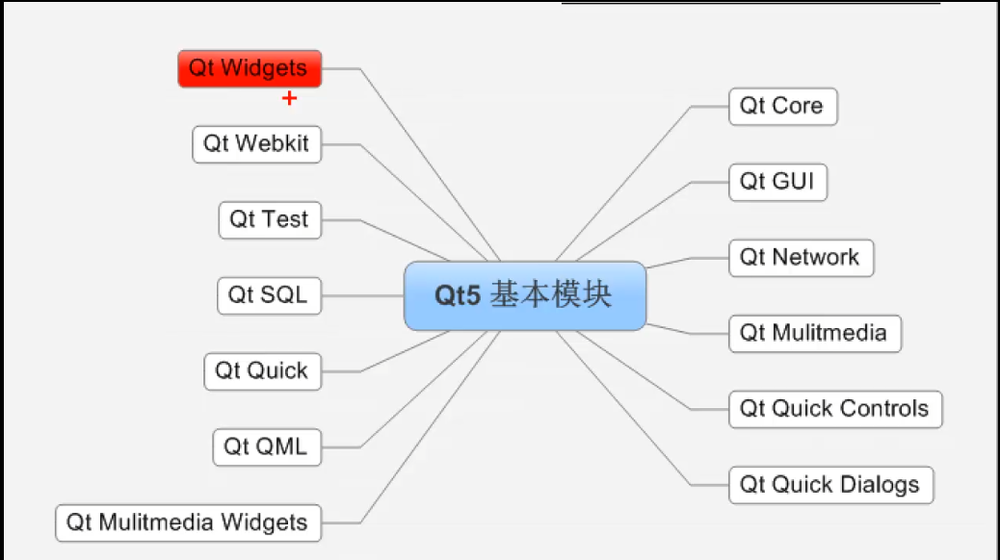

# 6.1 QT入门

## 6.1 QT 概述

QT是一个跨平台的C++图形化用户界面应用程序框架，1991年由奇趣科技开发，分为商业版和开源版，总体功能基本无差别。

**优点**

- 跨平台

- 接口简单、容易上手

- 一定程度上简化了内存回收

- 市场份额良好

- 可以支持嵌入式开发

**成功案例**：

- Linux桌面环境：KDE
- 谷歌地图
- WPS
- Skype

### 6.1.1 创建第一个项目

#### 6.1.1.2 步骤

详见附录中的QT部分：[QT项目创建](../appendix.md)

1. 点击文件新建项目
2. 项目名称：不能有中文和空格
3. 项目路径：不能有中文路径
4. 第一个类命名
   - QWidget：标准窗口，不带菜单栏
   - QMainWindow：带菜单栏，是QWidget子类
   - QDialog：标准对话框，是QWidget子类

#### 6.1.1.2 默认创建的文件

1.  .pro文件：QT项目文件，不要随意修改

   - Qt += gui：默认包含模块
   - 4.0以上版本，加了widget模块
   - Target：生成应用程序的名称
   - Template：app等应用程序模块
   - Source：源文件
   - Header：头文件

2.  main.cpp：主要为程序入口“main”函数

   - QApplication a：应用程序对象，在QT中有且仅有一个

   - MyWidget w：创建自定义窗口对象

   - w.show()：通过show方法，现实窗口

   - return a.exec()：进入消息循环，程序阻塞，等待用户事件（或输入），类似：

     ```c++
     while (1) {
       sleep(5);
     }
     ```
     

3.  自定义类名称.h：创建时定义的第一个类的名字，如：MyWidget.h

4. 自定义类名称.cpp：创建时定义的第一个类的名字，如：MyWidget.cpp

   **QT主要的模块如下**：


### 6.1.2 基本控件接口

#### 6.1.2.1 QPushButton使用

1. 初始化：QPushButton *btn = new QPushButton

2. 设置显示窗口：在哪个窗口中显示这个按钮

   btn->setParent(this) //在当前窗口中显示按钮

3. 设置文本：默认的显示文本

   btn->setText("测试")

4. 设置位置：将按钮移动到某一个位置（x，y）

   btn->move(x,y)

5. 设置窗口显示的大小，参数为（宽，高），按钮设置的方法一样

   this->resize(600,400)

6. 设置窗口固定的大小，按钮设置方法相同

   this->setFixedSize(600,400)

7. 设置窗口的标题，一般针对窗口设置

   this->setWindowTitle(标题名)

#### 6.1.2.2 Qt中的一些基本特征

1. 对象树

   - Qt中内部管理了对象树，在创建对象时，如果父类QObject或QObject派生的类，这个对象可以不用去管理释放，他在创建时已被放入了对象树上，系统会自动释放。
   - 对象的构造和释放的顺序是相反的。

2. Qt中的坐标系

   **Qt中的左上角是(0, 0)**。

   - 向右：x增加
   - 向下：y增加

### 6.1.3 信号和槽

信号和槽是连接两个对象的事件触发和后续的动作的方法。由信号的发送者、发送的信号、信号的接收者和后续动作（槽函数）组成。连接方式由connect函数完成，详细如下：

```c++
// 参数1：信号发送者
// 参数2：发送的信号
// 参数3：信号的接收者
// 参数4：接收者收到信号后，后续的动作
connect(const QObject *sender, const QMetaMethod &signal, const QObject *receiver, const QMetaMethod &method, Qt::ConnectionType type = Qt::AutoConnection);

```

#### 6.1.3.1 自定义的信号和槽函数

1. 自定义信号

   - 在头文件**signals**下编写声明
   - 返回值void
   - 只需声明，无需实现
   - 可以重载
   - 使用**emit**出发信号

2. 自定义槽函数

   - 可以在public、public slot下编写方法，或是全局函数，或lambda函数

   - 返回值void

   - 必须声明和实现

   - 可以重载

#### 6.1.3.2 信号和槽的拓展

   - 当自定义信号和槽发生重载时，应使用函数指针明确指出函数地址

   - 信号可以连接信号

   - 一个信号可以连接多个槽函数

   - 多个信号可以连接一个槽函数

   - 信号和槽函数的参数必须一一对应

   - 信号的参数个数可以多于槽函数，但类型必须一一对应

   - 信号和槽可以断开连接：**disconnect**

     > QString 转 char*：Qstring.toUtf8().data();
     >
     > 1. 使用toUtf8()转ByteArray
     > 2. byteArray.data() 转为 char*

#### 6.1.3.3 lambda表达式

   - 常用使用方法：[=](){}

     ```c++
     connect(btn, &QPushButton::clicked, this, [=](){
         this.close();
     })
         
     ```

   - 加上mutable修饰符后，可以修改按值传递进来的拷贝（**只是修改拷贝，而不是指本身**）

   - 返回值，使用"->"

     ```c++
     int n = []()->int { 
         return 10000; 
     };
     
     ```

## 6.2 QMainWindow模块

### 6.2.1 菜单栏

菜单栏在窗体中有且只有一个，`include<QMenuBar>`。

1. 定义：`QMenuBar * bar = QMenuBar;`
2. 设置菜单到窗口中：`setMenuBar(bar);`
3. 利用菜单栏添加菜单：`QMenu * fileMenu = bar->addMenu("文件")`
4. 添加菜单项：`QAction * newAction = fileMenu->addAction("新建")；`
5. 添加分割线：`fileMenu->addSeparator();`

### 6.2.2 工具栏

一个窗体中可以有多个工具栏，`include<QToolBar>`。

1. 定义：`QToolBar * toolBar = QToolBar(this)`

2. 设置工具栏到窗口中：`addToolBar(位置， toolBar)`

   `位置：QT::LetfToolBarArea、QT::RightToolBarArea...`

3. 设置允许停靠位置：

   `toolBar->setAllowedArears(QT::LetfToolBarArea | QT::RightToolBarArea);`

4. 设置浮动：`toolBar->setFloatable(false);`

5. 设置移动，定义工具栏是否可移动的总开关

   `toolBar->setMovable(false);`

6. 工具栏中添加小控件：

   - 添加按钮

     ~~~c++
     QPushButton * btn = new QPushButton(this);
     toolBar->addWidget(btn);
     ~~~

     

   - 添加菜单

     ~~~c++
     toolBar->addAction(newAction);
     toolBar->addAction(openAction);
     ~~~

   

### 6.2.3 状态栏